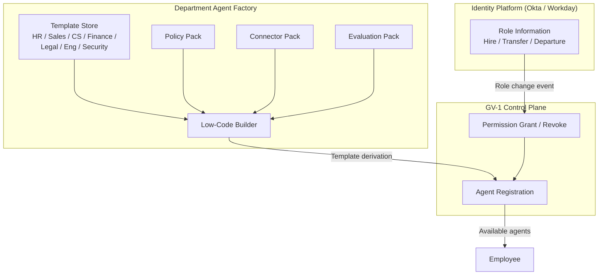

# GV-3 Department Agent Factory (Role Template Factory)

## Overview

Building HR, Sales, and CS agents from scratch every time leads to inconsistent quality and security across departments. This pattern provides standard templates for each department and role — bundled with policies, connectors, and evaluation packs — to enable safe, scalable agent production. When an employee joins, transfers, or leaves, the template-based system automatically follows the change and grants or revokes tools, data access, and permissions accordingly.

## Enterprise Problem Solved

Building agents department by department on an ad-hoc basis produces inconsistent permission designs, policy applications, and evaluation criteria. Variation that is tolerable at a team of ten becomes unmanageable at thousands or tens of thousands of people. Individually configuring settings for ten thousand employees is not realistic. Manually granting and revoking permissions for every hire, transfer, and departure inevitably produces mistakes and delays — the state where a former department's data remains accessible (permission drift) is a breeding ground for insider risk and audit violations. GV-3 introduces templates as a "standard mold" so that safe designs built once by the AI Center of Excellence propagate across the entire organization, and role-change automation closes the gaps in permission management.

!!! tip "Minimum Viable Requirements (MVP)"
    Create one YAML template for the department with the most users (e.g., Sales), defining permitted tools, data scope, and policies, then wire up automated permission grant/revoke based on role changes in the IdP.

## Value Hypothesis

Rapid agent creation from templates shortens per-department deployment lead times. The ability to mass-produce agents with standardized quality increases the speed at which business automation coverage expands across the organization.

## Solution and Design

Templates are defined at the "role" level. Each template includes permitted tools, data access scope, applicable policies, and an evaluation pack. When an employee's role changes in Okta or Workday due to a hire, transfer, or departure, the Control Plane (GV-1) automatically follows by granting or revoking permissions.



Agents derived from templates are registered in the GV-2 catalog and delivered to employees through the request and usage portal. By routing all configuration through the low-code builder, the design physically prevents creating configurations that deviate from the guardrails (policy packs and evaluation packs) managed by the AI CoE.

## Fit / Not a Fit

| Fit | Not a Fit |
|---|---|
| Organizations with an AI CoE or platform team responsible for deploying to multiple departments | Small organizations where department-specific requirements are minimal and a single enterprise-wide agent suffices — template management overhead exceeds the value |
| Scale of thousands or more employees where department agents need to be managed systematically | PoC stage still trialing within a single department or small team |
| Environments with frequent hire and transfer cycles where automated permission follow-through reduces operational cost | — |

## Component Technologies and System Integrations

- Template store: Template definitions in YAML/JSON format managed in Git, with changes tracked via GV-6 (Version Registry).
- Low-code builder: Permits only template-derived configurations and blocks any settings outside the guardrails.
- Policy pack: Integrated with ID-7 (Policy-as-Code Guardrail) to automatically apply prohibited operations and approval requirements by role.
- Connector pack: Bundles connection configurations for the SaaS systems permitted per role (Salesforce, Workday, Slack, Jira, etc.).
- Evaluation pack: Bundles golden datasets and evaluation rubrics used in GV-7 (Evaluation CI/CD) with the template.
- Okta / Workday: Serves as the source of role change events, providing triggers for permission grant and revoke.

## Pitfalls / Selection Considerations

!!! warning "Excessive Permissions from Coarse-Grained Templates"
    Designing templates too broadly results in default access to tools and data that the role does not actually need. A "Sales template" that includes full access to financial data is a classic anti-pattern. Apply the minimum-privilege principle from ID-4 (Permission Mirror / Least-of) when designing templates, and periodically review to prune excess permissions.

!!! warning "Template Sprawl Causing Management Breakdown"
    Accommodating every departmental request by adding templates without limit results in a count so large that management costs reverse the value equation. Establish an upper limit policy on the number of templates, and consolidate similar ones. Absorb differences through configuration parameters rather than proliferating templates.

!!! danger "Permission Revocation Not Following Role Changes"
    When role changes for transfers or departures are not reflected in agent permissions, access to the previous department's data persists. Implement synchronization between IdP (Okta/Workday) role change events and Control Plane permission revocation, and define a maximum follow-through delay (e.g., within one hour) as an operational requirement.

## Interfaces

The following are the key interfaces for implementing this pattern. Coding agents can generate stub code from these definitions.

```yaml
interfaces:
  - name: Role-Based Template Store
    description: "Git-managed YAML/JSON templates per department role (HR, Sales, CS, Finance) with bundled policy, connector, and evaluation packs."
    input:
      request: object
    output:
      response: object
    errors:
      - code: GENERAL_ERROR
        description: "Error occurred during Role-Based Template Store processing"
    protocol: "REST / gRPC"
    implementation_hints:
      - "See the Solution and Design section for details"
  - name: Low-Code Builder
    description: "Allows only derivative configuration from templates; blocks any settings outside the AI CoE-defined guardrails."
    input:
      request: object
    output:
      response: object
    errors:
      - code: GENERAL_ERROR
        description: "Error occurred during Low-Code Builder processing"
    protocol: "REST / gRPC"
    implementation_hints:
      - "See the Solution and Design section for details"
  - name: IdP Role Change Listener
    description: "Receives Okta/Workday role-change events and triggers automatic permission grant/revoke in GV-1 Control Plane within a defined SLA."
    input:
      request: object
    output:
      response: object
    errors:
      - code: GENERAL_ERROR
        description: "Error occurred during IdP Role Change Listener processing"
    protocol: "REST / gRPC"
    implementation_hints:
      - "See the Solution and Design section for details"
```

## Related Patterns

- [GV-1 Agent Control Plane](gv1-agent-control-plane.md) — Complement: the control plane that handles registration and permission management for agents generated by the Factory
- [GV-2 Agent Catalog & Marketplace](gv2-agent-catalog-marketplace.md) — Complement: the portal for discovering and requesting templates
- [ID-4 Permission Mirror / Least-of](../id-identity/id4-permission-mirror-least-of.md) — Complement: provides the minimum-privilege principle for template design
- [GV-4 Industry Policy Pack](gv4-industry-policy-pack.md) — Complement: defines industry-regulation policies to be embedded in templates
