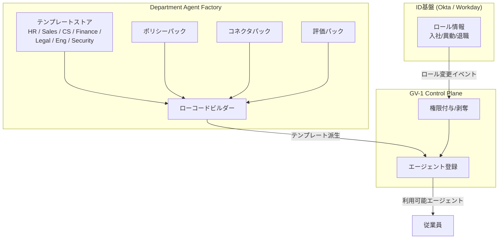

# GV-3 Department Agent Factory（役割テンプレート工場）

## 概要

HR エージェント・Sales エージェント・CS エージェントを毎回ゼロから作ると、部門ごとに品質もセキュリティもばらばらになる。このパターンは、部門・役割ごとにポリシー・コネクタ・評価パックをセットにした標準テンプレートを用意し、安全なエージェントを量産する仕組みである。従業員が入社・異動・退職すると、テンプレートに基づいてツール・データ・権限の付与や剥奪が自動で追従する。

## 解決する企業課題

エージェントを部門ごとに都度開発すると、権限設計・ポリシー適用・評価基準がバラバラになる。10 人規模なら許容できる設計ばらつきも、数千・数万人の規模になると統制不能だ。1 万人の従業員に個別設定を行うことも現実的ではない。入社・異動・退職のたびに権限を手動で付与・剥奪する運用は、必ずミスと遅延を生む。前の部門のデータにいつまでもアクセスできる状態（権限の取り残し）は内部不正リスクと監査違反の温床になる。GV-3 はテンプレートという「型」を導入することで、AI CoE が一度作った安全設計を全社に波及させ、ロール変更への自動追従で権限管理の穴を塞ぐ。

!!! tip "最小成立条件（MVP）"
    最も利用者の多い1部門（例：Sales）向けに、許可ツール・データ範囲・ポリシーを定義した YAML テンプレートを1つ作り、IdP のロール変更で権限を自動付与・剥奪する連携を組む。

## 価値仮説

テンプレートからの迅速なエージェント生成により、部門ごとの展開リードタイムを短縮する。標準化された品質のエージェントを量産できるため、全社の業務自動化カバレッジ拡大速度が上がる。

## 解決策と設計

テンプレートは「役割（role）」単位で定義される。各テンプレートには許可ツール・データアクセス範囲・適用ポリシー・評価パックが同梱される。従業員の入社・異動・退職により Okta/Workday 上のロールが変更されると、Control Plane（GV-1）が権限付与・剥奪を自動的に追従させる。



テンプレートから派生したエージェントは GV-2 カタログに登録され、申請・利用の窓口を通じて従業員に届く。ローコードビルダーを介することで、AI CoE が管理するガードレール（ポリシーパック・評価パック）から外れた設定を物理的に作れない構造になる。

## 向き／不向き

| 向き | 不向き |
|---|---|
| AI CoE やプラットフォームチームが存在し、複数部門へ展開する責任を持っている組織 | 部門固有の要件が薄く、全社共通エージェント 1 本で賄える小規模組織。テンプレート管理のオーバーヘッドが価値を上回る |
| 数千人以上の規模で、部門ごとのエージェントを体系的に管理する必要がある段階 | まだ 1 つの部門・少数チームで試行している PoC 段階 |
| 入社・異動のサイクルが多く、権限の自動追従が運用コスト削減につながる環境 | — |

## 要素技術・既存システム連携

- テンプレートストア：YAML/JSON 形式のテンプレート定義を Git で管理し、変更を GV-6（Version Registry）で追跡する。
- ローコードビルダー：テンプレートからの派生設定のみを許可し、ガードレール外の設定を遮断する。
- ポリシーパック：ID-7（Policy-as-Code Guardrail）と連携し、役割に応じた禁止操作・承認要件を自動適用する。
- コネクタパック：役割ごとに許可する SaaS（Salesforce、Workday、Slack、Jira 等）への接続設定を同梱する。
- 評価パック：GV-7（評価 CI/CD）で使用するゴールデンデータセット・評価ルーブリックをテンプレートに同梱する。
- Okta / Workday：ロール変更イベントのソースとして機能し、権限付与・剥奪のトリガーを提供する。

## 落とし穴／選定の勘所

!!! warning "粗いテンプレートによる過剰権限"
    テンプレートを大雑把に設計すると、その役割に本来不要なツール・データへのアクセスがデフォルトで付与される。「Sales テンプレート」に財務データへのフルアクセスが含まれているケースが典型的なアンチパターンだ。テンプレート設計時に ID-4（Permission Mirror / Least of）の原則で最小権限を適用し、定期レビューで余剰権限を削ることが必要である。

!!! warning "テンプレートの乱立による管理崩壊"
    部門からの要望に応じてテンプレートを際限なく追加すると、数が増えすぎて管理コストが逆転する。テンプレート数には上限方針を設けて類似するものは統合し、差分は設定パラメータで吸収してテンプレート自体の増殖を抑える。

!!! danger "ロール変更の追従漏れ"
    異動・退職時にロール変更がエージェント権限に反映されないと、前の部門のデータにアクセスできる状態が続く。IdP（Okta/Workday）のロール変更イベントと Control Plane の権限剥奪を同期させる仕組みを実装し、追従遅延の上限（例：1 時間以内）を運用要件として明確に定めておく。

## Interfaces

以下はこのパターンを実装する際の主要インターフェイスである。コーディングエージェントはこの定義からスタブコードを生成できる。

```yaml
interfaces:
  - name: Role-Based Template Store
    description: "Git-managed YAML/JSON templates per department role (HR, Sales, CS, Finance) with bundled policy, connector, and evaluation packs."
    input:
      request: object
    output:
      response: object
    errors:
      - code: GENERAL_ERROR
        description: "Role-Based Template Store の処理中にエラーが発生"
    protocol: "REST / gRPC"
    implementation_hints:
      - "詳細は本文の「解決策と設計」節を参照"
  - name: Low-Code Builder
    description: "Allows only derivative configuration from templates; blocks any settings outside the AI CoE-defined guardrails."
    input:
      request: object
    output:
      response: object
    errors:
      - code: GENERAL_ERROR
        description: "Low-Code Builder の処理中にエラーが発生"
    protocol: "REST / gRPC"
    implementation_hints:
      - "詳細は本文の「解決策と設計」節を参照"
  - name: IdP Role Change Listener
    description: "Receives Okta/Workday role-change events and triggers automatic permission grant/revoke in GV-1 Control Plane within a defined SLA."
    input:
      request: object
    output:
      response: object
    errors:
      - code: GENERAL_ERROR
        description: "IdP Role Change Listener の処理中にエラーが発生"
    protocol: "REST / gRPC"
    implementation_hints:
      - "詳細は本文の「解決策と設計」節を参照"
```

## 関連パターン

- [GV-1 Agent Control Plane（エージェント制御プレーン）](gv1-agent-control-plane.md) — 補完：Factory が生成したエージェントの登録・権限管理を担う制御プレーン
- [GV-2 Agent Catalog & Marketplace（社内カタログ）](gv2-agent-catalog-marketplace.md) — 補完：テンプレートを発見・申請する窓口として連動する
- [ID-4 Permission Mirror / Least-of（権限忠実アクセス）](../id-identity/id4-permission-mirror-least-of.md) — 補完：テンプレート設計時の最小権限原則を提供する
- [GV-4 Industry Policy Pack（業界ポリシーパック）](gv4-industry-policy-pack.md) — 補完：テンプレートに組み込む業界規制ポリシーを定義する
