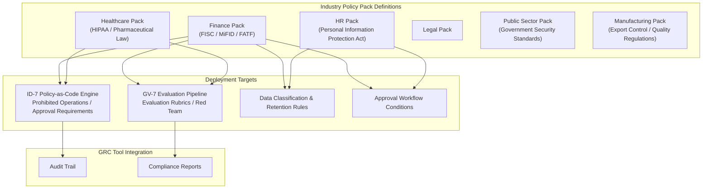

# GV-4 Industry Policy Pack

## Overview

Finance has restrictions on handling customer data, healthcare has restrictions on PHI access, and publicly listed companies must manage insider information — the rules that must be followed vary by industry. This pattern codifies industry-specific regulations, conventions, and audit requirements as reusable policy packs and embeds them in the agent platform. Rather than writing "don't handle this information" into individual agent prompts, Policy-as-Code causes the execution platform to enforce the regulations.

## Enterprise Problem Solved

Writing compliance requirements into per-agent prompts makes omissions, inconsistent phrasing, and ad-hoc updates inevitable. Prompt-based compliance degrades when personnel change, and during audits it becomes impossible to explain "where exactly is the regulation enforced." Regulatory language written in prompts also carries a fundamental vulnerability: it can be neutralized by prompt injection attacks. Re-implementing compliance for every new agent extends review lead times, and updating prompts in every individual agent when regulations change is not realistic. GV-4 escapes fragile prompt-dependent compliance by enforcing regulations at the execution-platform level.

!!! tip "Minimum Viable Requirements (MVP)"
    Define one policy pack in OPA/YAML for your organization's primary regulation (e.g., FISC for finance, HIPAA for healthcare), covering prohibited operations and data classification criteria, and apply it to the ID-7 Policy Engine.

## Value Hypothesis

Structurally reducing the risk of compliance violations and fines lowers the cost of staying in business. Automating compliance checks reduces the manual hours spent on compliance reviews and improves employee efficiency.

## Solution and Design

Policy packs are managed as independent packages per industry and regulatory framework. Each pack consists of prohibited operation rules, data classification criteria, retention periods, approval requirements, audit trail requirements, and evaluation rubrics. Deploying a pack simultaneously to the ID-7 Policy Engine, GV-7 evaluation CI, and GV-1 Control Plane propagates the regulation to all agents.



Packs are subject to version control (GV-6), so updating a single pack when regulations change propagates the change to all deployment targets. GV-3 (Department Agent Factory) templates automatically select the applicable pack based on the industry being deployed to.

## Fit / Not a Fit

| Fit | Not a Fit |
|---|---|
| Industries such as finance, healthcare, and public sector where regulations are strict and external audits are conducted regularly | Cases where only lightweight internal-support AI (internal FAQ, code completion, etc.) is operated and regulatory impact is minimal — pack design and maintenance costs exceed the value |
| Enterprises that must simultaneously comply with multiple regulatory frameworks globally (GDPR, national personal data protection laws, etc.) | Stage where a single team uses agents for limited use cases and manual per-agent verification is practical at that scale |
| Organizations deploying agents across many departments and use cases and needing to maintain consistent compliance | — |

## Component Technologies and System Integrations

- Policy pack definitions: Written in YAML/OPA (Open Policy Agent) format and managed in Git, making regulatory amendments trackable as PRs.
- ID-7 Policy-as-Code Engine: The engine that evaluates prohibited operations and approval requirements from the pack at runtime. GV-4 packs serve as the primary input source for ID-7.
- GV-7 Evaluation Pipeline: Embeds pack-bundled evaluation rubrics into CI, continuously measuring regulatory compliance.
- Data classification and retention rules: Deploys classification criteria defined in the pack to KM-4 (Memory Write Gate) and storage policies.
- GRC tools: Integration with ServiceNow GRC, OneTrust, etc. to auto-generate audit trails and compliance reports.
- GV-6 Version Registry: Manages pack versions to enable rollback and diff review when regulations change.

## Pitfalls / Selection Considerations

!!! danger "Embedding Regulations in Prompts"
    Writing text such as "regulations prohibit X" in a system prompt can be neutralized by prompt injection. Regulation enforcement belongs in the execution platform (Policy Engine and evaluation pipeline); prompts should contain only explanatory language.

!!! warning "Missed Pack Updates"
    When regulations change but pack updates are deprioritized, outdated rules continue running. Connect regulatory change tracking to GV-6, and establish a workflow that automatically creates a pack-update ticket when an amendment is detected.

!!! warning "Conflicting Packs"
    In a scenario that is both global and in finance, the finance pack and the GDPR pack may contain conflicting rules. Define inter-pack priority and merge strategies in advance, and set a default policy of adopting the stricter rule when conflicts arise.

## Interfaces

The following are the key interfaces for implementing this pattern. Coding agents can generate stub code from these definitions.

```yaml
interfaces:
  - name: Policy Pack Definition
    description: "YAML/OPA-format package per industry/regulation containing prohibited operations, data classification rules, retention periods, approval requirements, and audit evidence requirements."
    input:
      request: object
    output:
      response: object
    errors:
      - code: GENERAL_ERROR
        description: "Error occurred during Policy Pack Definition processing"
    protocol: "REST / gRPC"
    implementation_hints:
      - "See the Solution and Design section for details"
  - name: Policy Engine Deployment (ID-7)
    description: "Deploys pack rules to the ID-7 Policy Engine so they are enforced at runtime independently of agent prompts."
    input:
      request: object
    output:
      response: object
    errors:
      - code: GENERAL_ERROR
        description: "Error occurred during Policy Engine Deployment (ID-7) processing"
    protocol: "REST / gRPC"
    implementation_hints:
      - "See the Solution and Design section for details"
  - name: Evaluation Rubric (GV-7)
    description: "Pack-bundled evaluation rubrics and red-team scenarios loaded into the GV-7 CI pipeline to continuously measure regulatory compliance."
    input:
      request: object
    output:
      response: object
    errors:
      - code: GENERAL_ERROR
        description: "Error occurred during Evaluation Rubric (GV-7) processing"
    protocol: "REST / gRPC"
    implementation_hints:
      - "See the Solution and Design section for details"
```

## Related Patterns

- [ID-7 Policy-as-Code Guardrail](../id-identity/id7-policy-as-code-guardrail.md) — Complement: the engine that evaluates prohibited operations and approval requirements from policy packs at runtime
- [GV-7 Evaluation & Governance Pipeline](gv7-evaluation-governance-pipeline.md) — Complement: embeds pack-bundled evaluation rubrics into CI
- [GV-3 Department Agent Factory](gv3-department-agent-factory.md) — Complement: automatically selects and applies industry policy packs to templates
- [ID-6 Zero-Trust PDP/PEP](../id-identity/id6-zero-trust-pdp-pep.md) — Similar: shares the common philosophy of policy enforcement at the execution-platform level
