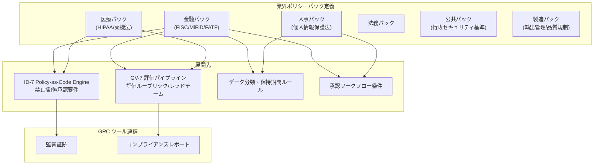

# GV-4 Industry Policy Pack（業界ポリシーパック）

## 概要

金融・医療・人事・法務・公共・製造などの業界特有の規制・慣習・監査要件を、再利用可能なポリシーパックとして定義するパターンである。パックは policy-as-code（ID-7）・評価パイプライン（GV-7）・データ分類・保持期間・承認ルールへ展開され、個々のエージェントプロンプトではなく実行基盤のレベルで規制を強制する。

## 解決する企業課題

規制への対応をエージェントごとのプロンプトに記述すると、記述の抜け漏れ・表現ブレ・更新の属人化が避けられない。プロンプトベースの規制対応は担当者が変わると形骸化し、監査時に「規制がどこで強制されているか」を説明できなくなる。また、プロンプトに書かれた規制文言はプロンプトインジェクション攻撃で無効化できるという根本的な脆弱性を持つ。新しいエージェントを追加するたびに規制対応を再実装すると導入審査のリードタイムが延びる。規制改正時に全エージェントのプロンプトを個別更新するのは現実的でなく、改正への追従が遅れる。GV-4 は規制を実行基盤レベルで強制することで、プロンプト依存の脆弱な対応から脱却する。

## 解決策と設計

ポリシーパックは業界・規制体系ごとに独立したパッケージとして管理される。パックの内部構造は、禁止操作ルール・データ分類基準・保持期間・承認要件・監査証跡要件・評価ルーブリックで構成される。デプロイ時にパックを ID-7 の Policy Engine・GV-7 の評価 CI・GV-1 の Control Plane へ同時に適用することで、全エージェントに規制が反映される。

パックはバージョン管理（GV-6）の対象であり、規制改正時にパック単体を更新することで全展開先へ変更が伝播する。GV-3（Department Agent Factory）のテンプレートはデプロイ対象の業界に応じて該当パックを自動選択する。

## 向き／不向き

**向いている条件**

- 金融・医療・公共など規制が厳格で外部監査が定期的に行われる産業。
- グローバルに複数の規制体系（GDPR・各国個人情報保護法等）に同時対応が必要な企業。
- エージェントを複数部門・多数のユースケースに展開しており、規制対応の一貫性を維持したい組織。

**向いていない条件**

- 規制の影響が軽微な内部支援 AI（社内 FAQ、コード補完など）のみを運用する場合。ポリシーパックの設計・維持コストが価値を上回る。
- 単一チームが限定的なユースケースで使う段階。エージェントごとに手動で確認する方が現実的な規模。

## 要素技術・既存システム連携

- ポリシーパック定義：YAML/OPA（Open Policy Agent）形式で記述し Git で管理する。規制改正を PR として追跡可能にする。
- ID-7 Policy-as-Code Engine：パックの禁止操作・承認要件を実行時に評価するエンジン。GV-4 のパックは ID-7 への主要な入力ソースとなる。
- GV-7 評価パイプライン：パック付属の評価ルーブリックを CI に組み込み、規制への適合性を継続的に測定する。
- データ分類・保持期間ルール：パックで定義した分類基準を KM-4（Memory Write Gate）・ストレージポリシーへ展開する。
- GRC ツール：ServiceNow GRC・OneTrust 等との連携により、監査証跡・コンプライアンスレポートを自動生成する。
- GV-6 Version Registry：パックのバージョンを管理し、規制改正時のロールバック・差分確認を可能にする。

## 落とし穴／選定の勘所

!!! danger "規制のプロンプト埋め込み"
    「法令で〇〇は禁止されています」という文言をエージェントのシステムプロンプトに書くことは、プロンプトインジェクションで無効化できる。規制の強制は実行基盤（Policy Engine・評価パイプライン）に委ね、プロンプトには説明のみを置くことが原則である。

!!! warning "パックの更新漏れ"
    規制改正があってもパックの更新が後回しになり、古いルールが動き続けるリスクがある。規制改正の追跡を GV-6 と連携させ、改正が検知された際に自動でパック更新チケットを起票する運用を設けることが望ましい。

!!! warning "複数パックの競合"
    金融かつグローバルの場合、金融パックと GDPR パックが競合するルールを持つことがある。パック間の優先順位・マージ戦略を事前に定義し、矛盾する場合は厳しい方を採用するデフォルト方針を設けること。

## 関連パターン

- [ID-7 Policy-as-Code Guardrail（ポリシーコードガードレール）](../id-identity/id7-policy-as-code-guardrail.md) — 補完：ポリシーパックの禁止操作・承認要件を実行時に評価するエンジン
- [GV-7 Evaluation & Governance Pipeline（評価CI/CD）](gv7-evaluation-governance-pipeline.md) — 補完：パック付属の評価ルーブリックを CI に組み込む
- [GV-3 Department Agent Factory（役割テンプレート工場）](gv3-department-agent-factory.md) — 補完：テンプレートに業界ポリシーパックを自動選択・適用する
- [ID-6 Zero-Trust PDP/PEP（ゼロトラスト認可）](../id-identity/id6-zero-trust-pdp-pep.md) — 類似：実行基盤レベルでのポリシー強制という共通思想を持つ
