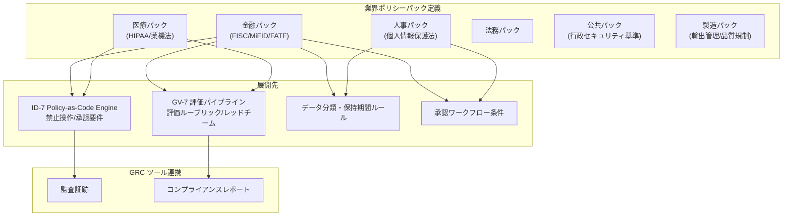

# GV-4 Industry Policy Pack（業界ポリシーパック）

## 概要

金融なら顧客情報の取り扱い制限、医療なら PHI へのアクセス制限、上場企業ならインサイダー情報の管理——業界ごとに守るべきルールは異なります。このパターンは、業界特有の規制・慣習・監査要件を再利用可能なポリシーパックとしてコード化し、エージェント基盤に組み込みます。個々のエージェントのプロンプトに「この情報は扱うな」と書くのではなく、Policy-as-Code として実行基盤が規制を強制するかたちをとります。

## 解決する企業課題

規制への対応をエージェントごとのプロンプトに記述すると、抜け漏れ・表現ブレ・更新の属人化が避けられません。プロンプトベースの規制対応は担当者が変わると形骸化し、監査時に「規制がどこで強制されているか」を説明できなくなります。さらに、プロンプトに書かれた規制文言はプロンプトインジェクション攻撃で無効化できるという根本的な脆弱性もあります。新しいエージェントを追加するたびに規制対応を再実装すれば導入審査のリードタイムが延び、規制改正時に全エージェントのプロンプトを個別更新することも現実的ではありません。GV-4 は規制を実行基盤レベルで強制することで、プロンプト依存の脆弱な対応から脱却します。

!!! tip "最小成立条件（MVP）"
    自社の主要規制（例：金融なら FISC、医療なら HIPAA）に対応する禁止操作ルールとデータ分類基準を OPA/YAML で1パック定義し、ID-7 Policy Engine に適用します。

## 価値仮説

コンプライアンス違反による罰金・訴訟リスクを構造的に低減し、事業継続コストを下げます。法令対応の自動化により、人手によるコンプライアンスチェック工数が減り、従業員効率の向上にも寄与します。

## 解決策と設計

ポリシーパックは業界・規制体系ごとに独立したパッケージとして管理されます。各パックは禁止操作ルール・データ分類基準・保持期間・承認要件・監査証跡要件・評価ルーブリックで構成されています。デプロイ時にパックを ID-7 の Policy Engine・GV-7 の評価 CI・GV-1 の Control Plane へ同時に適用することで、全エージェントに規制が反映される仕組みです。



パックはバージョン管理（GV-6）の対象です。規制改正時にパック単体を更新するだけで、変更が全展開先へ伝播します。GV-3（Department Agent Factory）のテンプレートは、デプロイ対象の業界に応じて該当パックを自動で選択します。

## 向き／不向き

| 向き | 不向き |
|---|---|
| 金融・医療・公共など規制が厳格で外部監査が定期的に行われる産業 | 規制の影響が軽微な内部支援 AI（社内 FAQ、コード補完など）のみを運用する場合。ポリシーパックの設計・維持コストが価値を上回る段階 |
| グローバルに複数の規制体系（GDPR・各国個人情報保護法等）に同時対応が必要な企業 | 単一チームが限定的なユースケースで使う段階。エージェントごとに手動で確認する方が現実的な規模 |
| エージェントを複数部門・多数のユースケースに展開しており、規制対応の一貫性を維持したい組織 | — |

## 要素技術・既存システム連携

- ポリシーパック定義：YAML/OPA（Open Policy Agent）形式で記述し Git で管理します。規制改正を PR として追跡可能にします。
- ID-7 Policy-as-Code Engine：パックの禁止操作・承認要件を実行時に評価するエンジンです。GV-4 のパックは ID-7 への主要な入力ソースとなります。
- GV-7 評価パイプライン：パック付属の評価ルーブリックを CI に組み込み、規制への適合性を継続的に測定します。
- データ分類・保持期間ルール：パックで定義した分類基準を KM-4（Memory Write Gate）・ストレージポリシーへ展開します。
- GRC ツール：ServiceNow GRC・OneTrust 等との連携により、監査証跡・コンプライアンスレポートを自動生成します。
- GV-6 Version Registry：パックのバージョンを管理し、規制改正時のロールバック・差分確認を可能にします。

## 落とし穴／選定の勘所

!!! danger "規制のプロンプト埋め込み"
    「法令で〇〇は禁止されています」という文言をシステムプロンプトに書くことは、プロンプトインジェクションで無効化できます。規制の強制は実行基盤（Policy Engine・評価パイプライン）に委ね、プロンプトには説明のみを置くことが原則です。

!!! warning "パックの更新漏れ"
    規制改正があってもパックの更新が後回しになり、古いルールが動き続けるリスクがあります。GV-6 と連携して規制改正を追跡し、改正が検知されたらパック更新チケットを自動起票する運用を設けておくと安全です。

!!! warning "複数パックの競合"
    金融かつグローバルの場合、金融パックと GDPR パックが競合するルールを持つことがあります。パック間の優先順位とマージ戦略を事前に定義し、矛盾する場合は厳しい方を採用するデフォルト方針を設けておきます。

## Interfaces

以下はこのパターンを実装する際の主要インターフェイスです。コーディングエージェントはこの定義からスタブコードを生成できます。

```yaml
interfaces:
  - name: Policy Pack Definition
    description: "YAML/OPA-format package per industry/regulation containing prohibited operations, data classification rules, retention periods, approval requirements, and audit evidence requirements."
    input:
      request: object
    output:
      response: object
    errors:
      - code: GENERAL_ERROR
        description: "Policy Pack Definition の処理中にエラーが発生"
    protocol: "REST / gRPC"
    implementation_hints:
      - "詳細は本文の「解決策と設計」節を参照"
    code_examples:
      typescript: |
        interface PolicyPackDefinitionRequest {
          industry: string;
          regulation: string;
          version: string;
        }
        interface PolicyPackDefinitionResponse {
          policyPack: object;
          prohibitedOps: string[];
          retentionPeriodDays: number;
        }
        interface PolicyPackDefinition {
          policyPackDefinition(req: PolicyPackDefinitionRequest): Promise<PolicyPackDefinitionResponse>;
        }
      python: |
        @dataclass
        class PolicyPackDefinitionRequest:
            industry: str
            regulation: str
            version: str
        
        @dataclass
        class PolicyPackDefinitionResponse:
            policy_pack: dict
            prohibited_ops: list[str]
            retention_period_days: int
        
        class PolicyPackDefinition(Protocol):
            async def policy_pack_definition(self, req: PolicyPackDefinitionRequest) -> PolicyPackDefinitionResponse: ...
  - name: Policy Engine Deployment (ID-7)
    description: "Deploys pack rules to the ID-7 Policy Engine so they are enforced at runtime independently of agent prompts."
    input:
      request: object
    output:
      response: object
    errors:
      - code: GENERAL_ERROR
        description: "Policy Engine Deployment (ID-7) の処理中にエラーが発生"
    protocol: "REST / gRPC"
    implementation_hints:
      - "詳細は本文の「解決策と設計」節を参照"
    code_examples:
      typescript: |
        interface PolicyEngineDeploymentRequest {
          policyPackId: string;
          targetEngineId: string;
          version: string;
        }
        interface PolicyEngineDeploymentResponse {
          deployed: boolean;
          deployedAt: Date;
          rulesCount: number;
        }
        interface PolicyEngineDeployment {
          policyEngineDeployment(req: PolicyEngineDeploymentRequest): Promise<PolicyEngineDeploymentResponse>;
        }
      python: |
        @dataclass
        class PolicyEngineDeploymentRequest:
            policy_pack_id: str
            target_engine_id: str
            version: str
        
        @dataclass
        class PolicyEngineDeploymentResponse:
            deployed: bool
            deployed_at: datetime
            rules_count: int
        
        class PolicyEngineDeployment(Protocol):
            async def policy_engine_deployment(self, req: PolicyEngineDeploymentRequest) -> PolicyEngineDeploymentResponse: ...
  - name: Evaluation Rubric (GV-7)
    description: "Pack-bundled evaluation rubrics and red-team scenarios loaded into the GV-7 CI pipeline to continuously measure regulatory compliance."
    input:
      request: object
    output:
      response: object
    errors:
      - code: GENERAL_ERROR
        description: "Evaluation Rubric (GV-7) の処理中にエラーが発生"
    protocol: "REST / gRPC"
    implementation_hints:
      - "詳細は本文の「解決策と設計」節を参照"
    code_examples:
      typescript: |
        interface EvaluationRubricRequest {
          policyPackId: string;
          agentId: string;
          ciRunId: string;
        }
        interface EvaluationRubricResponse {
          complianceScore: number;
          failedChecks: string[];
          redTeamResults: object;
        }
        interface EvaluationRubric {
          evaluationRubric(req: EvaluationRubricRequest): Promise<EvaluationRubricResponse>;
        }
      python: |
        @dataclass
        class EvaluationRubricRequest:
            policy_pack_id: str
            agent_id: str
            ci_run_id: str
        
        @dataclass
        class EvaluationRubricResponse:
            compliance_score: float
            failed_checks: list[str]
            red_team_results: dict
        
        class EvaluationRubric(Protocol):
            async def evaluation_rubric(self, req: EvaluationRubricRequest) -> EvaluationRubricResponse: ...
```

## 関連パターン

- [ID-7 Policy-as-Code Guardrail（ポリシーコードガードレール）](../id-identity/id7-policy-as-code-guardrail.md) — 補完：ポリシーパックの禁止操作・承認要件を実行時に評価するエンジン
- [GV-7 Evaluation & Governance Pipeline（評価CI/CD）](gv7-evaluation-governance-pipeline.md) — 補完：パック付属の評価ルーブリックを CI に組み込む
- [GV-3 Department Agent Factory（役割テンプレート工場）](gv3-department-agent-factory.md) — 補完：テンプレートに業界ポリシーパックを自動選択・適用する
- [ID-6 Zero-Trust PDP/PEP（ゼロトラスト認可）](../id-identity/id6-zero-trust-pdp-pep.md) — 類似：実行基盤レベルでのポリシー強制という共通思想を持つ

## Decision Summary

```yaml
decision_summary:
  pattern: GV-4
  participates_in:
    - decision: DC-6
      role: enabler
  recommended_if:
    - "金融・医療・公共等の業界固有規制がある"
    - "規制対応をエージェントの設計段階から組み込む"
  avoid_if:
    - "規制の少ない業界で汎用ポリシーで十分"
  combines_with: [ID-7, GV-1, GV-7]
  conflicts_with: []
  value_outcome:
    drivers: [audit_compliance]
    kpis: [規制準拠率, ポリシー適用カバレッジ]
  mvp: "主要規制1〜2本に対応するポリシーパックを策定"
  cost: M
```
