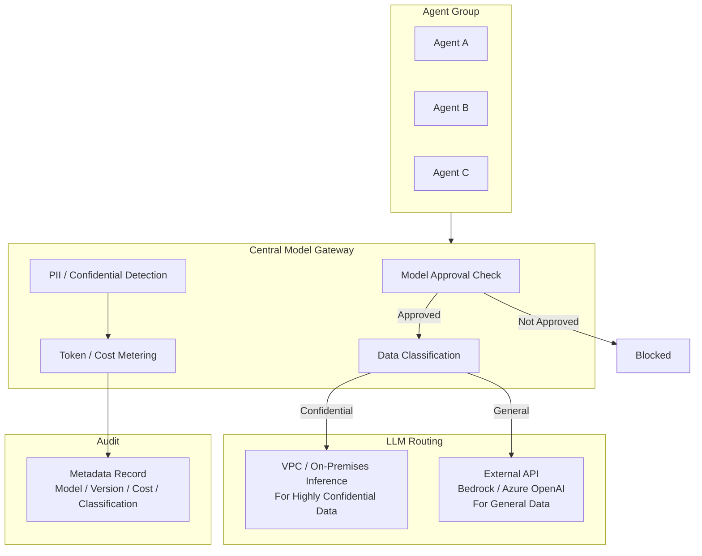

# GV-5 Central Model Gateway (Model & Vendor Control)

## Overview

A dedicated model gateway through which every internal LLM call must pass. Only approved models are permitted, and traffic is automatically routed based on data classification — highly confidential data goes to on-premises inference inside the VPC, while general data goes to external APIs (Bedrock, Azure OpenAI). This structurally prevents teams from inadvertently sending sensitive data to external LLMs, and consolidates vendor management, data residency, PII detection, cost metering, and auditing in one place.

## Enterprise Problem Solved

When individual teams develop a habit of calling external LLM APIs directly, incidents occur in which confidential data is sent externally without authorization. No one knows which team is using which model, vendors proliferate, and costs become opaque. There is no way to verify whether data residency (region) requirements and DPAs (Data Processing Agreements) are being honored. Silent model updates by providers go undetected and cause behavioral drift. Without per-department LLM cost aggregation, both chargeback (GV-8) and ROI measurement (GV-10) become impossible. Trying to manage all of this individually causes control costs to explode — making the Gateway the sole permitted path solves all of it at once.

!!! tip "Minimum Viable Requirements (MVP)"
    Stand up one LiteLLM-style proxy, configure an approved model allowlist, and use egress controls to block direct API calls. PII detection and data-classification routing can be added incrementally.

## Value Hypothesis

Centralizing model usage enables cost visibility and optimization for API spending, reducing AI operational costs. Centralized control over model switching and updates also lowers the cost of maintaining AI quality across the enterprise.

## Solution and Design

Only approved models are permitted, and routing is based on data classification. Highly confidential data is directed to on-premises/VPC inference, while general data is routed to external APIs. DPAs, regional requirements, and retention policies are enforced, with message bodies offloaded to storage and only metadata sent to audit.



## Fit / Not a Fit

| Fit | Not a Fit |
|---|---|
| Required as enterprise-wide AI infrastructure | Single application where a lighter approach may suffice (though governance is still necessary) |
| Environments using multiple vendors and models | Fully air-gapped, offline environments |
| Data-classification-based routing is required | PoC with only one model |

## Component Technologies and System Integrations

- **Gateway implementation**: LiteLLM, Portkey-style proxy
- **Cloud inference**: Amazon Bedrock (region-specific), Azure OpenAI (VPC integration)
- **On-premises inference**: vLLM, TGI, and other self-hosted platforms
- **DLP integration**: Combined with [KM-6 DLP & Redaction Boundary](../km-knowledge/km6-dlp-redaction-boundary.md)
- **Cost metering**: Supplies metering data to [GV-8 Cost Quota & Chargeback](gv8-cost-quota-chargeback.md)

## Pitfalls / Selection Considerations

!!! danger "Leaving Bypass Routes Open"
    Setting up a Gateway while leaving open bypass routes where developers call external APIs directly renders it meaningless. Use egress controls (network policies / firewall) to block direct communication to LLM APIs.

- Putting message bodies directly into the logging platform creates huge volumes, high cost, and PII risk. Offload bodies to storage and send only metadata to audit (three-layer separation).
- To handle silent model updates by vendors, integrate with [GV-6 Version Registry](gv6-version-registry.md) to record model versions.
- Design connection pooling, caching, and asynchronous processing appropriately so Gateway latency does not impact business operations.

## Interfaces

The following are the key interfaces for implementing this pattern. Coding agents can generate stub code from these definitions.

```yaml
interfaces:
  - name: Model Approval Check
    description: "Validates that the requested model is on the approved allowlist; blocks calls to unapproved or deprecated models."
    input:
      request: object
    output:
      response: object
    errors:
      - code: GENERAL_ERROR
        description: "Error occurred during Model Approval Check processing"
    protocol: "REST / gRPC"
    implementation_hints:
      - "See the Solution and Design section for details"
  - name: Data Classification Router
    description: "Routes top-secret classified requests to VPC/on-premises inference and general data requests to external API providers."
    input:
      request: object
    output:
      response: object
    errors:
      - code: GENERAL_ERROR
        description: "Error occurred during Data Classification Router processing"
    protocol: "REST / gRPC"
    implementation_hints:
      - "See the Solution and Design section for details"
  - name: Token & Cost Meter
    description: "Records per-request token counts and cost with cost_center tag; feeds GV-8 Cost Quota & Chargeback for department-level aggregation."
    input:
      request: object
    output:
      response: object
    errors:
      - code: GENERAL_ERROR
        description: "Error occurred during Token & Cost Meter processing"
    protocol: "REST / gRPC"
    implementation_hints:
      - "See the Solution and Design section for details"
```

## Related Patterns

- [GV-1 Agent Control Plane](gv1-agent-control-plane.md) — Complement: prerequisite that only registered agents are permitted to use the Gateway
- [GV-6 Version Registry](gv6-version-registry.md) — Complement: feeds model versions recorded at the Gateway into version management
- [GV-8 Cost Quota & Chargeback](gv8-cost-quota-chargeback.md) — Complement: supplies Gateway-measured costs for per-department chargeback
- [KM-6 DLP & Redaction Boundary](../km-knowledge/km6-dlp-redaction-boundary.md) — Complement: confidential data detection and redaction in input before it reaches the Gateway
- [KM-7 Ephemeral Secure Context Bus](../km-knowledge/km7-ephemeral-secure-context-bus.md) — Complement: secure context transfer that keeps highly confidential processing within the VPC
