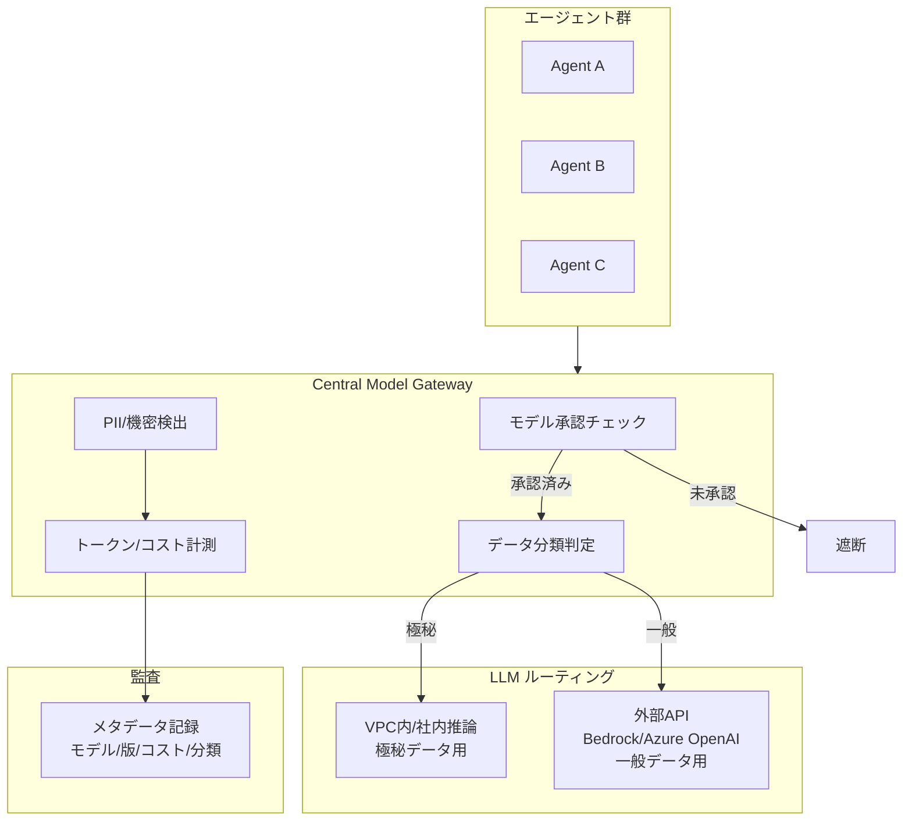

# GV-5 Central Model Gateway（モデル・ベンダー統制）

## 概要

社内のあらゆる LLM 呼び出しが必ず通るモデル専用ゲートウェイを置く。承認されていないモデルは使えず、極秘データは VPC 内の社内推論基盤へ、一般データは外部 API（Bedrock や Azure OpenAI）へと自動で振り分けられる。各チームが勝手に外部 LLM に機密を送る事態を構造的に防ぎ、ベンダー管理・データ所在地・PII 検出・コスト計測・監査をこの一箇所でまとめて制御する。

## 解決する企業課題

各チームが独自に外部 LLM API を直接呼び出す運用が定着すると、機密データが承認なしに外部へ送信される事故が起きる。どのチームがどのモデルを使っているか把握できず、ベンダーが乱立してコストも不可視になる。データ所在地（リージョン）要件や DPA（データ処理契約）が守られているかを確認する手段もなくなっていく。プロバイダが無告知でモデルを更新すると挙動の変化を検知できないし、LLM 呼び出しのコストを部門別に集計できなければコスト配賦（GV-8）も ROI 計測（GV-10）も成立しない。これらをすべて個別管理しようとすると統制コストが爆発する——Gateway を唯一の通路にすることで、まとめて解決する。

!!! tip "最小成立条件（MVP）"
    LiteLLM 等のプロキシを1台立て、承認済みモデルのホワイトリストと egress 制御による直接 API 呼び出しの遮断を設定する。PII 検出やデータ分類ルーティングは段階的に追加すればよい。

## 価値仮説

モデル利用の一元管理によりAPI費用の可視化と最適化を実現し、AI運用コストを削減する。モデル切替・更新を集中制御することで、全社のAI品質維持コストも低減する。

## 解決策と設計

承認済みモデルのみ許可し、データ分類に応じてルーティングする。極秘データは VPC 内/社内推論基盤へ、一般データは外部 API へ振り分ける。DPA・リージョン・保持ポリシーを強制し、本文はストレージに退避してメタデータのみ監査に送る。



## 向き／不向き

| 向き | 不向き |
|---|---|
| 全社 AI 基盤として必須 | 単一アプリで軽量化可（ただし統制は必要） |
| 複数ベンダー・複数モデルを使い分ける環境 | 完全オフラインの閉域環境 |
| データ分類に基づくルーティングが必要 | モデルが1つだけの PoC |

## 要素技術・既存システム連携

- **Gateway 実装**：LiteLLM、Portkey 型プロキシ
- **クラウド推論**：Amazon Bedrock（リージョン指定）、Azure OpenAI（VPC統合）
- **社内推論**：vLLM、TGI 等のセルフホスト基盤
- **DLP 連携**：[KM-6 DLP & Redaction Boundary](../km-knowledge/km6-dlp-redaction-boundary.md) と組み合わせ
- **コスト計測**：[GV-8 Cost Quota & Chargeback](gv8-cost-quota-chargeback.md) へ計測データを供給

## 落とし穴／選定の勘所

!!! danger "迂回ルートの放置"
    Gateway を設置しても、開発者が直接外部 API を叩く迂回ルートを放置すれば意味をなさない。egress 制御（ネットワークポリシー/ファイアウォール）で LLM API への直接通信を遮断する。

- 本文をログ基盤に直接入れると容量大・高コスト・PII リスクになる。本文はストレージに退避し、メタデータのみ監査に送る（三層分離）。
- モデルベンダーのサイレントアップデートに対応するため、[GV-6 Version Registry](gv6-version-registry.md) と連携してモデル版を記録しておく。
- Gateway のレイテンシが業務に影響しないよう、接続プール・キャッシュ・非同期処理を適切に設計することも忘れずに。

## Interfaces

以下はこのパターンを実装する際の主要インターフェイスである。コーディングエージェントはこの定義からスタブコードを生成できる。

```yaml
interfaces:
  - name: Model Approval Check
    description: "Validates that the requested model is on the approved allowlist; blocks calls to unapproved or deprecated models."
    input:
      request: object
    output:
      response: object
    errors:
      - code: GENERAL_ERROR
        description: "Model Approval Check の処理中にエラーが発生"
    protocol: "REST / gRPC"
    implementation_hints:
      - "詳細は本文の「解決策と設計」節を参照"
  - name: Data Classification Router
    description: "Routes top-secret classified requests to VPC/on-premises inference and general data requests to external API providers."
    input:
      request: object
    output:
      response: object
    errors:
      - code: GENERAL_ERROR
        description: "Data Classification Router の処理中にエラーが発生"
    protocol: "REST / gRPC"
    implementation_hints:
      - "詳細は本文の「解決策と設計」節を参照"
  - name: Token & Cost Meter
    description: "Records per-request token counts and cost with cost_center tag; feeds GV-8 Cost Quota & Chargeback for department-level aggregation."
    input:
      request: object
    output:
      response: object
    errors:
      - code: GENERAL_ERROR
        description: "Token & Cost Meter の処理中にエラーが発生"
    protocol: "REST / gRPC"
    implementation_hints:
      - "詳細は本文の「解決策と設計」節を参照"
```

## 関連パターン

- [GV-1 Agent Control Plane](gv1-agent-control-plane.md) — 補完：登録済みエージェントのみ Gateway 利用を許可する前提条件
- [GV-6 Version Registry](gv6-version-registry.md) — 補完：Gateway で記録したモデル版を版管理に連携する
- [GV-8 Cost Quota & Chargeback](gv8-cost-quota-chargeback.md) — 補完：Gateway で計測したコストを部門別配賦に供給する
- [KM-6 DLP & Redaction Boundary](../km-knowledge/km6-dlp-redaction-boundary.md) — 補完：Gateway 到達前の入力における機密検出と削除
- [KM-7 Ephemeral Secure Context Bus](../km-knowledge/km7-ephemeral-secure-context-bus.md) — 補完：極秘処理を VPC 内に閉じるための安全なコンテキスト転送
