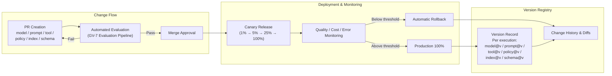

# GV-6 Version Registry (Model / Prompt / Tool / Policy / Index Versioning)

## Overview

Code versioning is taken for granted, but are prompts, models, RAG indexes, and policies managed with the same discipline? For an agent, "deploying = changing behavior" — changing a single line in a prompt can degrade response quality. This pattern version-controls every component and makes each change subject to PR review, evaluation, canary deployment, and rollback, preventing silent quality degradation and the inability to reproduce behavior during incident investigation.

## Enterprise Problem Solved

LLM agent behavior can shift dramatically from a minor model update or a single-word change in a prompt, even without any code changes. "It worked correctly last week but is giving wrong answers this week" becomes extremely difficult to diagnose when versions are not recorded. When providers silently update a model, that change cannot be detected unless the organization has explicitly pinned a version. Audit responses also require the ability to demonstrate "which model and prompt produced that decision," and without reproducible records, post-incident investigations are hampered. Managing code in Git while leaving prompts, models, and indexes uncontrolled is the most common governance gap in LLM agent operations.

!!! tip "Minimum Viable Requirements (MVP)"
    Record model@version and prompt@commit_hash in every execution log, and manage prompt definitions in Git. Canary automation and automated rollback can be added later, but recording "which version it ran on" is the minimal starting point.

## Value Hypothesis

Version management of prompts, policies, and models enables early detection of quality degradation, maintaining stable business automation. The availability of rollback reduces the risk of making changes and supports a faster improvement cycle (= productivity improvement).

## Solution and Design

Tag each execution with versions for model, prompt, tool, policy, retrieval_index, and schema. All change requests go through a PR, and merging is permitted only when automated evaluation (GV-7) passes. Production rollout goes through canary release, and if quality, cost, or error rate falls below the threshold, automatic rollback kicks in.



Combined with feature flags, new versions can be rolled out exclusively to specific tenants, departments, or users first. During audits, the full version set for a given execution can be retrieved by execution ID, enabling reproduction of the behavior at that time.

## Fit / Not a Fit

| Fit | Not a Fit |
|---|---|
| Continuously operated agents where regular model updates and prompt improvements occur | Short-lived experimental PoC — the cost of building version management exceeds the value |
| Operations requiring "reproduction of behavior at the time" for regulatory or audit compliance | Fully stateless, simple tasks where fine-grained output quality management is unnecessary (e.g., simple format conversion) |
| Multi-agent configurations where version combinations across multiple components must be managed | — |

## Component Technologies and System Integrations

- Registry store: A data store that centrally manages versions of models, prompts, tools, policies, RAG indexes, and schemas. Examples include MLflow Model Registry and custom implementations.
- Git: Used for change history management of prompts, policies, and tool definitions. Combined with a PR-based change flow.
- Feature flags: Tools such as LaunchDarkly or in-house implementations to control the rollout scope (tenant, user) for versions.
- Canary deployment platform: Executes multi-stage rollout (1% → 5% → 25% → 100%) and automatically evaluates quality, cost, and errors at each stage.
- Eval dataset: The golden dataset used in the GV-7 evaluation pipeline, retaining evaluation results per version.
- Rollback mechanism: Detects threshold violations during the canary phase and automatically reverts to the previous version.

## Pitfalls / Selection Considerations

!!! danger "Version-Controlling Code but Leaving Prompts, Models, and Indexes Unmanaged"
    A common pattern: application code is managed in Git, but prompts live in a Notion document, the RAG index is manually updated monthly, and the model auto-uses the provider's latest version. In this state, it is impossible to determine which combination of changes is producing the current behavior, and diagnosing quality degradation can take days. Making every behavior-determining factor a target of version control is the foundational requirement.

!!! warning "Overlooking Model Version Pinning"
    Default API calls to providers often use the latest model. Without explicitly specifying a model version (e.g., `gpt-4o-2024-08-06`), silent provider updates change behavior. It is necessary not only to record versions in the Registry but also to specify a pinned version at call time.

!!! warning "Rollback Granularity Too Coarse"
    Designing an all-at-once rollback causes components without problems to revert as well, cascading regressions. Design the system so that model, prompt, tool, policy, and index can each be rolled back independently.

## Interfaces

The following are the key interfaces for implementing this pattern. Coding agents can generate stub code from these definitions.

```yaml
interfaces:
  - name: Version Tag per Execution
    description: "Records model@version, prompt@commit_hash, tool@version, policy@version, index@version, and schema@version in every execution log for full reproduction."
    input:
      request: object
    output:
      response: object
    errors:
      - code: GENERAL_ERROR
        description: "Error occurred during Version Tag per Execution processing"
    protocol: "REST / gRPC"
    implementation_hints:
      - "See the Solution and Design section for details"
    code_examples:
      typescript: |
        interface VersionTagPerExecutionRequest {
          executionId: string;
          modelVersion: string;
          promptCommitHash: string;
          toolVersion: string;
        }
        interface VersionTagPerExecutionResponse {
          versionTag: object;
          taggedAt: Date;
        }
        interface VersionTagPerExecution {
          versionTagPerExecution(req: VersionTagPerExecutionRequest): Promise<VersionTagPerExecutionResponse>;
        }
      python: |
        @dataclass
        class VersionTagPerExecutionRequest:
            execution_id: str
            model_version: str
            prompt_commit_hash: str
            tool_version: str
        
        @dataclass
        class VersionTagPerExecutionResponse:
            version_tag: dict
            tagged_at: datetime
        
        class VersionTagPerExecution(Protocol):
            async def version_tag_per_execution(self, req: VersionTagPerExecutionRequest) -> VersionTagPerExecutionResponse: ...
  - name: PR-Gated Change Flow
    description: "All changes to model/prompt/tool/policy/index must pass automated GV-7 evaluation before merge; failed evaluations block the PR."
    input:
      request: object
    output:
      response: object
    errors:
      - code: GENERAL_ERROR
        description: "Error occurred during PR-Gated Change Flow processing"
    protocol: "REST / gRPC"
    implementation_hints:
      - "See the Solution and Design section for details"
    code_examples:
      typescript: |
        interface PrGatedChangeFlowRequest {
          prId: string;
          changedArtifacts: string[];
          evaluationSuiteId: string;
        }
        interface PrGatedChangeFlowResponse {
          passed: boolean;
          scores: object;
          blockingReason: string;
        }
        interface PrGatedChangeFlow {
          prGatedChangeFlow(req: PrGatedChangeFlowRequest): Promise<PrGatedChangeFlowResponse>;
        }
      python: |
        @dataclass
        class PrGatedChangeFlowRequest:
            pr_id: str
            changed_artifacts: list[str]
            evaluation_suite_id: str
        
        @dataclass
        class PrGatedChangeFlowResponse:
            passed: bool
            scores: dict
            blocking_reason: str
        
        class PrGatedChangeFlow(Protocol):
            async def pr_gated_change_flow(self, req: PrGatedChangeFlowRequest) -> PrGatedChangeFlowResponse: ...
  - name: Canary + Auto-Rollback
    description: "Staged rollout (1%→5%→25%→100%) with continuous quality/cost/error monitoring; auto-rollback to previous version on threshold breach."
    input:
      request: object
    output:
      response: object
    errors:
      - code: GENERAL_ERROR
        description: "Error occurred during Canary + Auto-Rollback processing"
    protocol: "REST / gRPC"
    implementation_hints:
      - "See the Solution and Design section for details"
    code_examples:
      typescript: |
        interface CanaryAutoRollbackRequest {
          deploymentId: string;
          targetVersion: string;
          rolloutPercent: number;
        }
        interface CanaryAutoRollbackResponse {
          stage: string;
          qualityOk: boolean;
          rolledBackTo: string;
        }
        interface CanaryAutoRollback {
          canaryAutoRollback(req: CanaryAutoRollbackRequest): Promise<CanaryAutoRollbackResponse>;
        }
      python: |
        @dataclass
        class CanaryAutoRollbackRequest:
            deployment_id: str
            target_version: str
            rollout_percent: int
        
        @dataclass
        class CanaryAutoRollbackResponse:
            stage: str
            quality_ok: bool
            rolled_back_to: str
        
        class CanaryAutoRollback(Protocol):
            async def canary_auto_rollback(self, req: CanaryAutoRollbackRequest) -> CanaryAutoRollbackResponse: ...
```

## Related Patterns

- [GV-5 Central Model Gateway](gv5-central-model-gateway.md) — Complement: Version Registry manages the model versions used by the Gateway
- [GV-7 Evaluation & Governance Pipeline](gv7-evaluation-governance-pipeline.md) — Complement: provides automated evaluation before PR merge and canary pass/fail determination
- [GV-9 Incident Response & Kill Switch](gv9-incident-response-kill-switch.md) — Complement: used to identify the rollback target version when an incident occurs
- [OB-1 Observability Lake](../ob-observability/ob1-observability-lake.md) — Complement: attaches version information to execution traces to improve observability
