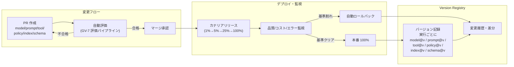

# GV-6 Version Registry（モデル/プロンプト/ツール/ポリシー/索引の版管理）

## 概要

モデル・プロンプト・ツール・ポリシー・RAG 索引・スキーマをバージョン管理し、変更を PR・eval・カナリア・ロールバックの対象として扱うパターンである。「エージェントのデプロイ＝挙動の変更」として Web アプリケーション並みの変更管理規律を適用することで、小さな変更によるサイレントな挙動劣化や監査時の再現不能を防ぐ。

## 設計

各実行に model/prompt/tool/policy/retrieval_index/schema の各バージョンをタグとして記録する。変更要求はすべて PR を経由し、自動評価（GV-7）がパスした場合にのみマージを許可する。本番への反映はカナリアリリースを経由し、品質・コスト・エラー率が基準を満たさない場合は自動ロールバックが起動する。

フィーチャーフラグを組み合わせることで、特定のテナント・部門・ユーザーにのみ新バージョンを先行適用できる。監査時は実行 ID からバージョンセット全体を一括取得し、当時の挙動を再現可能にする。

## 解決する企業課題

LLM エージェントの挙動は、コードを一切変えなくてもモデルのマイナーアップデートやプロンプトの一語変更で大きく変化する。「先週まで正しく動いていたのに今週は誤った回答をする」という現象は、バージョンが記録されていないと原因特定が困難になる。また、プロバイダがモデルをサイレントに更新するケースでは、自社でバージョンを固定していない限り変更を検知できない。監査対応においても「あの判断はどのモデル・プロンプトで行われたか」を示せることが必要であり、再現可能な記録がなければ事後調査に支障をきたす。

## 向き／不向き

**向いている条件**

- 継続的に運用するエージェントで、定期的なモデル更新・プロンプト改善が発生する環境。
- 規制対応・監査対応で「当時の挙動の再現」が求められる業務。
- マルチエージェント構成で、複数コンポーネントのバージョン組み合わせを管理する必要がある場合。

**向いていない条件**

- 短期間で廃棄する実験的 PoC。バージョン管理の構築コストが価値を上回る。
- 完全にステートレスで出力品質の細かな管理が不要な単純タスク（単純フォーマット変換など）。

## 要素技術・既存システム連携

- Registry ストア：モデル・プロンプト・ツール・ポリシー・RAG 索引・スキーマのバージョンを一元管理するデータストア。MLflow Model Registry、カスタム実装など。
- Git：プロンプト・ポリシー・ツール定義の変更履歴管理に使用する。PR ベースの変更フローと組み合わせる。
- Feature Flag：LaunchDarkly・自社実装などを使い、バージョンのロールアウト範囲（テナント・ユーザー）を制御する。
- Canary デプロイ基盤：1%→5%→25%→100% の多段展開を実行し、各段で品質・コスト・エラーを自動判定する。
- Eval Dataset：GV-7 の評価パイプラインで使用するゴールデンデータセット。バージョンごとに評価結果を保持する。
- Rollback 機構：カナリア段階での基準割れを検知して自動的に前バージョンへ切り戻す。

## 落とし穴／選定の勘所

!!! danger "コードだけ版管理してプロンプト・モデル・索引を野放しにする"
    アプリケーションコードは Git で管理しているが、プロンプトは Notion に書かれた文書、RAG 索引は月次で手動更新、モデルはプロバイダの最新版を自動使用、という運用がよくある。この状態では変更のどの組み合わせが現在の挙動を生み出しているかを特定できず、品質劣化の原因調査に数日を要する。すべての挙動決定要素をバージョン管理の対象にすることが大前提である。

!!! warning "モデルのバージョン固定の見落とし"
    プロバイダ API のデフォルト呼び出しでは最新モデルが使われることが多い。明示的にモデルバージョン（例：`gpt-4o-2024-08-06`）を指定しない限り、プロバイダのサイレント更新で挙動が変わる。Registry に記録するだけでなく、呼び出し時にも固定バージョンを使うことが必要である。

!!! warning "変更の粒度が大きすぎるロールバック"
    全体を一括ロールバックする設計だと、問題のないコンポーネントも戻してしまい、デグレードが連鎖する。model/prompt/tool/policy/index それぞれを独立してロールバックできる粒度で設計することが望ましい。

## 関連パターン

- [GV-5 Central Model Gateway（モデル・ベンダー統制）](gv5-central-model-gateway.md)
- [GV-7 Evaluation & Governance Pipeline（評価CI/CD）](gv7-evaluation-governance-pipeline.md)
- [GV-9 Incident Response & Kill Switch（事故対応・停止）](gv9-incident-response-kill-switch.md)
- [OB-1 Observability Lake（オブザーバビリティ基盤）](../ob-observability/ob1-observability-lake.md)
