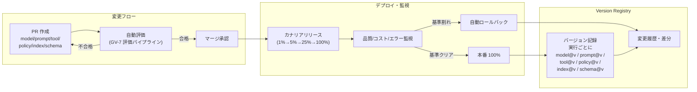

# GV-6 Version Registry（モデル/プロンプト/ツール/ポリシー/索引の版管理）

## 概要

コードのバージョン管理は当たり前ですが、プロンプト・モデル・RAG 索引・ポリシーも同じ規律で管理されているでしょうか。エージェントにとって「デプロイ＝挙動の変更」であり、プロンプトを1行変えただけで回答品質が劣化することもあります。このパターンは、すべての構成要素をバージョン管理し、PR レビュー・評価・カナリアデプロイ・ロールバックの対象にすることで、サイレントな品質劣化とインシデント時の再現不能を防ぎます。

## 解決する企業課題

LLM エージェントの挙動は、コードを一切変えなくてもモデルのマイナーアップデートやプロンプトの一語変更で大きく変化します。「先週まで正しく動いていたのに今週は誤った回答をする」という現象は、バージョンが記録されていないと原因特定が難しいです。プロバイダがモデルをサイレントに更新する場合、自社でバージョンを固定していない限り変更を検知できません。監査対応でも「あの判断はどのモデル・プロンプトで行われたか」を示せる必要があり、再現可能な記録がなければ事後調査に支障をきたします。コードだけ Git 管理してプロンプト・モデル・索引を野放しにする運用は、LLM エージェントにおいて最も一般的なガバナンスの穴です。

!!! tip "最小成立条件（MVP）"
    各実行ログに model@version と prompt@commit_hash を記録し、プロンプト定義を Git 管理します。カナリアやロールバック自動化は後から追加できますが、「どのバージョンで動いたか」の記録が最小の出発点です。

## 価値仮説

プロンプト・ポリシー・モデルの版管理により、品質劣化を早期に検知して安定した業務自動化を維持できます。ロールバック可能性が変更リスクを下げ、改善サイクルの高速化（＝生産性向上）を支えます。

## 解決策と設計

各実行に model/prompt/tool/policy/retrieval_index/schema の各バージョンをタグとして記録します。変更要求はすべて PR を経由し、自動評価（GV-7）がパスした場合にのみマージを許可します。本番への反映はカナリアリリースを経由し、品質・コスト・エラー率が基準を満たさなければ自動ロールバックが起動します。



フィーチャーフラグを組み合わせれば、特定のテナント・部門・ユーザーにのみ新バージョンを先行適用できます。監査時は実行 ID からバージョンセット全体を一括取得し、当時の挙動を再現することもできるようになります。

## 向き／不向き

| 向き | 不向き |
|---|---|
| 継続的に運用するエージェントで、定期的なモデル更新・プロンプト改善が発生する環境 | 短期間で廃棄する実験的 PoC。バージョン管理の構築コストが価値を上回る段階 |
| 規制対応・監査対応で「当時の挙動の再現」が求められる業務 | 完全にステートレスで出力品質の細かな管理が不要な単純タスク（単純フォーマット変換など） |
| マルチエージェント構成で、複数コンポーネントのバージョン組み合わせを管理する必要がある場合 | — |

## 要素技術・既存システム連携

- Registry ストア：モデル・プロンプト・ツール・ポリシー・RAG 索引・スキーマのバージョンを一元管理するデータストアです。MLflow Model Registry、カスタム実装などがあります。
- Git：プロンプト・ポリシー・ツール定義の変更履歴管理に使用します。PR ベースの変更フローと組み合わせます。
- Feature Flag：LaunchDarkly・自社実装などを使い、バージョンのロールアウト範囲（テナント・ユーザー）を制御します。
- Canary デプロイ基盤：1%→5%→25%→100% の多段展開を実行し、各段で品質・コスト・エラーを自動判定します。
- Eval Dataset：GV-7 の評価パイプラインで使用するゴールデンデータセットです。バージョンごとに評価結果を保持します。
- Rollback 機構：カナリア段階での基準割れを検知して自動的に前バージョンへ切り戻します。

## 落とし穴／選定の勘所

!!! danger "コードだけ版管理してプロンプト・モデル・索引を野放しにする"
    アプリケーションコードは Git で管理しているが、プロンプトは Notion の文書、RAG 索引は月次で手動更新、モデルはプロバイダの最新版を自動使用——という運用がよくあります。この状態では変更のどの組み合わせが現在の挙動を生み出しているかを特定できず、品質劣化の原因調査に数日を要します。すべての挙動決定要素をバージョン管理の対象にすることが大前提です。

!!! warning "モデルのバージョン固定の見落とし"
    プロバイダ API のデフォルト呼び出しでは最新モデルが使われることが多いです。明示的にモデルバージョン（例：`gpt-4o-2024-08-06`）を指定しない限り、プロバイダのサイレント更新で挙動が変わります。Registry に記録するだけでなく、呼び出し時にも固定バージョンを指定することが欠かせません。

!!! warning "変更の粒度が大きすぎるロールバック"
    全体を一括ロールバックする設計では、問題のないコンポーネントまで戻してしまいデグレードが連鎖します。model/prompt/tool/policy/index それぞれを独立してロールバックできる粒度で設計しておくことが望ましいです。

## Interfaces

以下はこのパターンを実装する際の主要インターフェイスです。コーディングエージェントはこの定義からスタブコードを生成できます。

```yaml
interfaces:
  - name: Version Tag per Execution
    description: "Records model@version, prompt@commit_hash, tool@version, policy@version, index@version, and schema@version in every execution log for full reproduction."
    input:
      request: object
    output:
      response: object
    errors:
      - code: GENERAL_ERROR
        description: "Version Tag per Execution の処理中にエラーが発生"
    protocol: "REST / gRPC"
    implementation_hints:
      - "詳細は本文の「解決策と設計」節を参照"
    code_examples:
      typescript: |
        interface VersionTagPerExecutionRequest {
          executionId: string;
          modelVersion: string;
          promptCommitHash: string;
          toolVersion: string;
        }
        interface VersionTagPerExecutionResponse {
          versionTag: object;
          taggedAt: Date;
        }
        interface VersionTagPerExecution {
          versionTagPerExecution(req: VersionTagPerExecutionRequest): Promise<VersionTagPerExecutionResponse>;
        }
      python: |
        @dataclass
        class VersionTagPerExecutionRequest:
            execution_id: str
            model_version: str
            prompt_commit_hash: str
            tool_version: str
        
        @dataclass
        class VersionTagPerExecutionResponse:
            version_tag: dict
            tagged_at: datetime
        
        class VersionTagPerExecution(Protocol):
            async def version_tag_per_execution(self, req: VersionTagPerExecutionRequest) -> VersionTagPerExecutionResponse: ...
  - name: PR-Gated Change Flow
    description: "All changes to model/prompt/tool/policy/index must pass automated GV-7 evaluation before merge; failed evaluations block the PR."
    input:
      request: object
    output:
      response: object
    errors:
      - code: GENERAL_ERROR
        description: "PR-Gated Change Flow の処理中にエラーが発生"
    protocol: "REST / gRPC"
    implementation_hints:
      - "詳細は本文の「解決策と設計」節を参照"
    code_examples:
      typescript: |
        interface PrGatedChangeFlowRequest {
          prId: string;
          changedArtifacts: string[];
          evaluationSuiteId: string;
        }
        interface PrGatedChangeFlowResponse {
          passed: boolean;
          scores: object;
          blockingReason: string;
        }
        interface PrGatedChangeFlow {
          prGatedChangeFlow(req: PrGatedChangeFlowRequest): Promise<PrGatedChangeFlowResponse>;
        }
      python: |
        @dataclass
        class PrGatedChangeFlowRequest:
            pr_id: str
            changed_artifacts: list[str]
            evaluation_suite_id: str
        
        @dataclass
        class PrGatedChangeFlowResponse:
            passed: bool
            scores: dict
            blocking_reason: str
        
        class PrGatedChangeFlow(Protocol):
            async def pr_gated_change_flow(self, req: PrGatedChangeFlowRequest) -> PrGatedChangeFlowResponse: ...
  - name: Canary + Auto-Rollback
    description: "Staged rollout (1%→5%→25%→100%) with continuous quality/cost/error monitoring; auto-rollback to previous version on threshold breach."
    input:
      request: object
    output:
      response: object
    errors:
      - code: GENERAL_ERROR
        description: "Canary + Auto-Rollback の処理中にエラーが発生"
    protocol: "REST / gRPC"
    implementation_hints:
      - "詳細は本文の「解決策と設計」節を参照"
    code_examples:
      typescript: |
        interface CanaryAutoRollbackRequest {
          deploymentId: string;
          targetVersion: string;
          rolloutPercent: number;
        }
        interface CanaryAutoRollbackResponse {
          stage: string;
          qualityOk: boolean;
          rolledBackTo: string;
        }
        interface CanaryAutoRollback {
          canaryAutoRollback(req: CanaryAutoRollbackRequest): Promise<CanaryAutoRollbackResponse>;
        }
      python: |
        @dataclass
        class CanaryAutoRollbackRequest:
            deployment_id: str
            target_version: str
            rollout_percent: int
        
        @dataclass
        class CanaryAutoRollbackResponse:
            stage: str
            quality_ok: bool
            rolled_back_to: str
        
        class CanaryAutoRollback(Protocol):
            async def canary_auto_rollback(self, req: CanaryAutoRollbackRequest) -> CanaryAutoRollbackResponse: ...
```

## 関連パターン

- [GV-5 Central Model Gateway（モデル・ベンダー統制）](gv5-central-model-gateway.md) — 補完：Gateway で使用するモデル版を Version Registry が管理する
- [GV-7 Evaluation & Governance Pipeline（評価CI/CD）](gv7-evaluation-governance-pipeline.md) — 補完：PR マージ前の自動評価とカナリア判定を提供する
- [GV-9 Incident Response & Kill Switch（事故対応・停止）](gv9-incident-response-kill-switch.md) — 補完：インシデント発生時のロールバック先の特定に使う
- [OB-1 Observability Lake（オブザーバビリティ基盤）](../ob-observability/ob1-observability-lake.md) — 補完：実行トレースにバージョン情報を付与して可観測性を高める

## Decision Summary

```yaml
decision_summary:
  pattern: GV-6
  participates_in:
    - decision: DC-9
      role: enabler
  recommended_if:
    - "モデル・プロンプト・ツール・ポリシーの版管理が必要"
    - "カナリアリリースやロールバックを行う"
  avoid_if:
    - "単一版で固定運用"
  combines_with: [GV-1, GV-7, GV-5]
  conflicts_with: []
  value_outcome:
    drivers: [audit_compliance, automation]
    kpis: [バージョン追跡率, ロールバック所要時間]
  mvp: "モデル・プロンプト・ポリシーの版をGitOpsで管理"
  cost: S
```
