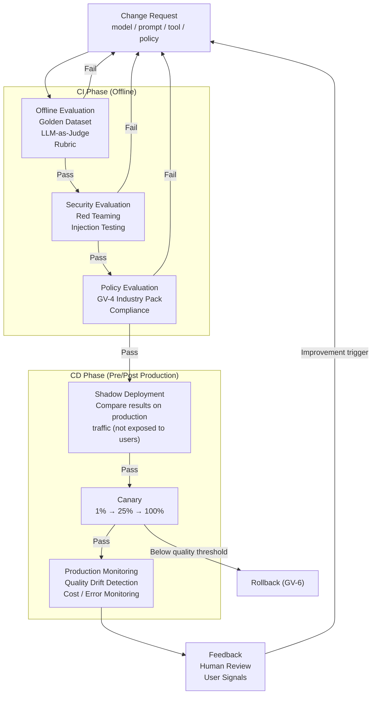

# GV-7 Evaluation & Governance Pipeline (Evaluation CI/CD)

## Overview

LLM output varies with every call. The same prompt can return a different answer today than it did yesterday. Traditional unit tests cannot detect quality degradation, so agents need "continuous evaluation" rather than "testing." This pattern designs the full pipeline as a connected sequence — from change request through offline evaluation, security evaluation, shadow deployment, canary release, production monitoring, and feedback loop — combining rubrics, LLM-as-Judge, red teaming, and human review to maintain quality.

## Enterprise Problem Solved

Because LLM agents are non-deterministic, traditional unit tests (verifying that input produces matching output) cannot detect quality degradation. A prompt word change, a model version bump, or a RAG index update can cause unintended behavioral changes, yet if traditional tests pass, the change gets approved. Even after production deployment, drift (behavioral degradation over time) occurs, but without continuous monitoring it goes unnoticed. Prompt injection, jailbreaking, and data leakage paths are not found by normal testing — red teaming is required. Operating with change approval based solely on technical metrics, without evaluating business fitness and safety, is the cause of quality degradation silently accumulating.

!!! tip "Minimum Viable Requirements (MVP)"
    Create a golden dataset of 20–50 examples and embed automated evaluation using promptfoo or similar into CI on every PR. Production monitoring and shadow deployment can be added later, but "evaluation runs on every change" is the minimal starting point.

## Value Hypothesis

Continuous measurement of agent quality quantifies contribution to business outcomes and provides a basis for improvement investment decisions. Early detection of quality degradation is directly linked to maintaining user trust and preventing adoption decline.

## Solution and Design

The evaluation pipeline progresses in stages, starting from a change request. At each gate, a pass/fail decision is made; failures feed back to the preceding stage. The production monitoring phase runs continuously to detect drift on an ongoing basis.



Evaluation methods are composed in multiple layers. Pre-evaluation using golden datasets guarantees a baseline. LLM-as-Judge balances cost reduction with automation, but the judge model's own biases must be periodically calibrated. Property assertions (e.g., "does not output PII," "follows a specific format") can be evaluated programmatically and are easy to embed in CI. Red teaming is conducted in the security evaluation phase to probe for prompt injection, jailbreaking, and data leakage paths.

## Fit / Not a Fit

| Fit | Not a Fit |
|---|---|
| All production agents — where early quality degradation detection and root cause identification are needed | Temporary PoC or experimental phase where lightweight manual evaluation is sufficient |
| Continuously operated environments with regular model updates and prompt improvements | Extremely simple tasks (such as basic text conversion) where designing a rubric is not worthwhile |
| Cases where continuous verification of compliance with GV-4 policy packs is required in regulated industries | — |

## Component Technologies and System Integrations

- Golden Dataset: A dataset recording representative input/output pairs and expected quality. Curated by hand and continuously expanded.
- LLM-as-a-Judge: A technique where a dedicated evaluation LLM scores output quality. The evaluation criteria (rubric) are provided as a system prompt.
- promptfoo: An open-source LLM evaluation framework. Easy to integrate into CI.
- DeepEval: A Python-based evaluation library providing property assertions, RAG evaluation, toxicity detection, and other metrics.
- Braintrust: A platform providing trace comparison, dashboards, and tracking for evaluation results.
- CI/CD platform: Integrates with GitHub Actions, GitLab CI, etc. to automatically run evaluation on PR creation.
- OB-1 (Observability Lake): Supplies traces and metrics as input for the production monitoring phase.

## Pitfalls / Selection Considerations

!!! danger "Making Pass/Fail Decisions on Technical Metrics Alone"
    Making pass/fail decisions only on technical metrics — latency, token count, error rate — while not evaluating business fitness and safety is the worst anti-pattern. A change that "improves response time" might slip through while hiding "reduced answer accuracy." Rubrics must always include business accuracy, safety, and compliance.

!!! warning "Golden Dataset Stagnation"
    If the golden dataset is never updated after initial creation, agents become "overfit" to it, and the gap with actual production quality widens. Regularly supplement the dataset with samples from production traffic and continuously add cases the model has not seen.

!!! warning "Judge Model Bias"
    LLM-as-Judge has preferences toward the judge model's own response style and cultural biases. A tendency to over-rate long, polite responses has been reported. Periodically calibrate judge model evaluations against human assessments.

!!! warning "Shadow Deployment Cost Overlooked"
    Shadow deployment processes production traffic through both old and new models, doubling costs during the evaluation period. Integrate with GV-8 (Cost Chargeback) to explicitly track the shadow period, and configure alerts to detect cost spikes.

## Interfaces

The following are the key interfaces for implementing this pattern. Coding agents can generate stub code from these definitions.

```yaml
interfaces:
  - name: Offline Evaluation Gate (CI)
    description: "Runs golden dataset evaluation, LLM-as-judge scoring, and characteristic assertions on every PR; blocks merge on failure."
    input:
      request: object
    output:
      response: object
    errors:
      - code: GENERAL_ERROR
        description: "Error occurred during Offline Evaluation Gate (CI) processing"
    protocol: "REST / gRPC"
    implementation_hints:
      - "See the Solution and Design section for details"
    code_examples:
      typescript: |
        interface OfflineEvaluationGateRequest {
          prId: string;
          agentId: string;
          goldenDatasetId: string;
        }
        interface OfflineEvaluationGateResponse {
          passed: boolean;
          score: number;
          failureReasons: string[];
        }
        interface OfflineEvaluationGate {
          offlineEvaluationGate(req: OfflineEvaluationGateRequest): Promise<OfflineEvaluationGateResponse>;
        }
      python: |
        @dataclass
        class OfflineEvaluationGateRequest:
            pr_id: str
            agent_id: str
            golden_dataset_id: str
        
        @dataclass
        class OfflineEvaluationGateResponse:
            passed: bool
            score: float
            failure_reasons: list[str]
        
        class OfflineEvaluationGate(Protocol):
            async def offline_evaluation_gate(self, req: OfflineEvaluationGateRequest) -> OfflineEvaluationGateResponse: ...
  - name: Security Evaluation (Red-Teaming)
    description: "Searches for prompt injection, jailbreak, and data leakage paths in the security evaluation phase; results fed back to the change request."
    input:
      request: object
    output:
      response: object
    errors:
      - code: GENERAL_ERROR
        description: "Error occurred during Security Evaluation (Red-Teaming) processing"
    protocol: "REST / gRPC"
    implementation_hints:
      - "See the Solution and Design section for details"
    code_examples:
      typescript: |
        interface SecurityEvaluationRequest {
          agentId: string;
          changeSetId: string;
          redTeamScenarios: string[];
        }
        interface SecurityEvaluationResponse {
          vulnerabilitiesFound: string[];
          passed: boolean;
          severity: string;
        }
        interface SecurityEvaluation {
          securityEvaluation(req: SecurityEvaluationRequest): Promise<SecurityEvaluationResponse>;
        }
      python: |
        @dataclass
        class SecurityEvaluationRequest:
            agent_id: str
            change_set_id: str
            red_team_scenarios: list[str]
        
        @dataclass
        class SecurityEvaluationResponse:
            vulnerabilities_found: list[str]
            passed: bool
            severity: str
        
        class SecurityEvaluation(Protocol):
            async def security_evaluation(self, req: SecurityEvaluationRequest) -> SecurityEvaluationResponse: ...
  - name: Production Drift Monitor
    description: "Continuously detects quality drift, cost anomalies, and error rate increases in production; triggers GV-6 rollback on threshold breach."
    input:
      request: object
    output:
      response: object
    errors:
      - code: GENERAL_ERROR
        description: "Error occurred during Production Drift Monitor processing"
    protocol: "REST / gRPC"
    implementation_hints:
      - "See the Solution and Design section for details"
    code_examples:
      typescript: |
        interface ProductionDriftMonitorRequest {
          agentId: string;
          windowMinutes: number;
        }
        interface ProductionDriftMonitorResponse {
          driftDetected: boolean;
          qualityScore: number;
          costAnomaly: boolean;
          triggerRollback: boolean;
        }
        interface ProductionDriftMonitor {
          productionDriftMonitor(req: ProductionDriftMonitorRequest): Promise<ProductionDriftMonitorResponse>;
        }
      python: |
        @dataclass
        class ProductionDriftMonitorRequest:
            agent_id: str
            window_minutes: int
        
        @dataclass
        class ProductionDriftMonitorResponse:
            drift_detected: bool
            quality_score: float
            cost_anomaly: bool
            trigger_rollback: bool
        
        class ProductionDriftMonitor(Protocol):
            async def production_drift_monitor(self, req: ProductionDriftMonitorRequest) -> ProductionDriftMonitorResponse: ...
```

## Related Patterns

- [GV-6 Version Registry](gv6-version-registry.md) — Complement: assigns versions to each change and correlates them with evaluation results
- [OB-1 Observability Lake](../ob-observability/ob1-observability-lake.md) — Complement: supplies traces and metrics as input for the production monitoring phase
- [GV-9 Incident Response & Kill Switch](gv9-incident-response-kill-switch.md) — Complement: connects to shutdown decisions when the evaluation pipeline detects a serious quality problem
- [GV-1 Agent Control Plane](gv1-agent-control-plane.md) — Complement: embeds passing the evaluation pipeline as a condition for agent registration and publication
