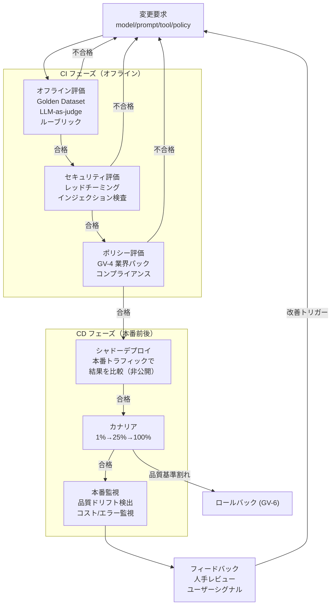

# GV-7 Evaluation & Governance Pipeline（評価CI/CD）

## 概要

LLM の出力は毎回変わる。同じプロンプトでも昨日と今日で違う答えが返る。従来の単体テストでは品質劣化を検出できないため、エージェントには「テスト」ではなく「継続評価」が必要である。このパターンは、変更要求からオフライン評価・セキュリティ評価・シャドーデプロイ・カナリアリリース・本番監視・フィードバックまでを一連のパイプラインとして設計し、ルーブリック・LLM-as-Judge・レッドチーミング・人手レビューを組み合わせて品質を守る。

## 解決する企業課題

LLM エージェントは非決定論的であるため、従来のソフトウェア単体テスト（入力に対して出力が一致するか確認する）では品質劣化を検出できない。プロンプトの一語変更、モデルのバージョンアップ、RAG 索引の更新が意図しない挙動変化をもたらすことがあるが、従来のテストが通っていれば変更を承認してしまう。本番デプロイ後もドリフト（時間とともに挙動が劣化する現象）が起きるが、継続監視なしでは気づけない。セキュリティ面では、プロンプトインジェクション・ジェイルブレイク・データ漏洩パスのような攻撃は通常テストでは発見できず、レッドチーミングが必要である。業務適合性と安全性を評価せずに技術指標だけで変更を承認する運用は、品質劣化が静かに蓄積する原因になる。

## 解決策と設計

評価パイプラインは変更要求を起点として段階的に進む。各ゲートで合否が判定され、不合格の場合は前段にフィードバックされる。本番監視フェーズは常時稼働し、ドリフトを継続的に検出する。

評価手法は多層で構成される。ゴールデンデータセットによる事前評価はベースラインを保証する。LLM-as-judge は人手コスト削減と自動化を両立するが、judge モデル自体のバイアスを定期的にキャリブレーションする必要がある。特性アサーション（例：「PII を出力しない」「特定フォーマットを守る」）はプログラマティックに判定できるため CI への組み込みが容易である。レッドチーミングはセキュリティ評価フェーズで実施し、プロンプトインジェクション・ジェイルブレイク・データ漏洩パスを探索する。

## 向き／不向き

**向いている条件**

- 本番運用するエージェント全般。品質劣化を早期検出し、原因を特定する必要がある。
- 定期的なモデル更新・プロンプト改善が発生する継続運用環境。
- 規制産業で GV-4 のポリシーパックとの適合性を継続的に確認する必要がある場合。

**向いていない条件**

- 一時的な PoC・実験段階。軽量な手動評価で十分な場合が多い。
- 極めてシンプルなタスク（単純テキスト変換など）でルーブリックを設計するほどでもないケース。

## 要素技術・既存システム連携

- Golden Dataset：代表的な入出力ペアと期待品質を記録したデータセット。人手でキュレーションし継続的に拡充する。
- LLM-as-a-judge：評価専用の LLM が出力品質を採点する手法。評価基準（ルーブリック）をシステムプロンプトとして与える。
- promptfoo：オープンソースの LLM 評価フレームワーク。CI への組み込みが容易。
- DeepEval：Python ベースの評価ライブラリ。特性アサーション・RAG 評価・毒性検出などのメトリクスを提供する。
- Braintrust：評価結果のトレース・比較・ダッシュボードを提供するプラットフォーム。
- CI/CD 基盤：GitHub Actions・GitLab CI 等と統合し、PR 時に評価を自動実行する。
- OB-1（Observability Lake）：本番監視フェーズの入力となるトレース・メトリクスを供給する。

## 落とし穴／選定の勘所

!!! danger "技術指標のみで合否判定する"
    レイテンシ・トークン数・エラー率といった技術指標だけで合否を判定し、業務適合性と安全性を評価しないことが最大のアンチパターンである。「レスポンスタイムが改善された」が「回答の正確性が下がった」を上回る変更を通過させてしまう。ルーブリックに業務的正確性・安全性・コンプライアンスを必ず含めること。

!!! warning "評価データセットの固定化"
    ゴールデンデータセットが作成時のまま更新されないと、エージェントがデータセットに「過適合」し、実際の本番品質との乖離が生じる。定期的にデータセットを本番トラフィックから補充し、モデルが見ていない事例を増やし続けることが必要である。

!!! warning "judge モデルのバイアス"
    LLM-as-judge は judge モデル固有の応答スタイルへの好みや文化的バイアスを持つ。特に長い・丁寧な回答を過剰評価する傾向が報告されている。judge モデルの評価結果を定期的に人手評価と照合し、キャリブレーションすること。

!!! warning "シャドーデプロイのコスト見落とし"
    シャドーデプロイは本番トラフィックを新旧両方のモデルで処理するため、評価期間中のコストが倍増する。GV-8（コスト配賦）と連携してシャドー期間を明示し、コストの跳ね上がりをアラートで検知できるようにしておくこと。

## 関連パターン

- [GV-6 Version Registry（モデル/プロンプト/ツール/ポリシー/索引の版管理）](gv6-version-registry.md) — 補完：変更ごとにバージョンを付与して評価結果と対応づける
- [OB-1 Observability Lake（オブザーバビリティ基盤）](../ob-observability/ob1-observability-lake.md) — 補完：本番監視フェーズのトレース・メトリクスを供給する
- [GV-9 Incident Response & Kill Switch（事故対応・停止）](gv9-incident-response-kill-switch.md) — 補完：評価パイプラインで検出した重大な品質問題の際に停止判断と連動する
- [GV-1 Agent Control Plane（エージェント制御プレーン）](gv1-agent-control-plane.md) — 補完：評価パイプラインの通過を登録・公開の条件として組み込む
