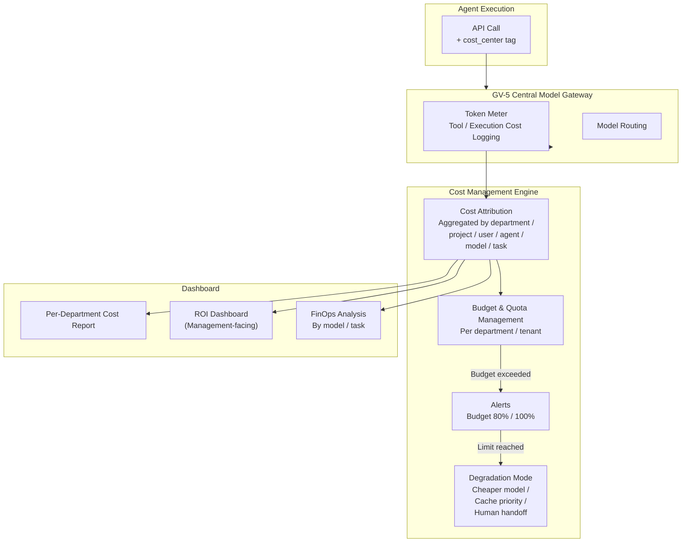

# GV-8 Cost Quota & Chargeback

## Overview

"Do you know how much AI cost each department spent last month?" — without being able to answer this, neither AI investment justification nor budget management is possible. This pattern meters LLM token consumption, tool calls, and execution costs at the granularity of department, project, user, and agent, sets budget limits and performs departmental allocation. When a limit is reached, degradation strategies such as switching to a cheaper model or prioritizing cache hits prevent cost runaway.

## Enterprise Problem Solved

LLM costs differ from traditional infrastructure costs — they grow nonlinearly based on request count, token count, and agent call depth. Departments using AI freely generate unexpected end-of-month bills, and it becomes unclear which department, project, or agent is generating the expense. In multi-agent configurations, a single user request can trigger inference explosions where hundreds of LLM calls are chained together. Companies providing AI capabilities to customers cannot design pricing without knowing per-customer profitability. Managing costs as a lump-sum "infrastructure expense" without linking them to business outcomes causes agents with high cost but no visible results to go unnoticed, making it impossible to fulfill accountability for AI investment as a whole.

!!! tip "Minimum Viable Requirements (MVP)"
    Tag every LLM call with a cost_center and display per-department monthly token consumption and estimated cost on a dashboard. Budget limits and degradation strategies can be added later.

## Value Hypothesis

Cost transparency and departmental allocation of AI investment enables management to make ROI-based decisions. Setting cost limits prevents budget overrun risk and encourages concentration of resources on high-value-for-investment use cases.

## Solution and Design

Attach a `cost_center` (department code, project ID, tenant ID, etc.) to every LLM call and tool execution, and log them through the Central Model Gateway (GV-5). Cost metering covers not just token unit cost but also tool execution fees, external API call fees, and storage fees.



Design the degradation strategy at limit-reached time in stages. Send an alert at 80% of budget; at 100%, switch to a cheaper model, substitute from cache, or prompt human handoff. In multi-agent configurations, recursive calls make inference cost explosions common, making per-agent execution cost limits essential.

## Fit / Not a Fit

| Fit | Not a Fit |
|---|---|
| Organizations operating agents at thousands of users or more where per-department cost allocation is a management-level issue | Small-scale PoC or single team — the cost of building cost measurement exceeds the value at this stage; simple monitoring is sufficient |
| Companies providing AI capabilities to customers that need to track per-customer profitability | Cases where monthly costs are negligibly small and departmental allocation is unnecessary |
| Multi-agent configurations with a high risk of inference cost explosions | — |

## Component Technologies and System Integrations

- Token Meter: Retrieves usage responses from the LLM provider (prompt_tokens/completion_tokens), multiplies by unit cost to calculate cost. The standard approach is to embed this in GV-5's Central Model Gateway.
- Cost Attribution: A data pipeline that aggregates costs by department/project/user/agent/model/task using the cost_center tag as the axis.
- Budget/Quota management: Set monthly budgets and execution limits per department and tenant, and define actions to take when limits are exceeded.
- FinOps tools: Integrate with FinOps tools such as CloudCost, Apptio, etc. to consolidate AI costs into existing infrastructure cost management.
- Org graph (KM-3): Leverage the org graph for mapping department codes, projects, and cost centers. Serves as the reference axis for allocation logic.
- BI dashboard: Visualize per-department costs, ROI, and usage trends using Looker, Tableau, Power BI, etc.

## Pitfalls / Selection Considerations

!!! warning "Treating Costs as Infrastructure Expense Without Linking to Business Outcomes"
    Managing LLM costs as variable costs the same way as server fees — without linking them to business outcomes — causes agents with high cost and no business results to go unnoticed. Pair costs with GV-10 (Three-Layer Value Measurement) to understand business outcomes per unit cost (reduced processing volume, revenue contribution).

!!! danger "Missing Multi-Agent Inference Explosions"
    Monitoring only simple API call costs means recursive multi-agent calls that cause hundredfold cost explosions go undetected. Per-agent and per-execution-session cost limits combined with depth limits are essential.

!!! warning "Missing Degradation UX Design"
    When agents suddenly stop working due to budget limits, business operations halt and confusion ensues. In degradation mode, display a message such as "currently responding in simplified mode," or implement queuing that allocates resources only to high-priority processing.

## Interfaces

The following are the key interfaces for implementing this pattern. Coding agents can generate stub code from these definitions.

```yaml
interfaces:
  - name: cost_center Tag Attribution
    description: "All LLM calls carry a cost_center tag (department code, project ID, tenant ID) enabling per-dimension aggregation."
    input:
      request: object
    output:
      response: object
    errors:
      - code: GENERAL_ERROR
        description: "Error occurred during cost_center Tag Attribution processing"
    protocol: "REST / gRPC"
    implementation_hints:
      - "See the Solution and Design section for details"
    code_examples:
      typescript: |
        interface CostCenterTagAttributionRequest {
          requestId: string;
          agentId: string;
          costCenter: string;
          projectId: string;
        }
        interface CostCenterTagAttributionResponse {
          tagged: boolean;
          aggregationKey: string;
        }
        interface CostCenterTagAttribution {
          costCenterTagAttribution(req: CostCenterTagAttributionRequest): Promise<CostCenterTagAttributionResponse>;
        }
      python: |
        @dataclass
        class CostCenterTagAttributionRequest:
            request_id: str
            agent_id: str
            cost_center: str
            project_id: str
        
        @dataclass
        class CostCenterTagAttributionResponse:
            tagged: bool
            aggregation_key: str
        
        class CostCenterTagAttribution(Protocol):
            async def cost_center_tag_attribution(self, req: CostCenterTagAttributionRequest) -> CostCenterTagAttributionResponse: ...
  - name: Budget Alert & Degradation
    description: "Alerts at 80% budget; at 100% switches to cheaper model, cache-first mode, or queues requests; prevents runaway inference chains."
    input:
      request: object
    output:
      response: object
    errors:
      - code: GENERAL_ERROR
        description: "Error occurred during Budget Alert & Degradation processing"
    protocol: "REST / gRPC"
    implementation_hints:
      - "See the Solution and Design section for details"
    code_examples:
      typescript: |
        interface BudgetAlertDegradationRequest {
          costCenter: string;
          currentSpend: number;
          budgetLimit: number;
        }
        interface BudgetAlertDegradationResponse {
          alertLevel: string;
          degradationMode: string;
          queueEnabled: boolean;
        }
        interface BudgetAlertDegradation {
          budgetAlertDegradation(req: BudgetAlertDegradationRequest): Promise<BudgetAlertDegradationResponse>;
        }
      python: |
        @dataclass
        class BudgetAlertDegradationRequest:
            cost_center: str
            current_spend: float
            budget_limit: float
        
        @dataclass
        class BudgetAlertDegradationResponse:
            alert_level: str
            degradation_mode: str
            queue_enabled: bool
        
        class BudgetAlertDegradation(Protocol):
            async def budget_alert_degradation(self, req: BudgetAlertDegradationRequest) -> BudgetAlertDegradationResponse: ...
  - name: ROI Dashboard
    description: "Pairs cost data (denominator) with GV-10 business outcome data (numerator) to compute unit-cost-per-business-outcome per agent and department."
    input:
      request: object
    output:
      response: object
    errors:
      - code: GENERAL_ERROR
        description: "Error occurred during ROI Dashboard processing"
    protocol: "REST / gRPC"
    implementation_hints:
      - "See the Solution and Design section for details"
    code_examples:
      typescript: |
        interface RoiDashboardRequest {
          userId: string;
          period: string;
        }
        interface RoiDashboardResponse {
          timeSavedMinutes: number;
          taskCount: number;
          weeklyTrend: object;
        }
        interface RoiDashboard {
          roiDashboard(req: RoiDashboardRequest): Promise<RoiDashboardResponse>;
        }
      python: |
        @dataclass
        class RoiDashboardRequest:
            user_id: str
            period: str
        
        @dataclass
        class RoiDashboardResponse:
            time_saved_minutes: float
            task_count: int
            weekly_trend: dict
        
        class RoiDashboard(Protocol):
            async def roi_dashboard(self, req: RoiDashboardRequest) -> RoiDashboardResponse: ...
```

## Related Patterns

- [GV-5 Central Model Gateway](gv5-central-model-gateway.md) — Complement: the Gateway serves as the cost metering point
- [GV-10 Three-Layer Value Measurement](gv10-two-layer-value-measurement.md) — Counterpart: combines the cost denominator with the business outcome numerator to demonstrate ROI
- [OB-1 Observability Lake](../ob-observability/ob1-observability-lake.md) — Complement: aggregates cost metering data in the observability platform
- [GV-1 Agent Control Plane](gv1-agent-control-plane.md) — Complement: manages per-agent cost budgets as attributes in the Control Plane
