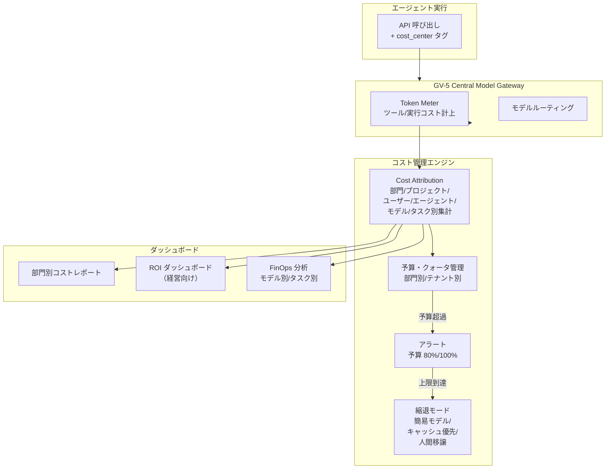

# GV-8 Cost Quota & Chargeback（コスト配賦）

## 概要

LLM のトークン消費・ツール呼び出し・実行コストを、部門・プロジェクト・ユーザー・エージェント・モデル・タスク種別の粒度で計測し、予算管理・上限設定・部門按分を行うパターンである。上限到達時は簡易モデルへの切り替え・キャッシュ活用・人間処理への縮退で制御する。「AI のコストがどこで発生しているか分からない」状態を解消し、経営向け ROI ダッシュボードで投資対効果を可視化する。

## 解決する企業課題

LLM コストは従来のインフラコストと異なり、利用量がリクエスト数・トークン数・エージェント呼び出し深度に依存して非線形に増加する。部門が自由に使うと月末に予想外の請求が発生し、どの部門・プロジェクト・エージェントが費用を生んでいるかが不明瞭になる。マルチエージェント構成では 1 つのユーザーリクエストが連鎖的に数百回の LLM 呼び出しを生む推論爆発が起きうる。また、顧客向け AI 機能を提供している企業では顧客別採算が把握できないとプライシング設計ができない。コストを「インフラ費」として一括管理するだけでは「高いコストをかけているが成果が出ていない」エージェントを見逃し、AI 投資全体の説明責任が果たせなくなる。

## 解決策と設計

すべての LLM 呼び出し・ツール実行に `cost_center`（部門コード・プロジェクト ID・テナント ID 等）を付与し、Central Model Gateway（GV-5）経由で計上する。コスト計測はトークン単価だけでなく、ツール実行費用・外部 API 呼び出し費用・ストレージ費用も含む。

上限到達時の縮退戦略は段階的に設計する。予算の 80% でアラートを送信し、100% に達すると簡易モデル（コスト小）へ切り替えるか、キャッシュ結果で代替するか、人間への移譲を促す。マルチエージェント構成では再帰呼び出しによる推論コストの爆発が起きやすいため、エージェント単位の実行コスト上限を設けることが重要である。

## 向き／不向き

**向いている条件**

- 数千人以上の規模でエージェントを運用しており、部門間のコスト按分が経営上の問題になっている組織。
- 顧客向けに AI 機能を有料提供しており、顧客別採算を把握する必要がある企業。
- マルチエージェント構成で推論コストの爆発リスクが高い環境。

**向いていない条件**

- 小規模 PoC・単一チーム。コスト計測の構築コストが価値を上回る段階では簡易モニタリングで十分。
- 月次コストが無視できるほど小さく、部門按分の必要がない場合。

## 要素技術・既存システム連携

- Token Meter：LLM プロバイダの usage レスポンス（prompt_tokens/completion_tokens）を取得し、単価と掛け合わせてコストを算出する。GV-5 の Central Model Gateway に組み込む形が標準的である。
- Cost Attribution：cost_center タグを軸に部門/プロジェクト/ユーザー/エージェント/モデル/タスク別にコストを集計するデータパイプライン。
- Budget/Quota 管理：部門・テナントごとに月次予算と実行上限を設定し、超過時のアクションを定義する。
- FinOps ツール：CloudCost・Apptio 等の FinOps ツールと連携し、AI コストを既存のインフラコスト管理に統合する。
- 組織グラフ（KM-3）：部門コード・プロジェクト・コストセンターのマッピングに組織グラフを活用する。按分ロジックの基準軸として機能する。
- BI ダッシュボード：Looker・Tableau・Power BI 等で部門別コスト・ROI・利用動向を可視化する。

## 落とし穴／選定の勘所

!!! warning "コストをインフラ費として扱い業務成果に紐づけない"
    LLM コストを「サーバー費と同じ変動コスト」として管理するだけでは、「高いコストをかけているが業務成果が出ていない」エージェントを見逃す。コストは GV-10（Two-Layer Value Measurement）と対にして使い、単位コストあたりの業務成果（処理件数削減・売上貢献）を把握することが重要である。

!!! danger "マルチエージェントの推論爆発を見落とす"
    単純な API 呼び出しコストしか監視していないと、マルチエージェントの再帰呼び出しによる数百倍のコスト爆発を検知できない。エージェント単位・実行セッション単位のコスト上限を設け、深度制限と組み合わせることが必須である。

!!! warning "縮退時のユーザー体験設計の欠落"
    予算上限に達してエージェントが突然動かなくなると、業務が止まり混乱を招く。縮退モードでは「現在は簡易モードで回答しています」等のメッセージを出すか、優先度の高い処理にのみリソースを割り当てるキューイングを実装する。

## 関連パターン

- [GV-5 Central Model Gateway（モデル・ベンダー統制）](gv5-central-model-gateway.md) — 補完：Gateway がコスト計測の計上点として機能する
- [GV-10 Two-Layer Value Measurement（生産性×経営KPI）](gv10-two-layer-value-measurement.md) — 対比：コストの分母と業務成果の分子を組み合わせてROIを示す
- [OB-1 Observability Lake（オブザーバビリティ基盤）](../ob-observability/ob1-observability-lake.md) — 補完：コスト計測データをオブザーバビリティ基盤に集約する
- [GV-1 Agent Control Plane（エージェント制御プレーン）](gv1-agent-control-plane.md) — 補完：エージェント単位のコスト予算をControl Planeの属性として管理する
