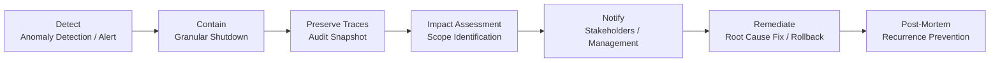

# GV-9 Incident Response & Kill Switch

## Overview

When an agent causes a problem in production, having only two options — "stop everything" or "do nothing" — is the worst possible state. This pattern pre-builds a Kill Switch capable of instantly stopping at the granularity of model, agent, tool, or tenant, along with a full incident response flow: detect → contain → preserve traces → assess impact → notify → remediate → post-mortem. "Can stop it, can investigate it, knows the scope" are the minimum requirements for production operation.

## Enterprise Problem Solved

When agents run in production, incidents will occur. Accidental transmission of confidential data, unauthorized manipulation via prompt injection, unintended data overwrites due to runaway tools, cost explosions — facing these with no way to stop them, no way to understand what happened, and no way to identify the scope of impact represents the greatest risk in embedding AI into core business operations. A design with only full shutdown capability means one agent's problem stops all AI across the enterprise. Organizations without granular stop capability are forced into a binary choice at incident time: shut everything down or leave it running.

!!! tip "Minimum Viable Requirements (MVP)"
    Prepare one Kill Switch that can instantly stop at the agent level (feature flag or Gateway blocklist), and write a Runbook covering stop → notify → root cause investigation. Granularity refinement and replay capabilities can be added later.

## Value Hypothesis

Instant shutdown and rapid recovery at failure time minimizes business downtime caused by agents. The existence of a safety net makes it possible to apply agents to higher-risk operations, expanding the scope of automation (= the total value generated).

## Solution and Design

Incident response proceeds through the following flow.



Design shutdown granularity as follows.

| Shutdown Granularity | Target | Example |
|---|---|---|
| Model | Block a specific model version | Quality degradation detected in new version |
| Agent | Stop a specific agent | Malfunctioning department agent |
| Tool | Disable a specific tool/MCP | Connector with leaked API key |
| Tenant | Stop a specific department/project | Department with cost explosion |
| Global | Emergency stop all agents | Critical security incident |

## Fit / Not a Fit

| Fit | Not a Fit |
|---|---|
| Required for all production AI | — |
| There are essentially no cases where this is not a fit | Kill Switch design cost is extremely small compared to operational risk |

## Component Technologies and System Integrations

- **Instant shutdown**: Kill Switch, Circuit Breaker
- **Operational procedures**: Runbooks (automatable procedures)
- **Evidence preservation**: Audit Snapshot, Event Store
- **Reproduction**: Replay Tool (reproducing past executions)
- **Access revocation**: Access Revocation (immediate expiration of tokens and keys)
- **Monitoring integration**: SIEM (Splunk / Sentinel), PagerDuty

## Pitfalls / Selection Considerations

!!! danger "Designing with Only Global Shutdown"
    Having only global shutdown means one agent's problem stops all AI across the enterprise. Design the system to allow granular stopping by model, agent, tool, and tenant.

- A Kill Switch is not useful just by "existing" — verify its operation through regular game-day exercises.
- Automate trace preservation during incidents. Manual response is too slow and evidence disappears.
- Feed post-mortem findings back into policies ([ID-7](../id-identity/id7-policy-as-code-guardrail.md)) and evaluation ([GV-7](gv7-evaluation-governance-pipeline.md)) to structurally prevent recurrence.

## Interfaces

The following are the key interfaces for implementing this pattern. Coding agents can generate stub code from these definitions.

```yaml
interfaces:
  - name: Granular Kill Switch
    description: "Feature flag or gateway blocklist enabling immediate stop at model, agent, tool, or tenant scope without affecting other dimensions."
    input:
      request: object
    output:
      response: object
    errors:
      - code: GENERAL_ERROR
        description: "Error occurred during Granular Kill Switch processing"
    protocol: "REST / gRPC"
    implementation_hints:
      - "See the Solution and Design section for details"
    code_examples:
      typescript: |
        interface GranularKillSwitchRequest {
          scope: string;
          scopeId: string;
          reason: string;
          operatorId: string;
        }
        interface GranularKillSwitchResponse {
          stopped: boolean;
          stoppedAt: Date;
          affectedRequests: number;
        }
        interface GranularKillSwitch {
          granularKillSwitch(req: GranularKillSwitchRequest): Promise<GranularKillSwitchResponse>;
        }
      python: |
        @dataclass
        class GranularKillSwitchRequest:
            scope: str
            scope_id: str
            reason: str
            operator_id: str
        
        @dataclass
        class GranularKillSwitchResponse:
            stopped: bool
            stopped_at: datetime
            affected_requests: int
        
        class GranularKillSwitch(Protocol):
            async def granular_kill_switch(self, req: GranularKillSwitchRequest) -> GranularKillSwitchResponse: ...
  - name: Trace Preservation
    description: "Automatically snapshots relevant audit and trace data at incident detection time before any remediation changes the evidence state."
    input:
      request: object
    output:
      response: object
    errors:
      - code: GENERAL_ERROR
        description: "Error occurred during Trace Preservation processing"
    protocol: "REST / gRPC"
    implementation_hints:
      - "See the Solution and Design section for details"
    code_examples:
      typescript: |
        interface TracePreservationRequest {
          incidentId: string;
          agentId: string;
          timeWindowStart: Date;
          timeWindowEnd: Date;
        }
        interface TracePreservationResponse {
          snapshotId: string;
          preservedAt: Date;
          traceCount: number;
        }
        interface TracePreservation {
          tracePreservation(req: TracePreservationRequest): Promise<TracePreservationResponse>;
        }
      python: |
        @dataclass
        class TracePreservationRequest:
            incident_id: str
            agent_id: str
            time_window_start: datetime
            time_window_end: datetime
        
        @dataclass
        class TracePreservationResponse:
            snapshot_id: str
            preserved_at: datetime
            trace_count: int
        
        class TracePreservation(Protocol):
            async def trace_preservation(self, req: TracePreservationRequest) -> TracePreservationResponse: ...
  - name: Incident Response Runbook
    description: "Pre-defined automation-ready runbook covering detect→contain→preserve→assess→notify→fix→postmortem; postmortem outputs feed back to ID-7 and GV-7."
    input:
      request: object
    output:
      response: object
    errors:
      - code: GENERAL_ERROR
        description: "Error occurred during Incident Response Runbook processing"
    protocol: "REST / gRPC"
    implementation_hints:
      - "See the Solution and Design section for details"
    code_examples:
      typescript: |
        interface IncidentResponseRunbookRequest {
          incidentId: string;
          severity: string;
          agentId: string;
        }
        interface IncidentResponseRunbookResponse {
          phase: string;
          actionsExecuted: string[];
          postmortemId: string;
        }
        interface IncidentResponseRunbook {
          incidentResponseRunbook(req: IncidentResponseRunbookRequest): Promise<IncidentResponseRunbookResponse>;
        }
      python: |
        @dataclass
        class IncidentResponseRunbookRequest:
            incident_id: str
            severity: str
            agent_id: str
        
        @dataclass
        class IncidentResponseRunbookResponse:
            phase: str
            actions_executed: list[str]
            postmortem_id: str
        
        class IncidentResponseRunbook(Protocol):
            async def incident_response_runbook(self, req: IncidentResponseRunbookRequest) -> IncidentResponseRunbookResponse: ...
```

## Related Patterns

- [GV-1 Agent Control Plane](gv1-agent-control-plane.md) — Complement: handles permission management for per-agent shutdown control
- [GV-5 Central Model Gateway](gv5-central-model-gateway.md) — Complement: executes model-level blocking at the Gateway
- [OB-1 Observability Lake](../ob-observability/ob1-observability-lake.md) — Complement: accumulates trace data needed for failure investigation
- [OB-2 Unified Audit & Lineage](../ob-observability/ob2-unified-audit-lineage.md) — Complement: used for impact scope identification and replay during incidents
- [GV-6 Version Registry](gv6-version-registry.md) — Complement: used to identify rollback target versions and perform reversion
