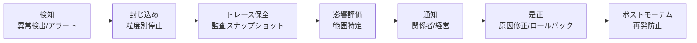

# GV-9 Incident Response & Kill Switch（事故対応・停止）

## 概要

誤送信・漏洩・誤更新・コスト暴走・インジェクション・ツール暴走に備えた検知・停止・調査・復旧の仕組み。粒度別（モデル/エージェント/ツール/テナント）に即座に止められることが必須である。

## 解決する企業課題

エージェントが本番で稼働すると、必ずインシデントは発生する。機密データの誤送信、プロンプトインジェクションによる不正操作、ツール暴走による意図しないデータ書き換え、コスト暴走——これらに対して「止められない」「何が起きたか分からない」「影響範囲を特定できない」という状態は、AI を企業の中核業務に持ち込む際の最大リスクである。全体停止しかできない設計では、1 つのエージェントの問題で全社の AI が止まる。粒度別に止められる構造を持たない組織は、インシデント時に「全停止か放置か」の二択を迫られる。

## 解決策と設計

インシデント対応は以下のフローで進行する。

停止の粒度は以下のように設計する。

| 停止粒度 | 対象 | 例 |
|---|---|---|
| モデル | 特定モデル版の遮断 | 新版で品質劣化が発覚 |
| エージェント | 特定エージェントの停止 | 誤動作する部門エージェント |
| ツール | 特定ツール/MCP の無効化 | APIキー漏洩したコネクタ |
| テナント | 特定部門/プロジェクトの停止 | コスト暴走した部門 |
| 全体 | 全エージェントの緊急停止 | 重大セキュリティインシデント |

## 向き／不向き

| 向き | 不向き |
|---|---|
| 本番 AI 全般に必須 | — |
| 不向きなケースは基本的にない | Kill Switch の設計コストは運用リスクに比べ極めて小さい |

## 要素技術・既存システム連携

- **即時停止**：Kill Switch、Circuit Breaker
- **運用手順**：Runbook（自動化可能な手順）
- **証跡保全**：Audit Snapshot、Event Store
- **再現**：Replay Tool（過去実行の再現）
- **アクセス失効**：Access Revocation（トークン・キーの即時失効）
- **監視連携**：SIEM（Splunk/Sentinel）、PagerDuty

## 落とし穴／選定の勘所

!!! danger "全体停止しかできない設計"
    全体停止しかできないと、1つのエージェントの問題で全社の AI が止まる。粒度別（モデル/エージェント/ツール/テナント）に止められるよう設計する。

- Kill Switch は「ある」だけでなく、定期的に訓練（ゲームデー）で動作確認する。
- インシデント時のトレース保全を自動化する。手動では遅れて証跡が消える。
- ポストモーテムの結果をポリシー（[ID-7](../id-identity/id7-policy-as-code-guardrail.md)）や評価（[GV-7](gv7-evaluation-governance-pipeline.md)）にフィードバックし、再発を構造的に防ぐ。

## 関連パターン

- [GV-1 Agent Control Plane](gv1-agent-control-plane.md) — 補完：エージェント単位の停止制御の権限管理を担う
- [GV-5 Central Model Gateway](gv5-central-model-gateway.md) — 補完：モデル単位の遮断をGatewayで実行する
- [OB-1 Observability Lake](../ob-observability/ob1-observability-lake.md) — 補完：障害調査に必要なトレースデータを蓄積する
- [OB-2 Unified Audit & Lineage](../ob-observability/ob2-unified-audit-lineage.md) — 補完：インシデント時の影響範囲特定とリプレイに使う
- [GV-6 Version Registry](gv6-version-registry.md) — 補完：ロールバック先バージョンの特定と切り戻しに使う
