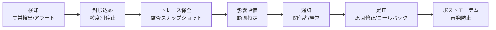

# GV-9 Incident Response & Kill Switch（事故対応・停止）

## 概要

エージェントが本番で問題を起こしたとき、「全部止めるか放っておくか」の二択しかないのは最悪の状態である。このパターンは、モデル・エージェント・ツール・テナントの粒度で即座に停止できる Kill Switch と、検知→封じ込め→トレース保全→影響評価→通知→是正→ポストモーテムという一連のインシデント対応フローを事前に整備する。「止められる・調べられる・影響範囲が分かる」が本番運用の最低条件である。

## 解決する企業課題

エージェントが本番で稼働すると、インシデントは必ず発生する。機密データの誤送信、プロンプトインジェクションによる不正操作、ツール暴走による意図しないデータ書き換え、コスト暴走——こうした事態に対して「止められない」「何が起きたか分からない」「影響範囲を特定できない」という状態は、AI を企業の中核業務に組み込む際の最大リスクだ。全体停止しかできない設計では、1 つのエージェントの問題で全社の AI が止まる。粒度別に止められる構造を持たない組織は、インシデント時に「全停止か放置か」の二択しか取れなくなる。

!!! tip "最小成立条件（MVP）"
    エージェント単位で即時停止できる Kill Switch（フィーチャーフラグ or Gateway のブロックリスト）を1つ用意し、停止→通知→原因調査の Runbook を書く。粒度の細分化やリプレイ機能は後から追加できる。

## 価値仮説

障害時の即時停止と迅速復旧により、エージェント起因の業務損失時間を最小化する。安全網の存在が高リスク業務への適用拡大を可能にし、自動化対象範囲（＝価値の総量）を広げる。

## 解決策と設計

インシデント対応は以下のフローで進行する。



停止の粒度は以下のように設計する。

| 停止粒度 | 対象 | 例 |
|---|---|---|
| モデル | 特定モデル版の遮断 | 新版で品質劣化が発覚 |
| エージェント | 特定エージェントの停止 | 誤動作する部門エージェント |
| ツール | 特定ツール/MCP の無効化 | APIキー漏洩したコネクタ |
| テナント | 特定部門/プロジェクトの停止 | コスト暴走した部門 |
| 全体 | 全エージェントの緊急停止 | 重大セキュリティインシデント |

## 向き／不向き

| 向き | 不向き |
|---|---|
| 本番 AI 全般に必須 | — |
| 不向きなケースは基本的にない | Kill Switch の設計コストは運用リスクに比べ極めて小さい |

## 要素技術・既存システム連携

- **即時停止**：Kill Switch、Circuit Breaker
- **運用手順**：Runbook（自動化可能な手順）
- **証跡保全**：Audit Snapshot、Event Store
- **再現**：Replay Tool（過去実行の再現）
- **アクセス失効**：Access Revocation（トークン・キーの即時失効）
- **監視連携**：SIEM（Splunk/Sentinel）、PagerDuty

## 落とし穴／選定の勘所

!!! danger "全体停止しかできない設計"
    全体停止しかできないと、1つのエージェントの問題で全社の AI が止まる。粒度別（モデル/エージェント/ツール/テナント）に止められるよう設計する。

- Kill Switch は「ある」だけでなく、定期的なゲームデーで実際の動作を確認する。
- インシデント時のトレース保全は自動化しておく。手動対応では遅れて証跡が消えることがある。
- ポストモーテムの結果をポリシー（[ID-7](../id-identity/id7-policy-as-code-guardrail.md)）や評価（[GV-7](gv7-evaluation-governance-pipeline.md)）にフィードバックし、再発を構造的に防ぐ。

## Interfaces

以下はこのパターンを実装する際の主要インターフェイスである。コーディングエージェントはこの定義からスタブコードを生成できる。

```yaml
interfaces:
  - name: Granular Kill Switch
    description: "Feature flag or gateway blocklist enabling immediate stop at model, agent, tool, or tenant scope without affecting other dimensions."
    input:
      request: object
    output:
      response: object
    errors:
      - code: GENERAL_ERROR
        description: "Granular Kill Switch の処理中にエラーが発生"
    protocol: "REST / gRPC"
    implementation_hints:
      - "詳細は本文の「解決策と設計」節を参照"
    code_examples:
      typescript: |
        interface GranularKillSwitchRequest {
          scope: string;
          scopeId: string;
          reason: string;
          operatorId: string;
        }
        interface GranularKillSwitchResponse {
          stopped: boolean;
          stoppedAt: Date;
          affectedRequests: number;
        }
        interface GranularKillSwitch {
          granularKillSwitch(req: GranularKillSwitchRequest): Promise<GranularKillSwitchResponse>;
        }
      python: |
        @dataclass
        class GranularKillSwitchRequest:
            scope: str
            scope_id: str
            reason: str
            operator_id: str
        
        @dataclass
        class GranularKillSwitchResponse:
            stopped: bool
            stopped_at: datetime
            affected_requests: int
        
        class GranularKillSwitch(Protocol):
            async def granular_kill_switch(self, req: GranularKillSwitchRequest) -> GranularKillSwitchResponse: ...
  - name: Trace Preservation
    description: "Automatically snapshots relevant audit and trace data at incident detection time before any remediation changes the evidence state."
    input:
      request: object
    output:
      response: object
    errors:
      - code: GENERAL_ERROR
        description: "Trace Preservation の処理中にエラーが発生"
    protocol: "REST / gRPC"
    implementation_hints:
      - "詳細は本文の「解決策と設計」節を参照"
    code_examples:
      typescript: |
        interface TracePreservationRequest {
          incidentId: string;
          agentId: string;
          timeWindowStart: Date;
          timeWindowEnd: Date;
        }
        interface TracePreservationResponse {
          snapshotId: string;
          preservedAt: Date;
          traceCount: number;
        }
        interface TracePreservation {
          tracePreservation(req: TracePreservationRequest): Promise<TracePreservationResponse>;
        }
      python: |
        @dataclass
        class TracePreservationRequest:
            incident_id: str
            agent_id: str
            time_window_start: datetime
            time_window_end: datetime
        
        @dataclass
        class TracePreservationResponse:
            snapshot_id: str
            preserved_at: datetime
            trace_count: int
        
        class TracePreservation(Protocol):
            async def trace_preservation(self, req: TracePreservationRequest) -> TracePreservationResponse: ...
  - name: Incident Response Runbook
    description: "Pre-defined automation-ready runbook covering detect→contain→preserve→assess→notify→fix→postmortem; postmortem outputs feed back to ID-7 and GV-7."
    input:
      request: object
    output:
      response: object
    errors:
      - code: GENERAL_ERROR
        description: "Incident Response Runbook の処理中にエラーが発生"
    protocol: "REST / gRPC"
    implementation_hints:
      - "詳細は本文の「解決策と設計」節を参照"
    code_examples:
      typescript: |
        interface IncidentResponseRunbookRequest {
          incidentId: string;
          severity: string;
          agentId: string;
        }
        interface IncidentResponseRunbookResponse {
          phase: string;
          actionsExecuted: string[];
          postmortemId: string;
        }
        interface IncidentResponseRunbook {
          incidentResponseRunbook(req: IncidentResponseRunbookRequest): Promise<IncidentResponseRunbookResponse>;
        }
      python: |
        @dataclass
        class IncidentResponseRunbookRequest:
            incident_id: str
            severity: str
            agent_id: str
        
        @dataclass
        class IncidentResponseRunbookResponse:
            phase: str
            actions_executed: list[str]
            postmortem_id: str
        
        class IncidentResponseRunbook(Protocol):
            async def incident_response_runbook(self, req: IncidentResponseRunbookRequest) -> IncidentResponseRunbookResponse: ...
```

## 関連パターン

- [GV-1 Agent Control Plane](gv1-agent-control-plane.md) — 補完：エージェント単位の停止制御の権限管理を担う
- [GV-5 Central Model Gateway](gv5-central-model-gateway.md) — 補完：モデル単位の遮断をGatewayで実行する
- [OB-1 Observability Lake](../ob-observability/ob1-observability-lake.md) — 補完：障害調査に必要なトレースデータを蓄積する
- [OB-2 Unified Audit & Lineage](../ob-observability/ob2-unified-audit-lineage.md) — 補完：インシデント時の影響範囲特定とリプレイに使う
- [GV-6 Version Registry](gv6-version-registry.md) — 補完：ロールバック先バージョンの特定と切り戻しに使う
