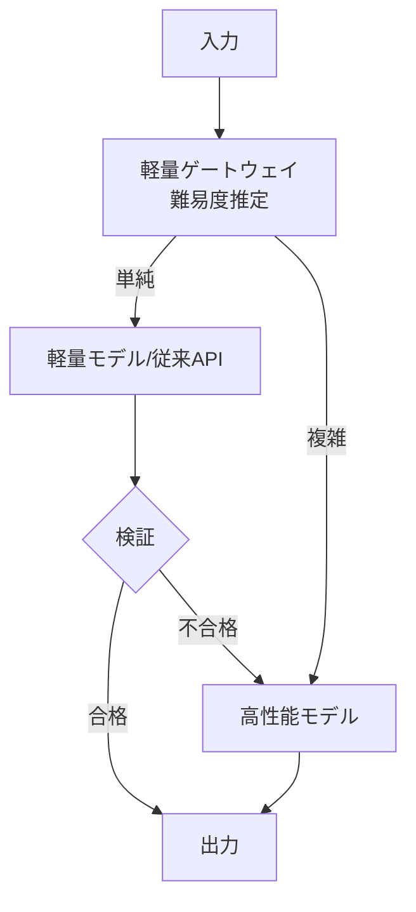

# H-1 Cost-Aware Model Router（コスト考慮モデルルーター／カスケード）

## 概要

タスクの難易度・リスク・予算に応じてモデルを動的選択し、失敗時のみ上位モデルへエスカレーション（カスケード）する。

## 設計

軽量ゲートウェイが入力を分類（難易度推定・キャッシュヒット判定）し、適切なモデル層へルーティングする。低信頼/検証不合格時は上位へescalateする。大半を安価層で捌き、難問のみ高コスト層へ。

## 解決する課題

- 全リクエスト最上位モデル処理の過剰コストと過剰遅延
- ベンダーロックイン
- 新モデル移行時のA/B比較

## ユースケース

- カスタマーサポート
- 社内FAQ
- 難易度のばらつきが大きいシステム
- 大量の分類/抽出/要約

## 向き

リクエスト難易度の分布が広いサービスに適する。

## 不向き

常に最高水準の推論が要る専門特化システムや、難易度判定自体が困難な領域には不向きである。

## 要素技術

- **ルーター**：RouteLLM等
- **分類**：難易度分類器
- **抽象化**：LiteLLM、OpenRouter
- **品質指標**：confidence score
- **フォールバック**：fallback chain

## 関連パターン

- [H-4 Graceful Degradation & Fallback](h4-graceful-degradation.md) — 障害時のフォールバック
- [A-5 Time-Budgeted Agent Loop](../a-execution/a5-time-budgeted-loop.md) — コスト予算との連携
- [B-4 Agent Ensemble & Debate](../b-composition/b4-ensemble-debate.md) — 難問にN数を増やす適応制御
- [J-2 Model Behavior Compatibility Layer](../j-abstraction/j2-model-compatibility-layer.md) — モデル間の互換性吸収
