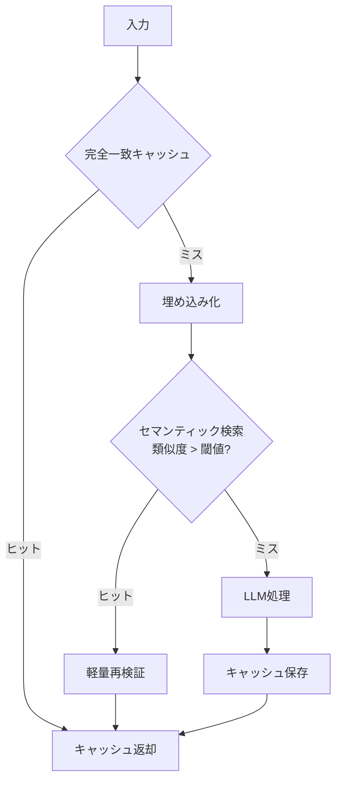

# H-2 Semantic Result Cache（セマンティック結果キャッシュ）

## 概要

完全一致でなく意味的に近いリクエストの結果を再利用してLLM/検索/ツール処理を省く。

## 設計

入力を埋め込み化しベクトルストアで類似検索する。閾値超なら過去回答を返す（必要なら軽量再検証）。完全一致キャッシュを一次、セマンティックを二次に置く多層構成とする。TTL・無効化でキャッシュ汚染を防ぐ。

## 解決する課題

- 高コスト・高レイテンシのLLM処理
- レート制限
- よくある質問への過剰処理

## ユースケース

- FAQ・社内問い合わせ
- 技術サポート
- レポート生成

## 向き

質問分布に偏りがある用途に適する。

## 不向き

最新性・個別性・厳密性が重要な処理や、再利用率が低い一意なリクエストには不向きである。

## 要素技術

- **埋め込み**：埋め込みモデル
- **ベクトルDB**：pgvector、Redis、Qdrant、Pinecone
- **キャッシュフレームワーク**：GPTCache
- **制御**：TTL、無効化、cache validation

## 関連パターン

- [H-3 Prompt-Cache Optimized Context](h3-prompt-cache-context.md) — プロンプトレベルのキャッシュ最適化
- [H-1 Cost-Aware Model Router](h1-cost-aware-router.md) — キャッシュヒット判定とルーティングの統合
- [H-4 Graceful Degradation & Fallback](h4-graceful-degradation.md) — キャッシュがフォールバック先にもなる
- [A-5 Time-Budgeted Agent Loop](../a-execution/a5-time-budgeted-loop.md) — コスト予算との連携
