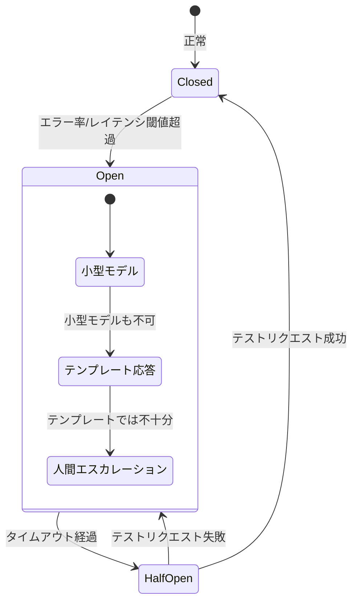

# H-4 Graceful Degradation & Fallback（縮退・フォールバック）

## 概要

LLMプロバイダ障害・高負荷・予算超過時に段階的に機能を落としてサービスを継続する。サーキットブレーカーで切替を自動化する。

## 設計

LLM呼び出しをサーキットブレーカーで包み、エラー率/レイテンシ閾値で回路を開く。縮退は段階的に行う。

1. 高性能モデル不可 → 小型モデルへフォールバック
2. 生成不可 → テンプレート応答へ
3. ツール不可 → 人間エスカレーション
4. RAG不可 → 検索リンク提示

半開状態で復旧を確認し、正常時は回路を閉じる。機能ごとにレート枠/プールを分離（bulkhead）し、一機能の障害が他機能へ波及することを防ぐ。

## 解決する課題

以下のエージェント特性に応える。

- 単一プロバイダ障害による即停止リスク
- レート制限による処理停滞
- コスト上限への巻き込まれ
- 輻輳の連鎖（cascading failure）

外部LLMへの依存という「可用性が不安定」な特性を、設計レベルで吸収する。

## ユースケース

- 顧客向けSaaS
- 24/7稼働の社内AI
- ミッションクリティカル補助機能

## 向き

可用性SLAを約束するサービスに適する。LLMが停止しても最低限の応答を継続する必要がある場面で効果が高い。

## 不向き

品質低下が一切許されない処理には不向きである。そのような場合はフォールバックよりエラー返却が誠実な選択となる。

## 要素技術

- **複数プロバイダ抽象**：LiteLLM、OpenRouter
- **レジリエンスライブラリ**：Resilience4j、Polly
- **フォールバックモデル**：小型モデル、テンプレートエンジン
- **レート制限**：rate limiter
- **バックプレッシャー**：queue backpressure、指数バックオフ＋ジッタ

## 関連パターン

- [A-1 Request-to-Job Gateway](../a-execution/a1-request-to-job-gateway.md) — 非同期化によりフォールバックの猶予を確保する
- [H-1 Cost-Aware Model Router](h1-cost-aware-router.md) — モデル選択とカスケードの仕組み
- [A-5 Time-Budgeted Agent Loop](../a-execution/a5-time-budgeted-loop.md) — 予算超過時の分岐先としてフォールバックを使う
- [K-3 Agent-to-Human Escalation](../k-human/k3-human-escalation.md) — 最終段のエスカレーション先
