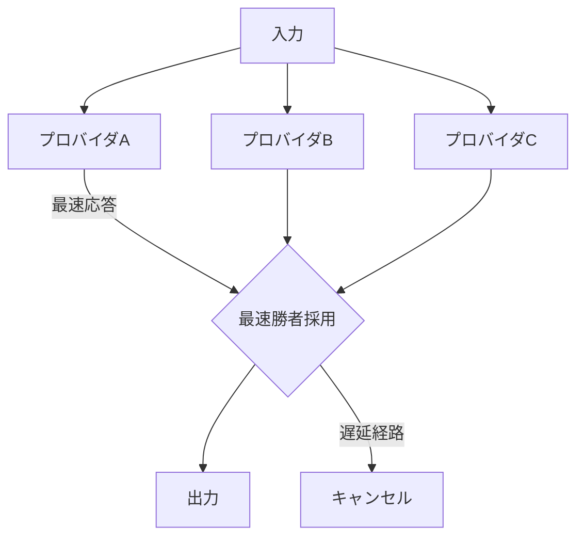

# H-5 Speculative / Hedged Execution（投機・ヘッジ実行）

## 概要

複数の処理経路を投機的に並列起動し、最初に成功した（または最良の）結果を採用する。レイテンシをコストで買う。

## 設計

複数プロバイダへ同時投入し最速応答を採用（hedged request）する。または複数解法を並列に試行する。コストがN倍になるため、レイテンシがクリティカルな箇所に限定する。遅延した経路はタイムアウト連動でキャンセルする。

## 解決する課題

- テールレイテンシ（遅いプロバイダ応答）
- 可用性の向上

## ユースケース

- レイテンシ厳守のリアルタイムUI
- 可用性最優先の重要パス

## 向き

レイテンシ価値がコスト増を上回るクリティカルパスに適する。

## 不向き

コスト最優先の大量バッチには不向きである（無駄なN倍課金）。

## 要素技術

- **実行方式**：hedged request
- **制御**：並列実行、最速勝者採用
- **効率化**：タイムアウト連動キャンセル、deadline propagation

## 関連パターン

- [H-4 Graceful Degradation & Fallback](h4-graceful-degradation.md) — 可用性向上の別アプローチ
- [H-1 Cost-Aware Model Router](h1-cost-aware-router.md) — コスト考慮のルーティング
- [B-4 Agent Ensemble & Debate](../b-composition/b4-ensemble-debate.md) — 品質のための並列実行
- [A-5 Time-Budgeted Agent Loop](../a-execution/a5-time-budgeted-loop.md) — N倍コストの予算制約
