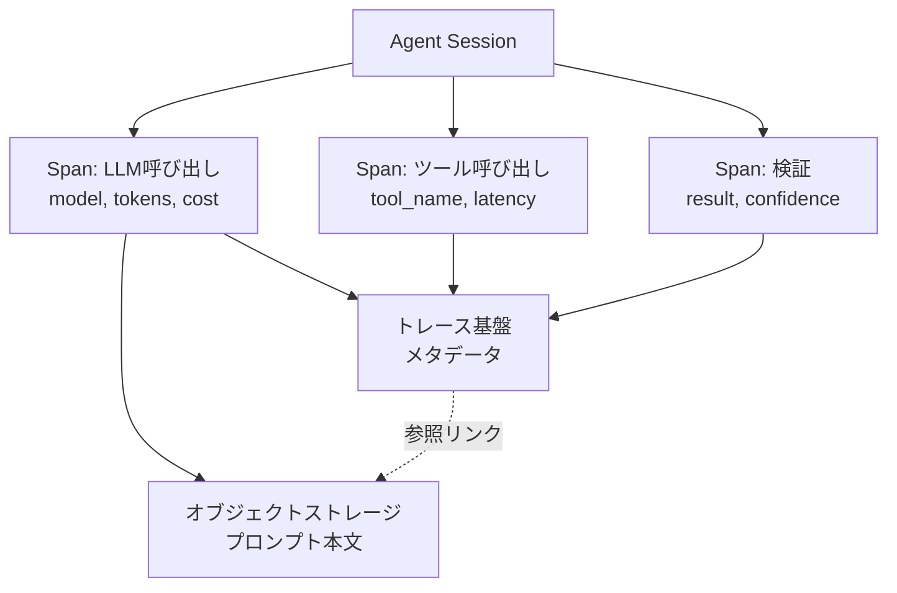

# I-1 Agent Trace & Observability（トレース・可観測性）

## 概要

各ステップ・LLM呼び出し・ツール呼び出し・判断・エラーをspanツリーとして記録する。

## 設計

以下の情報をトレースとして記録する。

- `agent_session_id`、`trace_id`、`span_id`
- `model`、`prompt_version`
- `tool_name`
- `latency`、`tokens`、`cost`
- `input_hash`、`output_hash`

エラー率・コスト・レイテンシ・品質をダッシュボード化しアラートを設定する。

全プロンプト本文はログ基盤でなくオブジェクトストレージへ退避し、参照リンクで紐づける。これにより、ログ基盤のサイズ・コスト・PIIリスクを抑えつつ、必要時に本文を参照できる。プロンプト保存の程度は[「程度」の選定基準](../../selection/degree-criteria.md)のログ粒度を参照。

トレースはevaluation（I-2）やリプレイ（I-3）の素材となる。記録がなければ評価も再現もできない。

## 解決する課題

以下のエージェント特性に応える。

- ブラックボックス化（「なぜその判断か」が不明）
- 「どこで失敗・課金されたか」の特定困難
- インシデント原因究明
- 説明責任（なぜそうしたか）の担保

## ユースケース

本番エージェント全般に適用する。トレースは運用の基盤であり、特定のユースケースに限定されない。

## 向き

すべての本番運用に適する。トレースのないエージェントの本番運用は避けるべきである。

## 不向き

基本的にない。機密情報はhash化・redactionで対応する。

## 要素技術

- **トレース標準**：OpenTelemetry（GenAI semantic conventions）
- **エージェント観測基盤**：LangSmith、Langfuse、Arize Phoenix
- **汎用観測基盤**：Datadog、CloudWatch
- **ストレージ**：trace store、object storage
- **プライバシー**：redaction

## 関連パターン

- [I-2 Evaluation CI/CD](i2-evaluation-cicd.md) — トレースをevalの素材として活用する
- [I-3 Production Replay](i3-production-replay.md) — トレースをリプレイの素材として活用する
- [I-4 Version Pinning & Change Management](i4-version-pinning.md) — 各実行に版情報を記録する
- [A-2 Durable Agent Session](../a-execution/a2-durable-session.md) — セッション状態とトレースの統合
