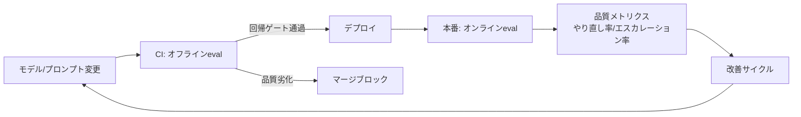

# I-2 Evaluation CI/CD（評価CI/CD）

## 概要

品質をテストでなく継続的評価（eval）として、CIと本番の双方で測り続ける。

## 設計

評価を2層で構成する。

**オフラインeval（CI）**：ユースケース別ゴールデンデータセットに対し、完全一致でなくルーブリック採点・LLM-as-Judge・特性アサーションで評価する。モデル/プロンプト/ツール/RAG変更時の回帰ゲートとして機能する。

**オンラインeval（本番）**：サンプリング採点・ユーザーフィードバック・やり直し率・エスカレーション率を計測する。

## 解決する課題

以下のエージェント特性に応える。

- 非決定論ゆえ通常の単体テストで品質劣化・挙動変化を検出できない
- モデル/プロンプト変更の影響を事前評価する手段の欠如

## ユースケース

- 継続改善する本番AI全般

## 向き

品質責任を負うチームに適する。CIにevalを組み込むことで、品質劣化をデプロイ前に検知できる。

## 不向き

評価基準が定義困難な探索的PoC初期には過剰である。まず手動評価で品質感を掴むのが先決。

## 要素技術

- **評価データ**：golden dataset
- **評価手法**：LLM-as-a-judge、scenario/regression eval
- **評価ツール**：promptfoo、DeepEval、Braintrust、LangSmith
- **CI/CD統合**：CI/CD pipeline

## 関連パターン

- [I-1 Agent Trace & Observability](i1-trace-observability.md) — トレースがevalの素材になる
- [I-3 Production Replay](i3-production-replay.md) — 本番ログを使ったオフラインeval
- [I-4 Version Pinning & Change Management](i4-version-pinning.md) — 変更のカナリアリリースと連携
- [F-3 Verifier Agent](../f-reliability/f3-verifier-agent.md) — リアルタイム検証との違い
