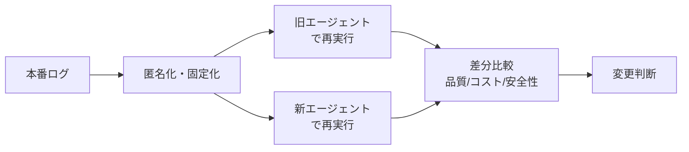

# I-3 Production Replay（本番リプレイ／差分テスト）

## 概要

本番ログを匿名化・固定化し、モデル/プロンプト変更時に新旧で再実行して差分比較する。

## 設計

実リクエスト・取得コンテキスト・ツール結果を匿名化保存し、新旧エージェントでreplayする。品質・コスト・レイテンシ・安全性で差分評価する。event sourcing（A-2）と組み合わせると任意時点へ巻き戻せる。

## 解決する課題

開発データでは再現できない本番の曖昧さ・ノイズ・攻撃・例外を再現する。

## ユースケース

- 大規模SaaS
- 顧客サポート
- 社内AI基盤

## 向き

トラフィックが多くログを活用できる運用に適する。

## 不向き

ログ保存が規制上難しい場合には匿名化が前提となる。

## 要素技術

- **匿名化**：log redaction
- **再実行**：replay harness
- **評価**：shadow evaluation、differential testing
- **ストレージ**：event store

## 関連パターン

- [I-1 Agent Trace & Observability](i1-trace-observability.md) — リプレイの素材となるトレース
- [I-2 Evaluation CI/CD](i2-evaluation-cicd.md) — リプレイ結果のevalへの統合
- [A-2 Durable Agent Session](../a-execution/a2-durable-session.md) — event sourcingとの連携
- [I-4 Version Pinning & Change Management](i4-version-pinning.md) — 版変更の差分検証
