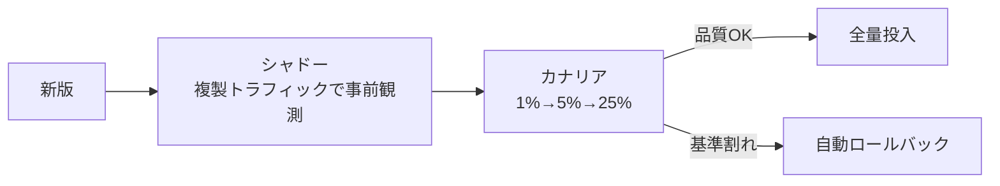

# I-4 Version Pinning & Change Management（版固定・カナリア）

## 概要

プロンプト・モデル・ツール・スキーマ・ポリシー・RAG indexをバージョン管理し、変更をPR・eval・カナリア・ロールバックの対象にする。「デプロイ＝挙動変更」をWebデプロイ並みの規律で扱う。

## 設計

各実行に以下の版情報を記録する。

- `prompt_version`
- `model_version`
- `tool_schema_version`
- `policy_version`
- `retriever_version`

新版はシャドー → カナリア → 全量の段階で投入する。

カナリアの各段で品質・コスト・エラー率を監視し、基準割れで自動ロールバックする。プロバイダ側のサイレントなモデル更新も検知対象となる。

## 解決する課題

以下のエージェント特性に応える。

- 小さなプロンプト変更でも挙動が大きく変わる
- プロバイダ側のサイレントなモデル更新
- LLM差し替えで挙動が変わる

## ユースケース

- 監査が必要な業務
- 継続改善するSaaS機能

## 向き

成熟した運用、十分なトラフィックがある環境に適する。変更の影響を統計的に検証できるだけのリクエスト量が必要である。

## 不向き

トラフィックが少なくカナリアの統計的有意性が出ない小規模には不向きである。その場合はオフラインeval（I-2）を重視する。

## 要素技術

- **レジストリ**：prompt/model/schema registry
- **制御**：feature flag
- **バージョニング**：semantic versioning、GitOps
- **デプロイ**：A/B基盤、自動ロールバック

## 関連パターン

- [I-1 Agent Trace & Observability](i1-trace-observability.md) — 版情報をトレースに記録する
- [I-2 Evaluation CI/CD](i2-evaluation-cicd.md) — カナリア前のオフラインevalゲート
- [I-3 Production Replay](i3-production-replay.md) — 新旧版の差分比較にリプレイを使う
- [L-1 Shadow Mode & Progressive Autonomy](../l-adoption/l1-shadow-progressive-autonomy.md) — シャドーモードの活用
