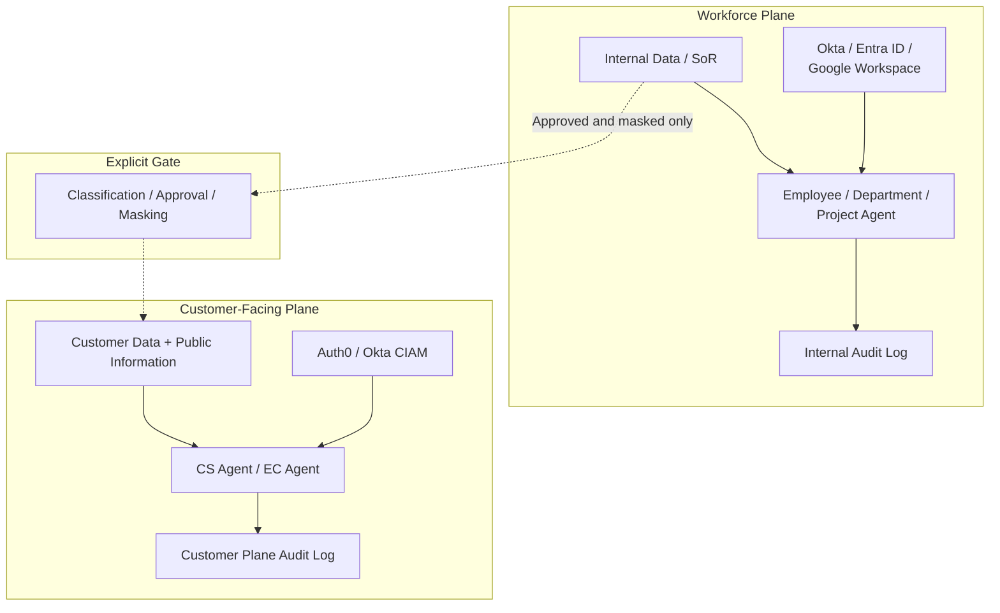

# ID-1 Workforce/Customer Dual-Plane Separation

## Overview

Internal AI and customer-facing AI may look similar on the surface, but the data each is permitted to touch is entirely different. Internal agents can access HR records and unpublished deals; if the same agent is repurposed for customer channels, it can expose internal data to customers — one of the most severe incident categories imaginable. This pattern physically separates the workforce plane and the customer plane across every dimension — IdP, data, execution environment, and audit trail — and eliminates leakage by making internal data structurally unreachable from the customer plane. Cross-plane data movement defaults to zero; when necessary, data passes through an explicit gate (classification, approval, masking).

## Business Problem

When enterprises adopt AI agents, the temptation to repurpose an internal AI for customer-facing channels is strong. It looks rational from a cost and development speed perspective — but that decision opens the most dangerous leakage path of all.

Workforce-plane agents are designed with access to internal knowledge bases, HR records, unpublished deal information, and internal metrics. When such an agent is repurposed for customer channels, prompt injection or unintended context leakage can allow internal data to reach customers. The reverse direction — customer data mixing into a workforce agent's reasoning — is equally severe.

In multi-tenant customer environments there is also the risk of "tenant contamination," where one customer's inquiry context leaks into another customer's session. For B2B SaaS companies, this is legally and contractually catastrophic.

This pattern addresses three enterprise problems:

- Eliminating the structural risk of internal data and reasoning leaking into customer channels
- Preventing reverse leakage where customer data mixes into workforce-agent reasoning
- Structurally blocking tenant contamination between customers in multi-tenant environments

!!! tip "Minimum Viable Implementation"
    Physically separate the IdP and data store between the workforce and customer planes, and set network reachability between the planes to zero. The explicit gate can come later; establish the separation on day one.

## Value Hypothesis

Separating the customer plane from the workforce plane allows each to evolve independently toward its optimal agent experience. The customer plane can pursue CX improvements that drive revenue while the workforce plane simultaneously drives operational efficiency.

## Solution and Design

The solution is straightforward. Start with separation as the design principle, and define cross-plane data flow as "zero by default, exceptions via explicit gate only."

The workforce plane and the customer plane are divided by a trust boundary, each with its own independent IdP, data store, agent fleet, and audit path. Cross-plane data movement is permitted only through the explicit gate (classification, approval, masking).

Design constraints for the customer plane:

- Access is limited to the customer's own data and publicly available information
- Internal reasoning processes are never exposed to customers
- High-risk situations trigger a human handoff
- Tenant isolation prevents one customer's inquiry context from reaching another customer

## Applicability

| Good Fit | Poor Fit |
|---|---|
| Any business with customer-facing touchpoints (CS/EC/support) | Internal-only deployments with no customer plane |
| B2B/B2C where separating customer and internal data is mandatory | Fully closed internal tooling with no external exposure |
| Multi-tenant B2B SaaS where cross-customer contamination is catastrophic | Early PoC stage where designing dual-plane separation is cost-prohibitive |

## Technology and Integration

- **Workforce IdP**: Okta, Entra ID, Google Workspace
- **Customer IdP (CIAM)**: Auth0, Okta Customer Identity
- **Tenant isolation**: Tenant Isolation, Namespace separation
- **Customer-plane SaaS**: Shopify, Zendesk, Salesforce Service Cloud
- **Safety mechanisms**: Output Guardrail, PII Filter, Human Handoff
- **Explicit gate integration**: [KM-6 DLP & Redaction Boundary](../km-knowledge/km6-dlp-redaction-boundary.md) for masking during cross-plane data movement

## Pitfalls and Selection Criteria

!!! danger "Never Repurpose Internal AI for Customer Channels"
    Exposing part of the internal AI as-is to a customer audience is the most dangerous anti-pattern. The customer plane must be designed as an independent boundary from the start.

- Cross-plane data flow defaults to "non-existent." When needed, route it through the explicit gate and apply data classification, approval, and masking before allowing any movement.
- Ensure agents on the customer plane cannot access internal tools, MCPs, or RAG indexes at the network and execution-environment level. Application-layer flags alone are insufficient.
- Tenant isolation for individual customers prevents one customer's inquiry context from leaking into another's. Always verify session management and context boundary implementations during architecture review.
- Audit logs must also be separated by plane. Mixing workforce and customer audit logs contaminates the evidence trail during incident investigations.

## Related Patterns

- [ID-2 Identity Federation & OBO](id2-identity-federation-obo.md) — Separate IdP federation and delegation per plane (**complementary**: implement per-plane authentication and delegation on the foundation of dual-plane separation)
- [ID-6 Zero-Trust PDP/PEP](id6-zero-trust-pdp-pep.md) — Enforce plane boundaries via PEP (**complementary**: verify the separated boundary at runtime using zero-trust)
- [KM-6 DLP & Redaction Boundary](../km-knowledge/km6-dlp-redaction-boundary.md) — Masking for cross-plane data movement (**complementary**: apply DLP as the implementation of the explicit gate)
- [EX-1 Enterprise Agent Gateway](../ex-experience/ex1-enterprise-agent-gateway.md) — Separate workforce/customer channels at the entry point (**complementary**: the unified gateway enforces dual-plane separation at the entry layer)
