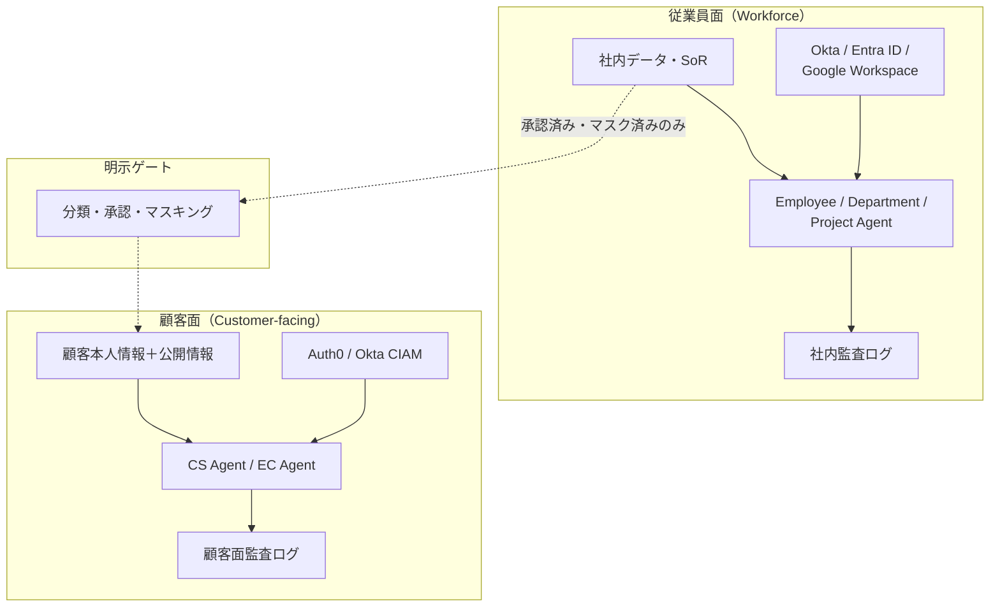

# ID-1 Workforce/Customer 二面分離

## 概要

従業員向けと顧客向けで、IdP・データ・エージェント・実行環境・監査を物理的・論理的に完全分離する。最重大の漏洩クラス——顧客向けが社内データに到達する、またはその逆——を構造的に排除する設計原則である。

## 設計

従業員面と顧客面は信頼境界で分断し、それぞれ独立した IdP・データストア・エージェント群・監査経路を持つ。面をまたぐデータ移動は明示ゲート（分類・承認・マスキング）でのみ許可する。

顧客面の設計制約は以下のとおりである。

- 顧客本人の情報＋公開情報のみアクセス可能
- 社内推論過程を顧客に露出しない
- 高リスク時は人間エージェントへ移譲（Human Handoff）
- 別顧客情報の混入を防ぐテナント分離

## 解決する企業課題

顧客向けが社内データに到達する（逆も）という最重大の漏洩クラスを構造的に排除する。また、別顧客情報の混入防止もこのパターンの範囲である。

## 向き／不向き

| 向き | 不向き |
|---|---|
| 顧客接点を持つ全企業（CS/EC/サポート） | 社内専用のみで顧客面が存在しない場合（片面で足りる） |
| B2B/B2C で顧客データと社内データの分離が必須 | 完全に閉じた内部ツールのみの運用 |

## 要素技術・既存システム連携

- **従業員 IdP**：Okta、Entra ID、Google Workspace
- **顧客 IdP（CIAM）**：Auth0、Okta Customer Identity
- **テナント分離**：Tenant Isolation、Namespace 分離
- **顧客面 SaaS**：Shopify、Zendesk、Salesforce Service Cloud
- **安全装置**：Output Guardrail、PII Filter、Human Handoff

## 落とし穴／選定の勘所

!!! danger "社内AIの流用禁止"
    社内AIの一部機能をそのまま外に出して顧客向けにするのは最も危険なアンチパターンである。顧客面は別境界として独立設計する。

- 面をまたぐデータフローは「存在しない」が既定。必要な場合は明示ゲートを通し、データ分類・承認・マスキングを経てから移動させる。
- 顧客面のエージェントが社内用のツール・MCP・RAG インデックスにアクセスできないよう、ネットワーク・実行環境レベルで隔離する。
- 顧客別テナント分離により、ある顧客の問い合わせ文脈が別顧客に漏れることを防ぐ。

## 関連パターン

- [ID-2 Identity Federation & OBO](id2-identity-federation-obo.md) — 各面で別々の IdP 連携と委譲を行う
- [ID-6 Zero-Trust PDP/PEP](id6-zero-trust-pdp-pep.md) — 面の境界を PEP で強制する
- [KM-6 DLP & Redaction Boundary](../km-knowledge/km6-dlp-redaction-boundary.md) — 面をまたぐデータ移動時のマスキング
- [EX-1 Enterprise Agent Gateway](../ex-experience/ex1-enterprise-agent-gateway.md) — 従業員/顧客チャネルを入口で分離
