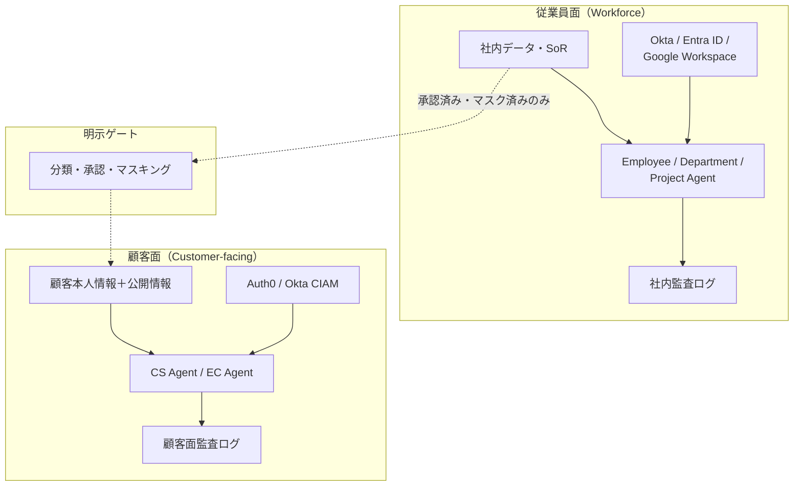

# ID-1 Workforce/Customer 二面分離

## 概要

社内向けの AI と顧客向けの AI は、見た目は似ていても「触れてよいデータ」がまったく異なる。社内エージェントは人事情報や未公開案件を扱えるが、そのまま顧客チャネルに転用すると、社内データが顧客に漏洩する最重大クラスの事故につながりうる。このパターンは、従業員面と顧客面を IdP・データ・実行環境・監査のすべてにおいて物理的に完全分離し、「そもそも到達できない」構造で漏洩を排除する。面をまたぐデータ移動は原則ゼロとし、必要な場合のみ明示ゲート（分類・承認・マスキング）を通す。

## 解決する企業課題

企業が AI エージェントを導入するとき、社内 AI を顧客接点にそのまま流用する誘惑が生まれる。コスト効率や開発速度の観点からは合理的に見えるが、この判断が最も危険な漏洩経路を開く。

従業員面のエージェントは社内ナレッジ・人事情報・未公開案件情報・内部メトリクスにアクセスできる状態で設計される。このエージェントを顧客接点に転用すると、プロンプトインジェクションや意図せぬコンテキスト流出によって社内データが顧客に到達しうる。逆方向——顧客のデータが従業員エージェントの推論に混入するケース——も同様に深刻である。

さらに、マルチテナント顧客環境では別顧客の情報が混入する「テナント汚染」リスクがある。ある顧客の問い合わせ文脈が別顧客のセッションに漏れることは、B2B SaaS 企業にとって契約上・法的に致命的な問題になる。

このパターンが解決する企業課題は次の3点である。

- 社内データ・推論過程が顧客チャネルへ流出する構造的リスクの排除
- 顧客データが社内エージェントの推論に混入する逆方向漏洩の防止
- マルチテナント環境での顧客間テナント汚染の構造的遮断

## 解決策と設計

解決策はシンプルである。「分離」を設計の出発点とし、面をまたぐフローを「原則ゼロ・例外は明示ゲート経由」と定める。

従業員面と顧客面は信頼境界で分断し、それぞれ独立した IdP・データストア・エージェント群・監査経路を持つ。面をまたぐデータ移動は明示ゲート（分類・承認・マスキング）を通じてのみ許可する。

顧客面の設計制約は以下のとおりである。

- 顧客本人の情報と公開情報にのみアクセスできる
- 社内の推論過程を顧客に露出しない
- 高リスク時は人間エージェントへ移譲（Human Handoff）
- テナント分離により別顧客情報の混入を防ぐ

## 向き／不向き

| 向き | 不向き |
|---|---|
| 顧客接点を持つ全企業（CS/EC/サポート） | 社内専用のみで顧客面が存在しない場合（片面で足りる） |
| B2B/B2C で顧客データと社内データの分離が必須 | 完全に閉じた内部ツールのみの運用 |
| マルチテナント B2B SaaS で顧客間の情報混入が致命的な場合 | PoC 段階で両面の分離設計が工数的に困難な初期段階 |

## 要素技術・既存システム連携

- **従業員 IdP**：Okta、Entra ID、Google Workspace
- **顧客 IdP（CIAM）**：Auth0、Okta Customer Identity
- **テナント分離**：Tenant Isolation、Namespace 分離
- **顧客面 SaaS**：Shopify、Zendesk、Salesforce Service Cloud
- **安全装置**：Output Guardrail、PII Filter、Human Handoff
- **明示ゲート連携**：[KM-6 DLP & Redaction Boundary](../km-knowledge/km6-dlp-redaction-boundary.md) でデータ移動時のマスキングを実施

## 落とし穴／選定の勘所

!!! danger "社内AIの流用禁止"
    社内AIの一部機能をそのまま外に出して顧客向けにするのは最も危険なアンチパターンである。顧客面は別境界として独立設計する。

- 面をまたぐデータフローは「存在しない」が既定である。必要な場合は明示ゲートを通し、データ分類・承認・マスキングを経てから移動させる。
- 顧客面のエージェントが社内用のツール・MCP・RAG インデックスにアクセスできないよう、ネットワーク・実行環境レベルで隔離する。アプリ層のフラグによる制御は不十分である。
- 顧客別テナント分離により、ある顧客の問い合わせ文脈が別顧客に漏れることを防ぐ。セッション管理・コンテキスト境界の実装をアーキテクチャレビューで必ず確認する。
- 監査ログも面ごとに分離する。従業員面と顧客面の監査ログが混在すると、インシデント調査時に証跡が汚染される。

## 関連パターン

- [ID-2 Identity Federation & OBO](id2-identity-federation-obo.md) — 各面で別々の IdP 連携と委譲を行う（**補完**：二面分離の前提のもとで各面の認証・委譲を実装する）
- [ID-6 Zero-Trust PDP/PEP](id6-zero-trust-pdp-pep.md) — 面の境界を PEP で強制する（**補完**：分離した境界をゼロトラストで実行時に検証する）
- [KM-6 DLP & Redaction Boundary](../km-knowledge/km6-dlp-redaction-boundary.md) — 面をまたぐデータ移動時のマスキング（**補完**：明示ゲートの実装として DLP を適用する）
- [EX-1 Enterprise Agent Gateway](../ex-experience/ex1-enterprise-agent-gateway.md) — 従業員/顧客チャネルを入口で分離（**補完**：エントリポイント層で二面分離を強制する統一ゲートウェイ）
