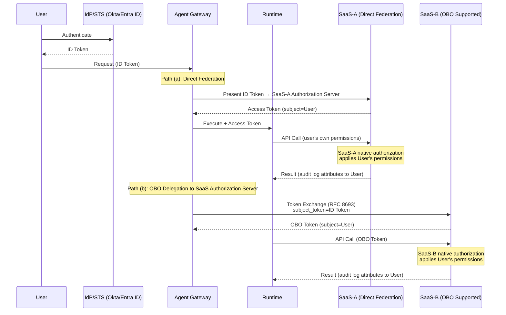

# ID-2 Identity Federation & On-Behalf-Of (OBO Delegation)

## Overview

An agent operating under an all-powerful admin account is convenient but represents the most dangerous design choice. In this pattern, the agent obtains a delegation token scoped down to the requester's own permissions for each SaaS it needs to call. For example, when a sales representative asks "please update this opportunity," the agent operates using only that representative's Salesforce permissions, and the audit log records exactly who acted via the agent. However, each SaaS has its own independent authorization server, and the token acquisition path splits into three routes: direct federation, OBO delegation via RFC 8693, and an ID-4 fallback for SaaS systems that do not support delegation. Choosing the right path — combined with the SaaS's native authorization — structurally prevents permission aggregation and confused deputy attacks.

## Business Problem

In enterprise environments, the easiest implementation for an agent spanning multiple SaaS systems is to "create one broad-permission service account and use it for all SaaS access." This works in the short term but directly conflicts with enterprise audit, compliance, and security requirements.

The first problem is **permission aggregation**. An all-powerful service account retains access to all SaaS systems for all users for as long as the agent runs. If this account is compromised, every user's data across every SaaS is exposed simultaneously.

The second problem is **confused deputy**. The agent acts on behalf of User A, but because the service account has the permissions of all users, it can also access User B's data. An architecture that relies on application-layer filtering means any filtering bug immediately becomes a data leak.

The third problem is **non-traceable audit**. Each SaaS audit log records only "service account accessed," making it impossible to trace who directed the agent to perform the operation. This is a fatal defect in incident investigations and compliance audits.

This pattern structurally resolves all three problems through OBO (On-Behalf-Of) delegation.

!!! tip "Minimum Viable Implementation"
    Start by OBO-ing only the 2–3 primary SaaS systems that already support federation via path (a) or (b), and use [ID-4 Permission Mirror](id4-permission-mirror-least-of.md) to approximate the rest. There is no need to OBO all SaaS systems at once.

!!! note "Implementation Cost and Operational Overhead"
    OBO-ing a single SaaS integration — including Connected App/OAuth setup, token broker implementation, and testing — takes several weeks. Tackling all SaaS systems at once can stretch to months, so starting with key systems in the MVP and expanding incrementally is realistic. Ongoing costs include token revocation management (linked to SCIM on offboarding/transfers) and maintaining the consent acquisition flow.

## Value Hypothesis

Guaranteeing secure operations under the user's own permissions makes it possible to grant agents write access. The ability to delegate not just reads but also updates and executions dramatically broadens the scope of applicable business automation.

## Solution and Design

The core of OBO delegation is that the agent dynamically acquires a token — scoped by both scope and audience — for each downstream SaaS, in the requester's name. Permission constraints are enforced in two layers.

1. **Token acquisition (IdP/STS or SaaS authorization server)**: The Gateway uses the requester's ID token as a starting point to obtain an access token in the format accepted by the target SaaS. However, the token acquisition path differs per SaaS (see below).
2. **SaaS-native authorization (Relying Party)**: The actual permission enforcement is performed by the native authorization engine of the SaaS (Relying Party) that receives the token. In Salesforce, profiles and permission sets; in ServiceNow, ACLs — each applies the user's own permissions based on the token's subject.

This two-layer approach achieves a clean separation: "the token's scope controls which API calls are allowed; the SaaS's native authorization constrains data-level permissions."

### Token Acquisition Paths by SaaS

Because each SaaS has its own independent OAuth authorization server, the IdP cannot universally issue access tokens for every SaaS. Token acquisition splits into three paths based on the SaaS's capabilities.

| Path | Condition | Flow | Example |
|---|---|---|---|
| **(a) Direct Federation** | SaaS has already set up OIDC/SAML federation with the IdP | Present the IdP's ID token to the SaaS authorization server; the SaaS issues an access token | Salesforce Connected App, Google Workspace domain-wide delegation |
| **(b) OBO Delegation to SaaS Authorization Server** | SaaS supports OAuth 2.0 Token Exchange (RFC 8693) or a proprietary OBO flow | Gateway sends the IdP-issued token as the subject_token to the SaaS authorization endpoint; the SaaS issues an OBO token | Microsoft 365 (Entra ID OBO flow), ServiceNow (OAuth Token Exchange support) |
| **(c) No Delegation Support → Fallback to ID-4** | SaaS does not support delegation or only exposes legacy APIs | Connect via service account and use [ID-4 Permission Mirror](id4-permission-mirror-least-of.md) to scope down to the user's permissions. Classify as high-risk | Legacy internal systems, some older SaaS products |

!!! warning "Path (c) Is a Supplement, Not a First Choice"
    When connecting to a delegation-unsupported SaaS via service account, Permission Mirror is **an approximation, not an authoritative source**. Prioritize delegation paths (a) or (b) wherever possible, and limit (c) to systems where delegation is technically impossible.

The delegation chain (user → agent → tool) is recorded in the token's actor/subject claims, enabling attribution to the individual in each SaaS audit log. When using a service account, record the executing actor and the original requester (subject) separately.

## Applicability

| Good Fit | Poor Fit |
|---|---|
| Cross-SaaS workflows with strict audit requirements | Operations handling only fully public information |
| Personal productivity assistance (Employee Copilot) requiring user's own permissions | Delegation-unsupported legacy SaaS (handle separately with Permission Mirror) |
| Workflows involving high-risk operations | Autonomous batch processing (ID-3 Workload Identity is more appropriate) |
| — | Small-scale use cases where consent acquisition and token revocation overhead across tens of thousands of users and many SaaS systems is disproportionate |

## Technology and Integration

- **Authentication standards**: OIDC, SAML 2.0, SCIM (provisioning)
- **Delegation standard**: OAuth 2.0 Token Exchange (RFC 8693)
- **IdP**: Okta, Auth0, Entra ID, Google Workspace
- **Supported SaaS**: Salesforce, ServiceNow, Slack, Box, Google Workspace, Microsoft 365
- **Tool connectivity**: OBO tokens also propagate through MCP (Model Context Protocol)

## Pitfalls and Selection Criteria

!!! danger "The All-Powerful Service Account Trap"
    Using a single all-powerful service account for all SaaS calls and relying on application-layer filtering to "hide" data is the most dangerous anti-pattern. A filtering bug equals a data leak. Delegate permission decisions to the SaaS's native authorization (path a/b) wherever possible, and use ID-4 Permission Mirror only as a supplement for non-delegation-capable systems.

- For delegation-unsupported SaaS, use [ID-4 Permission Mirror](id4-permission-mirror-least-of.md) to reproduce entitlements, and classify those integrations as high-risk. Permission Mirror is an approximation, not an authoritative source.
- Keep token lifetimes short. Extending cache windows to avoid "slowness" violates the principles of [ID-5 JIT Scoped Credentials](id5-jit-scoped-credentials.md).
- In multi-agent configurations with long delegation chains, establish a mechanism to verify that scope narrows at each hop. Always confirm that downstream agents do not exceed the original user's permissions.
- In environments with tens of thousands of users and many SaaS systems, the operational cost of obtaining user consent (the initial OAuth flow) and managing token revocation (on offboarding, transfers, and permission changes) is non-trivial. Design lifecycle management automation in conjunction with the IdP's auto-provisioning (SCIM).

## Related Patterns

- [ID-1 Workforce/Customer Dual-Plane Separation](id1-workforce-customer-split.md) — Separate delegation trust boundaries between the workforce and customer planes (**complementary**: implement OBO on the foundation of dual-plane separation)
- [ID-4 Permission Mirror & Least-of](id4-permission-mirror-least-of.md) — Reproduce permissions for OBO-unsupported SaaS (**complementary**: use Permission Mirror as a fallback for systems where delegation is unavailable)
- [ID-5 JIT Scoped Credentials](id5-jit-scoped-credentials.md) — Short-lived, purpose-limited token issuance (**complementary**: issue OBO tokens themselves as JIT short-lived, purpose-limited credentials)
- [ID-6 Zero-Trust PDP/PEP](id6-zero-trust-pdp-pep.md) — Zero-trust authorization including OBO token verification (**complementary**: validate issued OBO tokens through the PEP on every call)
- [OB-2 Unified Audit & Lineage](../ob-observability/ob2-unified-audit-lineage.md) — Record the delegation chain in the audit trail (**complementary**: collect and store the dual actor/subject records in the audit infrastructure)
- [EX-1 Enterprise Agent Gateway](../ex-experience/ex1-enterprise-agent-gateway.md) — Unified entry point where Token Exchange runs (**complementary**: the gateway serves as the execution point for OBO token exchange)
