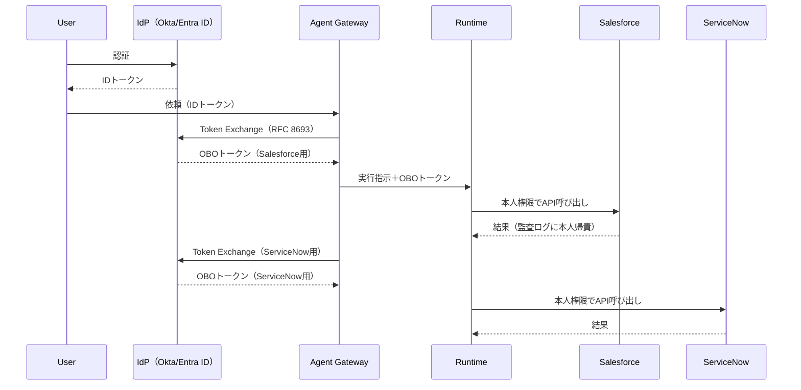

# ID-2 Identity Federation & On-Behalf-Of（OBO委譲）

## 概要

エージェントが「何でもできる管理者アカウント」で SaaS を操作するのは、便利だが最も危険な設計である。このパターンでは、エージェントは依頼者本人の権限に縮退した委譲トークンを SaaS ごとに取得して動く。たとえば営業担当が「この商談を更新して」と頼むと、エージェントはその担当者の Salesforce 権限だけで操作し、監査ログにも「誰がエージェント経由で操作したか」が残る。OAuth 2.0 Token Exchange（RFC 8693）によるこの仕組みが、権限の集約と混乱代理を構造的に防ぐ。

## 解決する企業課題

エンタープライズ環境でエージェントを複数 SaaS にまたがって使うとき、最も安易な実装は「エージェント専用の広権限サービスアカウントを1つ作り、全 SaaS へのアクセスをそのアカウントで行う」方法である。この設計は短期には機能するが、企業の監査・コンプライアンス・セキュリティ要件と正面から衝突する。

問題の第一は「権限集約」である。万能サービスアカウントはエージェントが動く間、すべてのユーザーのすべての SaaS へのアクセス権を持ち続ける。このアカウントが侵害されると、全ユーザー・全 SaaS のデータが一度に危険にさらされる。

第二は「混乱代理（Confused Deputy）」である。エージェントがユーザー A の代理として動いているのに、サービスアカウントの権限ではユーザー B のデータも参照できてしまう。アプリ層のフィルタリングに頼るアーキテクチャでは、判定バグが即座に情報漏洩になる。

第三は「監査追跡不能」である。各 SaaS の監査ログには「サービスアカウントがアクセスした」としか記録されず、誰がエージェント経由で操作したかが追跡できない。インシデント調査・コンプライアンス監査で致命的な欠陥になる。

このパターンは、OBO（On-Behalf-Of）委譲によってこれら3つの問題を構造的に解消する。

## 解決策と設計

OBO 委譲の核心は「エージェントが依頼者本人の権限に縮退したトークンを下流 SaaS ごとに動的に取得する」点にある。エージェントは広権限を持たず、「今この依頼者がこの SaaS で持っている権限の範囲内」でのみ動作する。

ユーザーが IdP で認証した後、Gateway が OAuth 2.0 Token Exchange（RFC 8693）を用いて、下流 SaaS ごとに本人権限に縮退した OBO トークンを発行する。委譲チェーン（user → agent → tool）はトークンに刻まれ、各 SaaS の監査ログで本人に帰責できる。

サービスアカウントを利用する場合も、実行主体（actor）と依頼者（subject）を分離して記録する。これにより、どの SaaS の監査ログでも「誰がエージェント経由で操作したか」が追跡可能になる。

## 向き／不向き

| 向き | 不向き |
|---|---|
| 複数SaaS横断で監査要件が厳しい業務 | 完全に公開された情報のみを扱う場合 |
| 個人業務支援（Employee Copilot）で本人権限が必要 | 委譲非対応の旧式SaaS（別途 Permission Mirror で対処） |
| 高リスク操作を含むワークフロー | 自律バッチ処理（ID-3 Workload Identity が適する） |

## 要素技術・既存システム連携

- **認証標準**：OIDC、SAML 2.0、SCIM（プロビジョニング）
- **委譲標準**：OAuth 2.0 Token Exchange（RFC 8693）
- **IdP**：Okta、Auth0、Entra ID、Google Workspace
- **対応SaaS**：Salesforce、ServiceNow、Slack、Box、Google Workspace、Microsoft 365
- **ツール接続**：MCP（Model Context Protocol）経由でも OBO トークンを伝播

## 落とし穴／選定の勘所

!!! danger "万能サービスアカウントの罠"
    万能サービスアカウント1個で全SaaSを叩き、アプリ層だけで「見せない」と判定するのは最も危険なアンチパターンである。判定バグ＝漏洩になる。権限判定はSaaS側のネイティブ認可に委ねるべきである。

- 委譲非対応SaaSでは [ID-4 Permission Mirror](id4-permission-mirror-least-of.md) でエンタイトルメントを再現し、高リスクに分類して運用する。
- トークンの有効期限は短く保つ。「遅い」という理由でキャッシュを広げて長命化するのは [ID-5 JIT Scoped Credentials](id5-jit-scoped-credentials.md) の原則に反する。
- 委譲チェーンが長くなるマルチエージェント構成では、各段で権限が縮退していることを検証する仕組みが必要である。末端エージェントが元のユーザー権限を超えていないかを必ず確認する。

## 関連パターン

- [ID-1 Workforce/Customer 二面分離](id1-workforce-customer-split.md) — 従業員面と顧客面で委譲の信頼境界を分ける前提（**補完**：二面分離の前提のもとで OBO を実装する）
- [ID-4 Permission Mirror & Least-of](id4-permission-mirror-least-of.md) — OBO非対応SaaSの権限再現（**補完**：委譲が使えない系に対して Permission Mirror で代替する）
- [ID-5 JIT Scoped Credentials](id5-jit-scoped-credentials.md) — トークンの短命化・用途限定（**補完**：OBO トークン自体を JIT で発行し長命化を防ぐ）
- [ID-6 Zero-Trust PDP/PEP](id6-zero-trust-pdp-pep.md) — OBOトークンの検証を含むゼロトラスト認可（**補完**：発行された OBO トークンを PEP で毎回検証する）
- [OB-2 統一監査・系譜](../ob-observability/ob2-unified-audit-lineage.md) — 委譲チェーンを監査証跡に記録（**補完**：actor/subject の二重記録を監査基盤で収集・保管する）
- [EX-1 Enterprise Agent Gateway](../ex-experience/ex1-enterprise-agent-gateway.md) — Token Exchange を実行する統一入口（**補完**：ゲートウェイが OBO トークン交換の実行点になる）
