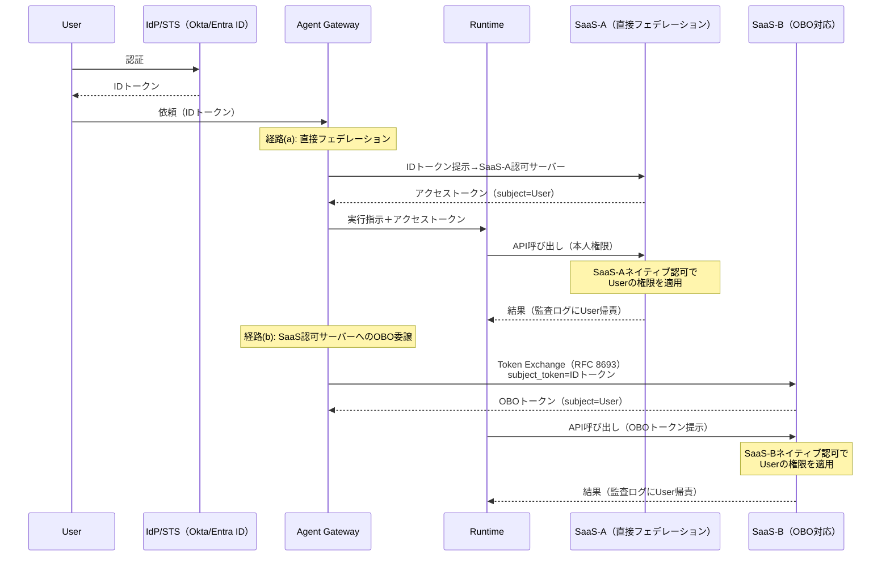

# ID-2 Identity Federation & On-Behalf-Of（OBO委譲）

## 概要

エージェントが「何でもできる管理者アカウント」で SaaS を操作するのは、便利だが最も危険な設計である。このパターンでは、エージェントは依頼者本人の権限に縮退した委譲トークンを SaaS ごとに取得して動く。たとえば営業担当が「この商談を更新して」と頼むと、エージェントはその担当者の Salesforce 権限だけで操作し、監査ログにも「誰がエージェント経由で操作したか」が残る。ただし SaaS ごとに認可サーバーは独立しており、トークン取得の経路は直接フェデレーション・OBO 委譲（RFC 8693 等）・委譲非対応系での ID-4 代替と分かれる。この経路選択と SaaS 側ネイティブ認可の二段構えが、権限の集約と混乱代理を構造的に防ぐ。

## 解決する企業課題

エンタープライズ環境でエージェントを複数 SaaS にまたがって使うとき、最も安易な実装は「エージェント専用の広権限サービスアカウントを1つ作り、全 SaaS へのアクセスをそのアカウントで行う」方法である。この設計は短期には機能するが、企業の監査・コンプライアンス・セキュリティ要件と正面から衝突する。

第一の問題は「権限集約」だ。万能サービスアカウントはエージェントが動く間、すべてのユーザーのすべての SaaS へのアクセス権を持ち続ける。このアカウントが侵害されると、全ユーザー・全 SaaS のデータが一度に危険にさらされる。

第二は「混乱代理（Confused Deputy）」である。エージェントがユーザー A の代理として動いているのに、サービスアカウントの権限ではユーザー B のデータも参照できてしまう。アプリ層のフィルタリングに頼るアーキテクチャでは、判定バグが即座に情報漏洩につながる。

第三は「監査追跡不能」だ。各 SaaS の監査ログには「サービスアカウントがアクセスした」としか記録されず、誰がエージェント経由で操作したかを追跡できない。インシデント調査・コンプライアンス監査で致命的な欠陥になる。

OBO（On-Behalf-Of）委譲はこれら3つの問題を構造的に解消する。

!!! tip "最小成立条件（MVP）"
    まず主要 2〜3 SaaS（フェデレーション対応済みのもの）のみ経路 (a)/(b) で OBO 化し、残りは [ID-4 Permission Mirror](id4-permission-mirror-least-of.md) で近似する。全 SaaS を一度に OBO 化する必要はない。

!!! note "導入コスト・運用負荷の相対感"
    SaaS 1系統あたりの OBO 化は、Connected App / OAuth 設定・トークンブローカー実装・テストを含め数週間規模の作業である。全 SaaS 一括化は数か月に及ぶため、MVP で主要系を先行し段階的に拡大するのが現実的である。運用面では、トークン失効管理（退職・異動時の SCIM 連動）と同意取得フローの維持が継続コストとなる。

## 価値仮説

本人権限での安全な操作を保証することで、エージェントへの書き込み権限付与を可能にする。読み取りだけでなく更新・実行まで委譲できることが、業務自動化の適用範囲を大幅に広げる。

## 解決策と設計

OBO 委譲の核心は「エージェントが依頼者の名のもとに scope と audience を限定したトークンを下流 SaaS ごとに動的に取得する」点にある。権限の制約は二段構えで実現される。

1. **トークン取得（IdP/STS またはSaaS認可サーバー側）**：Gateway が依頼者の ID トークンを起点に、対象 SaaS が受理できる形式のアクセストークンを取得する。ただし、SaaS ごとにトークン取得の経路は異なる（後述）。
2. **SaaS 側ネイティブ認可（RP 側）**：実際の権限制約は、トークンを受け取った SaaS（Relying Party）側のネイティブ認可エンジンが行う。Salesforce であればプロファイル・権限セット、ServiceNow であれば ACL が、トークンの subject に基づいて本人の権限を適用する。

この二段構えにより、「トークンの scope で API の呼び出し範囲を制御し、SaaS 側のネイティブ認可でデータレベルの権限を制約する」という分離が成立する。

### SaaS ごとのトークン取得経路

SaaS はそれぞれ独立した OAuth 認可サーバーを持つため、IdP が万能に全 SaaS 向けのアクセストークンを発行できるわけではない。トークン取得は SaaS の対応状況に応じて3つの経路に分かれる。

| 経路 | 条件 | フロー | 例 |
|---|---|---|---|
| **(a) 直接フェデレーション** | SaaS が IdP と OIDC/SAML フェデレーションを構成済み | IdP の ID トークンをSaaS の認可サーバーに提示し、SaaS 側がアクセストークンを発行 | Salesforce Connected App、Google Workspace ドメイン全体委任 |
| **(b) SaaS 認可サーバーへの OBO 委譲** | SaaS が OAuth 2.0 Token Exchange（RFC 8693）または独自の OBO フローに対応 | Gateway が IdP 発行トークンを subject_token として SaaS の認可エンドポイントへ送り、SaaS 側が OBO トークンを発行 | Microsoft 365（Entra ID OBO フロー）、ServiceNow（OAuth Token Exchange 対応） |
| **(c) 委譲非対応 → ID-4 で代替** | SaaS が委譲フローに非対応、または旧式 API のみ | サービスアカウントで接続し、[ID-4 Permission Mirror](id4-permission-mirror-least-of.md) で本人権限に絞り込む。高リスクに分類して運用 | レガシー社内システム、一部の旧式 SaaS |

!!! warning "経路 (c) はあくまで補完手段"
    委譲非対応 SaaS にサービスアカウントで接続する場合、Permission Mirror は**近似であり権威ソースではない**。可能な限り (a) または (b) の委譲経路を優先し、(c) は委譲が技術的に不可能な系に限定する。



委譲チェーン（user → agent → tool）はトークンの actor / subject クレームに記録され、各 SaaS の監査ログで本人に帰責できる。サービスアカウントを利用する場合も、実行主体（actor）と依頼者（subject）を分離して記録する。

## 向き／不向き

| 向き | 不向き |
|---|---|
| 複数SaaS横断で監査要件が厳しい業務 | 完全に公開された情報のみを扱う場合 |
| 個人業務支援（Employee Copilot）で本人権限が必要 | 委譲非対応の旧式SaaS（別途 Permission Mirror で対処） |
| 高リスク操作を含むワークフロー | 自律バッチ処理（ID-3 Workload Identity が適する） |
| — | 数万人×多数 SaaS 環境で同意取得・トークン失効の運用コストが見合わない小規模ユースケース |

## 要素技術・既存システム連携

- **認証標準**：OIDC、SAML 2.0、SCIM（プロビジョニング）
- **委譲標準**：OAuth 2.0 Token Exchange（RFC 8693）
- **IdP**：Okta、Auth0、Entra ID、Google Workspace
- **対応SaaS**：Salesforce、ServiceNow、Slack、Box、Google Workspace、Microsoft 365
- **ツール接続**：MCP（Model Context Protocol）経由でも OBO トークンを伝播

## 落とし穴／選定の勘所

!!! danger "万能サービスアカウントの罠"
    万能サービスアカウント1個で全SaaSを叩き、アプリ層だけで「見せない」と判定するのは最も危険なアンチパターンである。判定バグ＝漏洩になる。可能な限り権限判定は SaaS 側のネイティブ認可（経路 a/b）に委ね、委譲非対応系でのみ ID-4 Permission Mirror で補完する。

- 委譲非対応 SaaS では [ID-4 Permission Mirror](id4-permission-mirror-least-of.md) でエンタイトルメントを再現し、高リスクに分類して運用する。Permission Mirror はあくまで近似であり、権威ソースではないことを前提とする。
- トークンの有効期限は短く保つ。「遅い」という理由でキャッシュを広げて長命化するのは [ID-5 JIT Scoped Credentials](id5-jit-scoped-credentials.md) の原則に反する。
- 委譲チェーンが長くなるマルチエージェント構成では、各段で scope が縮小していることを検証する仕組みが必要だ。末端エージェントが元のユーザー権限を超えていないかを必ず確認する。
- 数万人×多数 SaaS の環境では、OBO の前提となるユーザー同意の取得（初回の OAuth フロー）と、トークン失効管理（退職・異動・権限変更時）の運用コストが無視できない。IdP の自動プロビジョニング（SCIM）と連携し、ライフサイクル管理を自動化する設計にすることを勧める。

## Interfaces

以下はこのパターンを実装する際の主要インターフェイスである。コーディングエージェントはこの定義からスタブコードを生成できる。

```yaml
interfaces:
  - name: Token Broker (Gateway)
    description: "At EX-1 Gateway, exchanges the requester's ID token for a per-SaaS OBO token using direct federation (path a) or RFC 8693 Token Exchange (path b)."
    input:
      request: object
    output:
      response: object
    errors:
      - code: GENERAL_ERROR
        description: "Token Broker (Gateway) の処理中にエラーが発生"
    protocol: "REST / gRPC"
    implementation_hints:
      - "詳細は本文の「解決策と設計」節を参照"
  - name: SaaS Native Authorization (RP)
    description: "The target SaaS (Relying Party) applies its own native authorization (Salesforce profiles, ServiceNow ACLs) based on the token subject, enforcing data-level permissions."
    input:
      request: object
    output:
      response: object
    errors:
      - code: GENERAL_ERROR
        description: "SaaS Native Authorization (RP) の処理中にエラーが発生"
    protocol: "REST / gRPC"
    implementation_hints:
      - "詳細は本文の「解決策と設計」節を参照"
  - name: Audit Delegation Chain
    description: "Records actor (agent) and subject (human) separately in audit logs so each SaaS audit (Salesforce Shield, Okta System Log) shows the human principal."
    input:
      request: object
    output:
      response: object
    errors:
      - code: GENERAL_ERROR
        description: "Audit Delegation Chain の処理中にエラーが発生"
    protocol: "REST / gRPC"
    implementation_hints:
      - "詳細は本文の「解決策と設計」節を参照"
```

## 関連パターン

- [ID-1 Workforce/Customer 二面分離](id1-workforce-customer-split.md) — 従業員面と顧客面で委譲の信頼境界を分ける前提（**補完**：二面分離の前提のもとで OBO を実装する）
- [ID-4 Permission Mirror & Least-of](id4-permission-mirror-least-of.md) — OBO非対応SaaSの権限再現（**補完**：委譲が使えない系に対して Permission Mirror で代替する）
- [ID-5 JIT Scoped Credentials](id5-jit-scoped-credentials.md) — トークンの短命化・用途限定（**補完**：OBO トークン自体を JIT で発行し長命化を防ぐ）
- [ID-6 Zero-Trust PDP/PEP](id6-zero-trust-pdp-pep.md) — OBOトークンの検証を含むゼロトラスト認可（**補完**：発行された OBO トークンを PEP で毎回検証する）
- [OB-2 統一監査・系譜](../ob-observability/ob2-unified-audit-lineage.md) — 委譲チェーンを監査証跡に記録（**補完**：actor/subject の二重記録を監査基盤で収集・保管する）
- [EX-1 Enterprise Agent Gateway](../ex-experience/ex1-enterprise-agent-gateway.md) — Token Exchange を実行する統一入口（**補完**：ゲートウェイが OBO トークン交換の実行点になる）
