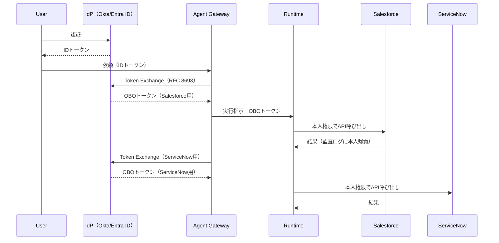

# ID-2 Identity Federation & On-Behalf-Of（OBO委譲）

## 概要

エージェントは万能特権IDを持たず、依頼者本人の権限（または明示委譲）に縮退したトークンを下流ごとに取得して動く。権限の忠実な伝播を実現する中核パターンである。

## 設計

ユーザーが IdP で認証した後、Gateway が OAuth 2.0 Token Exchange（RFC 8693）を用いて、下流 SaaS ごとに本人権限に縮退した OBO トークンを発行する。委譲チェーン（user → agent → tool）はトークンに刻まれ、各 SaaS の監査ログで本人に帰責できる。

サービスアカウント利用時も、実行主体（actor）と依頼者（subject）を分離記録する。これにより、どのSaaSの監査ログでも「誰がエージェント経由で操作したか」が追跡可能になる。

## 解決する企業課題

複数SaaSを横断するとき、エージェントに広い権限を与えると権限が集約し、混乱代理（confused deputy）が発生する。OBO委譲はこの問題を構造的に解決する。SaaS監査ログでの「誰がエージェント経由で触れたか」の追跡不能も解消する。

## 向き／不向き

| 向き | 不向き |
|---|---|
| 複数SaaS横断で監査要件が厳しい業務 | 完全に公開された情報のみを扱う場合 |
| 個人業務支援（Employee Copilot）で本人権限が必要 | 委譲非対応の旧式SaaS（別途 Permission Mirror で対処） |
| 高リスク操作を含むワークフロー | 自律バッチ処理（ID-3 Workload Identity が適する） |

## 要素技術・既存システム連携

- **認証標準**：OIDC、SAML 2.0、SCIM（プロビジョニング）
- **委譲標準**：OAuth 2.0 Token Exchange（RFC 8693）
- **IdP**：Okta、Auth0、Entra ID、Google Workspace
- **対応SaaS**：Salesforce、ServiceNow、Slack、Box、Google Workspace、Microsoft 365
- **ツール接続**：MCP（Model Context Protocol）経由でも OBO トークンを伝播

## 落とし穴／選定の勘所

!!! danger "万能サービスアカウントの罠"
    万能サービスアカウント1個で全SaaSを叩き、アプリ層だけで「見せない」と判定するのは最も危険なアンチパターンである。判定バグ＝漏洩になる。権限判定はSaaS側のネイティブ認可に委ねるべきである。

- 委譲非対応SaaSでは [ID-4 Permission Mirror](id4-permission-mirror-least-of.md) でエンタイトルメントを再現し、高リスクに分類して運用する。
- トークンの有効期限は短く保つ。「遅い」とキャッシュを広げ結局長命化するのは [ID-5 JIT Scoped Credentials](id5-jit-scoped-credentials.md) の原則に反する。
- 委譲チェーンが長くなるマルチエージェント構成では、各段での権限縮退を検証する仕組みが必要である。

## 関連パターン

- [ID-1 Workforce/Customer 二面分離](id1-workforce-customer-split.md) — 従業員面と顧客面で委譲の信頼境界を分ける前提
- [ID-4 Permission Mirror & Least-of](id4-permission-mirror-least-of.md) — OBO非対応SaaSの権限再現
- [ID-5 JIT Scoped Credentials](id5-jit-scoped-credentials.md) — トークンの短命化・用途限定
- [ID-6 Zero-Trust PDP/PEP](id6-zero-trust-pdp-pep.md) — OBOトークンの検証を含むゼロトラスト認可
- [OB-2 統一監査・系譜](../ob-observability/ob2-unified-audit-lineage.md) — 委譲チェーンを監査証跡に記録
- [EX-1 Enterprise Agent Gateway](../ex-experience/ex1-enterprise-agent-gateway.md) — Token Exchange を実行する統一入口
