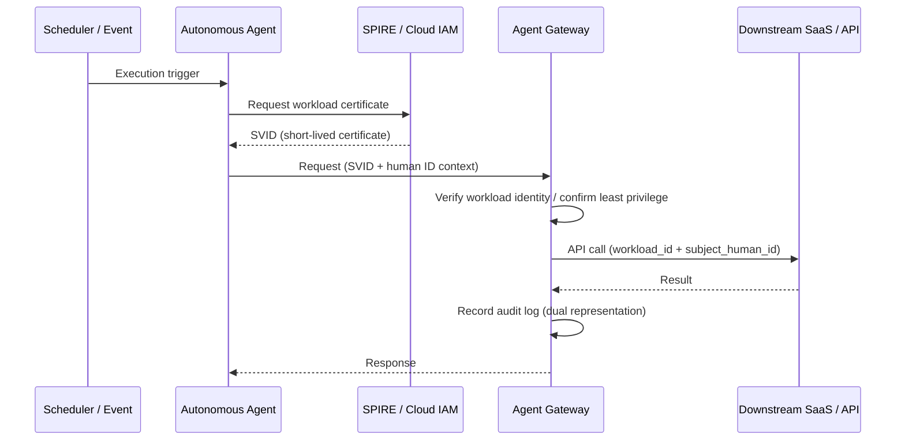

# ID-3 Workload / Agent Identity (The Agent's Own Identity)

## Overview

A batch agent that aggregates data every morning at 8 a.m., or an autonomous agent triggered by a webhook, is not acting on anyone's "behalf." Agents that operate without a human initiating the request need a verifiable machine identity (Workload Identity) that is distinct from human identities. Issue short-lived certificates using SPIFFE/SVID or cloud workload identity, making it clear "which agent is running, with what permissions, and for what purpose." Every call is recorded with a dual representation: "human identity (if any) + workload identity."

## Business Problem

Agents have two operating modes. One is "human proxy mode," triggered by an explicit human request. The other is "autonomous execution mode," where the agent operates without human involvement — driven by schedules, events, or autonomous decisions. Running both modes under the same identity creates several serious problems.

The first is **ambiguity of the acting subject**. When an audit log records only "service account X performed this operation," it is impossible to determine whether the action was requested by human A or triggered by a nightly batch. Investigating incidents and identifying root causes becomes extremely difficult.

The second is **excessive permission grants**. Using the same account for both human proxy and autonomous execution means the autonomous agent inherits the broad permissions needed for human workflows. When an autonomous agent malfunctions or is compromised, the blast radius extends across the entire organization.

The third is **inability to handle dynamic scaling**. In container and Kubernetes environments, agents are created and destroyed dynamically. Static service accounts cannot keep up with identity lifecycle management, and unused identities can persist for extended periods.

This pattern resolves these issues by assigning verifiable short-lived machine identities to autonomous agents and separating identities by mode of operation.

!!! tip "Minimum Viable Implementation"
    Assign a dedicated service account or cloud IAM role to each autonomous agent so that human-initiated operations and autonomous operations can be distinguished in audit logs. SPIFFE/SPIRE can be introduced incrementally.

## Value Hypothesis

Assigning a unique identity to the agent itself enables safe execution of autonomous background processing. The scope of automation that runs without human involvement expands, increasing overall business automation rates.

## Solution and Design

Assign autonomous agents a Workload Identity that is independent of human identities. This identity is implemented as a short-lived certificate based on the SPIFFE/SVID standard, or as a managed identity from the cloud provider, and is automatically rotated.

On startup, the autonomous agent obtains a workload certificate from SPIRE (SPIFFE Runtime Environment) or the cloud provider's identity infrastructure. The certificate is short-lived (e.g., 1 hour) and automatically rotated. All downstream API calls use this certificate or token to make it explicit that the caller is an agent.

When a human request is the origin (e.g., autonomous processing that starts after approval), retain the original human identity as the subject and record the workload identity as the actor. For fully autonomous batch jobs with no human origin, record only the workload identity and link the execution rationale (policy or schedule definition) to the audit record.

## Applicability

| Good Fit | Poor Fit |
|---|---|
| Autonomous execution via scheduled batch or system trigger exists | All agent operations originate from explicit human requests ([ID-2](id2-identity-federation-obo.md) is sufficient) |
| Need to distinguish autonomous agents from human proxy agents in audit logs | PoC stage where identity infrastructure is not yet in place (migrate incrementally from interim service accounts) |
| Workloads scale dynamically on Kubernetes/cloud | Small-scale batch running on a single fixed server (certificate rotation management overhead is disproportionate) |
| Existing SPIFFE-enabled infrastructure | On-premises-only environments where SPIRE deployment is difficult |

## Technology and Integration

- **SPIFFE/SPIRE**: Cryptographic workload attestation (SVID) issuance and automatic rotation
- **AWS IAM Roles Anywhere / IRSA**: Temporary credentials for EKS Pods and EC2 workloads
- **Microsoft Entra Workload Identity**: Managed identity issuance for Azure workloads
- **Google Workload Identity Federation**: Short-lived credentials for GKE workloads
- **mTLS**: Mutual authentication for inter-workload communication using SPIFFE SVID as the certificate
- **Short-lived tokens**: TTL set according to business risk (e.g., the duration of a single batch execution)

## Pitfalls and Selection Criteria

!!! danger "Granting Admin Permissions to Autonomous Agents"
    The more autonomously an agent operates, the more strictly least-privilege must be enforced. "It's just a batch, let's give it broad permissions" is the most dangerous design choice — it extends the blast radius of a malfunction or compromise across the entire organization. Split workload identities by purpose and grant each identity only the permissions it needs.

- Caching long-lived SVIDs or tokens and reusing them defeats the purpose of short-lived certificates. Combine with [ID-5 JIT Scoped Credentials](id5-jit-scoped-credentials.md) and obtain fresh credentials immediately before each tool call.
- As the number of workload identities grows, management tends to become superficial. Automate the identity lifecycle (issuance, revocation, inventory) and regularly remove unused identities.
- When autonomous batch processes chain multiple agents, verify that permissions narrow at each hop. Use [ID-6 Zero-Trust PDP/PEP](id6-zero-trust-pdp-pep.md) to confirm that downstream agents do not inherit the original permissions.

## Related Patterns

- [ID-2 Identity Federation & OBO](id2-identity-federation-obo.md) — Token delegation for human proxy mode (**contrast**: OBO is for human proxy; Workload Identity is for autonomous execution — use each for its respective operation type)
- [ID-5 JIT Scoped Credentials](id5-jit-scoped-credentials.md) — Short-lived, purpose-limited credentials issued to the workload identity (**complementary**: issue JIT credentials per tool call, using the workload identity as the holder)
- [ID-6 Zero-Trust PDP/PEP](id6-zero-trust-pdp-pep.md) — Authorization point that validates workload identity calls (**complementary**: evaluate each action by a workload identity using zero-trust, every time)
- [OB-2 Unified Audit & Lineage](../ob-observability/ob2-unified-audit-lineage.md) — Record the dual representation (human ID + workload ID) in audit logs (**complementary**: manage dual-representation records centrally in the audit infrastructure)
