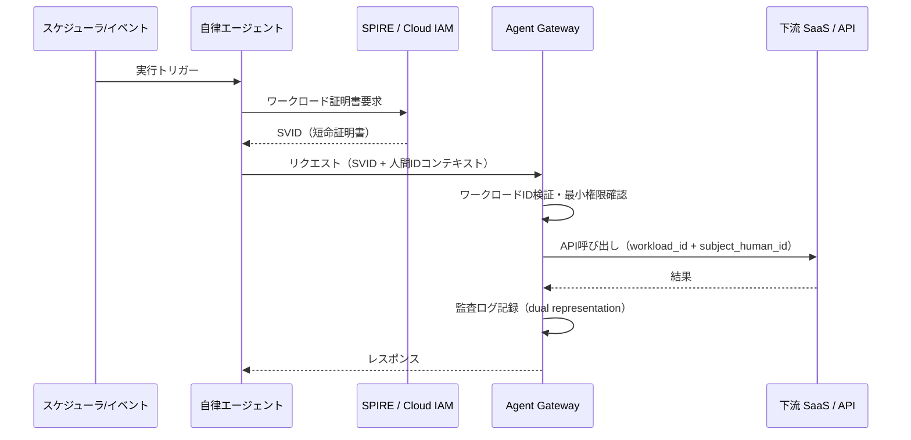

# ID-3 Workload / Agent Identity（エージェント自身のID）

## 概要

毎朝8時にデータを集計するバッチエージェントや、Webhook で起動する自律エージェントは、誰かの「代理」ではありません。こうした人間の依頼を介さないエージェントには、人間 ID とは別の検証可能なマシン ID（Workload Identity）を与えます。SPIFFE/SVID やクラウドのワークロード ID で短命の証明書を発行し、「これはどのエージェントが・どの権限で・何のために動いているか」を明確にします。すべての呼び出しは「人間 ID（あれば）＋ワークロード ID」の二重表現で記録されます。

## 解決する企業課題

エージェントには2種類の動作モードがあります。一つは人間の明示的な要求を起点とする「人間代理モード」、もう一つはスケジュール・イベント・自律判断によって人間の介在なしに動く「自律実行モード」です。この二つを同一の ID で動かすと、複数の深刻な問題が生まれます。

第一は「操作主体の曖昧さ」です。監査ログに「サービスアカウント X が操作した」とのみ記録されていても、それが人間 A の依頼によるものか深夜バッチによるものかが判別できません。インシデント発生時の調査・原因特定が著しく困難になります。

第二は「権限の過剰付与」です。人間代理と自律実行に同一アカウントを使うと、自律エージェントが人間の業務に必要な広い権限をそのまま持つことになります。自律エージェントが誤動作・侵害された場合のダメージが組織全体に広がります。

第三は「動的スケールへの対応不能」です。コンテナ・Kubernetes 環境ではエージェントが動的に生成・削除されます。静的なサービスアカウントでは ID ライフサイクル管理が追いつかず、使用されていない ID が長期間残存するリスクが生まれます。

このパターンは、自律エージェントに検証可能な短命マシン ID を付与し、動作種別ごとに ID を分離することでこれらを解決します。

!!! tip "最小成立条件（MVP）"
    自律エージェントごとに専用のサービスアカウントまたはクラウド IAM ロールを割り当て、監査ログで人間起点の操作と区別できる状態にします。SPIFFE/SPIRE は段階的に導入すればよいです。

## 価値仮説

エージェント自身に固有 ID を付与することで、自律的なバックグラウンド処理を安全に実行できます。人間の操作介在なしに動く自動化の範囲が広がり、業務自動化率の向上に寄与します。

## 解決策と設計

自律エージェントには人間の ID とは独立した Workload Identity を付与します。この ID は SPIFFE/SVID 規格に基づく短命証明書、またはクラウドプロバイダーのマネージド ID として実装し、自動ローテーションします。

自律エージェントは起動時に SPIRE（SPIFFE Runtime Environment）またはクラウドプロバイダーの ID 基盤からワークロード証明書を取得します。証明書は短命（例：1 時間）で自動ローテーションされます。下流 API の呼び出しにはこの証明書・トークンを用い、呼び出し元がエージェントであることを明示します。



人間の依頼を起点とする場合（例：承認後に自律処理が走るケース）は、元の人間 ID を subject として保持し、ワークロード ID を actor として記録します。完全自律バッチで人間の起点がない場合は、ワークロード ID のみを記録し、その実行根拠（ポリシー・スケジュール定義）を監査に紐づけます。

## 向き／不向き

| 向き | 不向き |
|---|---|
| スケジュールバッチ・システムトリガーによる自律実行が存在する | すべてのエージェント動作が人間の明示的要求に起因する（[ID-2](id2-identity-federation-obo.md) で十分） |
| 自律エージェントと人間代理エージェントを監査上で分離したい | PoC で ID 基盤が未整備の段階（暫定サービスアカウントから段階移行） |
| Kubernetes/クラウド上でワークロードが動的にスケールする | 単一固定サーバーで動く小規模バッチ（証明書ローテーションの管理コストが割に合わない） |
| SPIFFE 対応インフラが既にある | オンプレミスのみで SPIRE 導入が困難な環境 |

## 要素技術・既存システム連携

- **SPIFFE/SPIRE**：ワークロードの暗号証明（SVID）発行・自動ローテーション
- **AWS IAM Roles Anywhere / IRSA**：EKS Pod・EC2 ワークロードへの一時クレデンシャル付与
- **Microsoft Entra Workload Identity**：Azure 上のワークロードへのマネージド ID 発行
- **Google Workload Identity Federation**：GKE ワークロードへの短命クレデンシャル
- **mTLS**：ワークロード間通信での相互認証。SPIFFE SVID を証明書として利用
- **短命トークン**：TTL は業務リスクに応じて設定（例：バッチ1回分の実行時間）

## 落とし穴／選定の勘所

!!! danger "自律エージェントへの管理者権限付与"
    自律動作するほど最小権限を厳格にすべきです。「バッチだから広めに取っておく」は最も危険な設計であり、誤動作・侵害時の影響範囲を企業全体に広げます。ワークロード ID は用途ごとに分割し、各 ID に必要な権限だけを与えます。

- 長命の SVID・トークンをキャッシュして使い回すのは短命化の目的を損ないます。[ID-5 JIT Scoped Credentials](id5-jit-scoped-credentials.md) と組み合わせ、ツール呼び出し直前に都度取得します。
- ワークロード ID の発行数が増えると管理が形骸化します。ID ライフサイクル（発行・失効・棚卸し）を自動化し、定期的に未使用 ID を削除しておきます。
- 自律バッチが複数エージェントをチェーンする場合、各段で権限が縮退していることを確認します。末端エージェントが元の権限を引き継いでいないかを [ID-6 Zero-Trust PDP/PEP](id6-zero-trust-pdp-pep.md) で検証することが欠かせません。

## Interfaces

以下はこのパターンを実装する際の主要インターフェイスです。コーディングエージェントはこの定義からスタブコードを生成できます。

```yaml
interfaces:
  - name: Workload Certificate Issuer (SPIRE / Cloud IAM)
    description: "Issues short-lived SVID certificates or cloud managed identity tokens to agents at startup; auto-rotates within TTL."
    input:
      request: object
    output:
      response: object
    errors:
      - code: GENERAL_ERROR
        description: "Workload Certificate Issuer (SPIRE / Cloud IAM) の処理中にエラーが発生"
    protocol: "REST / gRPC"
    implementation_hints:
      - "詳細は本文の「解決策と設計」節を参照"
    code_examples:
      typescript: |
        interface WorkloadCertificateIssuerRequest {
          workloadId: string;
          agentType: string;
          requestedTtlSeconds: number;
        }
        interface WorkloadCertificateIssuerResponse {
          certificate: string;
          expiresAt: Date;
          workloadIdentity: string;
        }
        interface WorkloadCertificateIssuer {
          workloadCertificateIssuer(req: WorkloadCertificateIssuerRequest): Promise<WorkloadCertificateIssuerResponse>;
        }
      python: |
        @dataclass
        class WorkloadCertificateIssuerRequest:
            workload_id: str
            agent_type: str
            requested_ttl_seconds: int
        
        @dataclass
        class WorkloadCertificateIssuerResponse:
            certificate: str
            expires_at: datetime
            workload_identity: str
        
        class WorkloadCertificateIssuer(Protocol):
            async def workload_certificate_issuer(self, req: WorkloadCertificateIssuerRequest) -> WorkloadCertificateIssuerResponse: ...
  - name: Dual Representation Audit Record
    description: "Records workload_id as actor and human_id as subject (if present) per call; purely autonomous batches record only workload_id with policy/schedule reference."
    input:
      request: object
    output:
      response: object
    errors:
      - code: GENERAL_ERROR
        description: "Dual Representation Audit Record の処理中にエラーが発生"
    protocol: "REST / gRPC"
    implementation_hints:
      - "詳細は本文の「解決策と設計」節を参照"
    code_examples:
      typescript: |
        interface DualRepresentationAuditRecordRequest {
          workloadId: string;
          humanId: string | null;
          action: string;
          resource: string;
        }
        interface DualRepresentationAuditRecordResponse {
          auditId: string;
          recordedAt: Date;
        }
        interface DualRepresentationAuditRecord {
          dualRepresentationAuditRecord(req: DualRepresentationAuditRecordRequest): Promise<DualRepresentationAuditRecordResponse>;
        }
      python: |
        @dataclass
        class DualRepresentationAuditRecordRequest:
            workload_id: str
            human_id: str | None
            action: str
            resource: str
        
        @dataclass
        class DualRepresentationAuditRecordResponse:
            audit_id: str
            recorded_at: datetime
        
        class DualRepresentationAuditRecord(Protocol):
            async def dual_representation_audit_record(self, req: DualRepresentationAuditRecordRequest) -> DualRepresentationAuditRecordResponse: ...
  - name: Least-Privilege Workload Scope
    description: "Each autonomous agent's workload identity carries only the minimum permissions needed for its specific job; broader permissions are never inherited."
    input:
      request: object
    output:
      response: object
    errors:
      - code: GENERAL_ERROR
        description: "Least-Privilege Workload Scope の処理中にエラーが発生"
    protocol: "REST / gRPC"
    implementation_hints:
      - "詳細は本文の「解決策と設計」節を参照"
    code_examples:
      typescript: |
        interface LeastPrivilegeWorkloadScopeRequest {
          workloadId: string;
          jobType: string;
          requiredScopes: string[];
        }
        interface LeastPrivilegeWorkloadScopeResponse {
          grantedScopes: string[];
          permissionToken: string;
          expiresAt: Date;
        }
        interface LeastPrivilegeWorkloadScope {
          leastPrivilegeWorkloadScope(req: LeastPrivilegeWorkloadScopeRequest): Promise<LeastPrivilegeWorkloadScopeResponse>;
        }
      python: |
        @dataclass
        class LeastPrivilegeWorkloadScopeRequest:
            workload_id: str
            job_type: str
            required_scopes: list[str]
        
        @dataclass
        class LeastPrivilegeWorkloadScopeResponse:
            granted_scopes: list[str]
            permission_token: str
            expires_at: datetime
        
        class LeastPrivilegeWorkloadScope(Protocol):
            async def least_privilege_workload_scope(self, req: LeastPrivilegeWorkloadScopeRequest) -> LeastPrivilegeWorkloadScopeResponse: ...
```

## 関連パターン

- [ID-2 Identity Federation & OBO](id2-identity-federation-obo.md) — 人間代理時のトークン委譲（**対比**：OBO が人間代理のパターンであるのに対し、Workload Identity は自律実行専用であり、両者は動作種別で使い分ける）
- [ID-5 JIT Scoped Credentials](id5-jit-scoped-credentials.md) — ワークロード ID に紐付く短命・用途限定クレデンシャル（**補完**：ワークロード ID を保有者として JIT クレデンシャルを都度発行する）
- [ID-6 Zero-Trust PDP/PEP](id6-zero-trust-pdp-pep.md) — ワークロード ID の呼び出しを検証する認可点（**補完**：ワークロード ID による各アクションをゼロトラストで都度評価する）
- [OB-2 統一監査・系譜](../ob-observability/ob2-unified-audit-lineage.md) — 人間ID＋ワークロードIDの二重表現を監査ログに記録（**補完**：dual representation の記録を監査基盤で統一管理する）

## Decision Summary

```yaml
decision_summary:
  pattern: ID-3
  participates_in:
    - decision: TO-1
      role: option_b
    - decision: DC-1
      role: enabler
  recommended_if:
    - "エージェント自身の行為を人間と区別して監査する必要がある"
    - "バッチ処理や自動実行でOBOが不要な場合"
  avoid_if:
    - "すべての操作が必ずユーザー代理（OBO）で行われる"
  combines_with: [ID-2, GV-1, OB-2]
  conflicts_with: []
  value_outcome:
    drivers: [audit_compliance, automation]
    kpis: [エージェント識別可能率, サービスアカウント棚卸し完了率]
  mvp: "全エージェントにワークロードIDを付与しOB-2で監査可能に"
  cost: S
```
