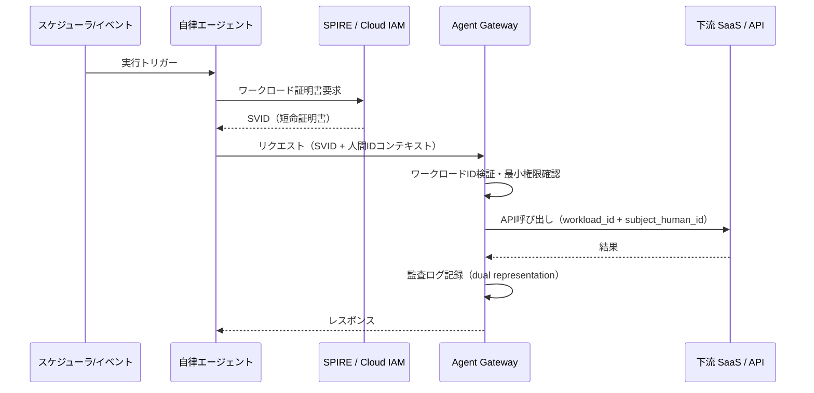

# ID-3 Workload / Agent Identity（エージェント自身のID）

## 概要

人間の要求を代理するのではなく、スケジュールバッチ・システムトリガー・自律ループで動作するエージェントには、人間の ID とは独立したマシン ID（Workload Identity）を付与する。SPIFFE/SVID やクラウドプロバイダーのワークロード ID を利用し、短命な証明書・トークンで認証する。すべての呼び出しは「人間ID（存在する場合）＋ワークロードID」の二重表現で記録され、自律動作の追跡と権限の最小化を両立する。

## 解決する企業課題

エージェントには2種類の動作モードがある。一つは人間の明示的な要求に起因する「人間代理モード」、もう一つはスケジュール・イベント・自律判断によって人間の介在なしに動く「自律実行モード」である。この二つを同一のIDで動かすと、複数の深刻な問題が生まれる。

第一は「操作主体の曖昧さ」である。監査ログに「サービスアカウントXが操作した」とのみ記録されていても、それが人間Aの依頼によるものか、深夜バッチによるものかが判別できない。インシデント発生時の調査・原因特定が著しく困難になる。

第二は「権限の過剰付与」である。人間代理と自律実行に同一アカウントを使うと、自律エージェントが人間の業務に必要な広い権限をそのまま持つ状態になる。自律エージェントが誤動作・侵害された場合のダメージ範囲が組織全体に広がる。

第三は「動的スケールへの対応不能」である。コンテナ・Kubernetes 環境では、エージェントが動的に生成・削除される。静的なサービスアカウントでは ID ライフサイクル管理が追いつかず、使用されていない ID が長期間残存するリスクが生まれる。

このパターンは、自律エージェントに検証可能な短命マシン ID を付与し、動作種別ごとにIDを分離することでこれらを解決する。

## 解決策と設計

自律エージェントには人間の ID とは独立した Workload Identity を付与する。この ID は SPIFFE/SVID 規格に基づく短命証明書、またはクラウドプロバイダーのマネージド ID として実装され、自動ローテーションされる。

自律エージェントは起動時に SPIRE（SPIFFE Runtime Environment）またはクラウドプロバイダーの ID 基盤からワークロード証明書を取得する。この証明書は短命（例：1時間）で自動ローテーションされる。下流 API の呼び出しにはこの証明書・トークンを使い、呼び出し元がエージェントであることを明示する。

人間の依頼に起因する場合（例：承認後に自律処理が走る場合）は、元の人間 ID を subject として保持し、ワークロード ID を actor として記録する。完全自律バッチで人間の起点がない場合は、ワークロード ID のみを記録し、その実行根拠（ポリシー・スケジュール定義）を監査に紐付ける。

## 向き／不向き

| 向き | 不向き |
|---|---|
| スケジュールバッチ・システムトリガーによる自律実行が存在する | すべてのエージェント動作が人間の明示的要求に起因する（[ID-2](id2-identity-federation-obo.md) で十分） |
| 自律エージェントと人間代理エージェントを監査上で分離したい | PoC で ID 基盤が未整備の段階（暫定サービスアカウントから段階移行） |
| Kubernetes/クラウド上でワークロードが動的にスケールする | 単一固定サーバーで動く小規模バッチ（証明書ローテーションの管理コストが割に合わない） |
| SPIFFE 対応インフラが既にある | オンプレミスのみで SPIRE 導入が困難な環境 |

## 要素技術・既存システム連携

- **SPIFFE/SPIRE**：ワークロードの暗号証明（SVID）発行・自動ローテーション
- **AWS IAM Roles Anywhere / IRSA**：EKS Pod・EC2 ワークロードへの一時クレデンシャル付与
- **Microsoft Entra Workload Identity**：Azure 上のワークロードへのマネージド ID 発行
- **Google Workload Identity Federation**：GKE ワークロードへの短命クレデンシャル
- **mTLS**：ワークロード間通信での相互認証。SPIFFE SVID を証明書として利用
- **短命トークン**：TTL は業務リスクに応じて設定（例：バッチ1回分の実行時間）

## 落とし穴／選定の勘所

!!! danger "自律エージェントへの管理者権限付与"
    自律動作するほど最小権限を厳格にすべきである。「バッチだから広めに取っておく」は最も危険な設計であり、誤動作・侵害時の影響範囲を企業全体に広げる。ワークロード ID は用途ごとに分割し、各 ID に必要な権限だけを与える。

- 長命の SVID・トークンをキャッシュして使い回すのは短命化の目的を損なう。[ID-5 JIT Scoped Credentials](id5-jit-scoped-credentials.md) と組み合わせ、ツール呼び出し直前に都度取得する。
- ワークロード ID の発行数が増えると管理が形骸化する。ID ライフサイクル（発行・失効・棚卸し）を自動化し、定期的に未使用 ID を削除する。
- 自律バッチが複数エージェントをチェーンする場合、各段で権限が縮退していることを確認する。末端エージェントが元の権限を引き継いでいないかを [ID-6 Zero-Trust PDP/PEP](id6-zero-trust-pdp-pep.md) で検証する。

## 関連パターン

- [ID-2 Identity Federation & OBO](id2-identity-federation-obo.md) — 人間代理時のトークン委譲（**対比**：OBO が人間代理のパターンであるのに対し、Workload Identity は自律実行専用であり、両者は動作種別で使い分ける）
- [ID-5 JIT Scoped Credentials](id5-jit-scoped-credentials.md) — ワークロード ID に紐付く短命・用途限定クレデンシャル（**補完**：ワークロード ID を保有者として JIT クレデンシャルを都度発行する）
- [ID-6 Zero-Trust PDP/PEP](id6-zero-trust-pdp-pep.md) — ワークロード ID の呼び出しを検証する認可点（**補完**：ワークロード ID による各アクションをゼロトラストで都度評価する）
- [OB-2 統一監査・系譜](../ob-observability/ob2-unified-audit-lineage.md) — 人間ID＋ワークロードIDの二重表現を監査ログに記録（**補完**：dual representation の記録を監査基盤で統一管理する）
