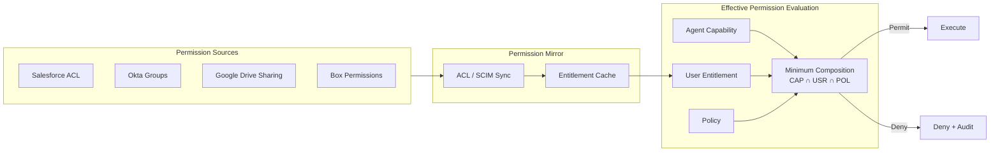

# ID-4 Permission Mirror & Least-of Faithful Access

## Overview

"Retrieved by search" does not mean "permitted to answer." When a RAG system searches across all company documents, it can retrieve confidential documents that a given user should never see. This pattern synchronizes the access permissions of each SaaS — Salesforce, Box, Google Drive, etc. — to the agent platform (Permission Mirror) and reduces the effective permission to the minimum of "agent capability ∩ user entitlement ∩ policy." Permission revocations for departing or transferred employees are reflected in real time, preventing "seeing what must not be seen" accidents.

**Permission Mirror is an approximation, not an authoritative source.** For final authorization at runtime, defer to SaaS-native authorization wherever possible ([ID-2 OBO](id2-identity-federation-obo.md) takes priority). The primary role of this pattern is limited to pre-filtering RAG results and supplementing delegation-unsupported systems.

## Business Problem

When enterprise RAG or cross-system search agents are deployed internally, "return an answer if the search found something" becomes the greatest risk. Placing all company documents in a vector database for fast search can cause RAG to retrieve and include confidential documents that the user is not authorized to view — this actually happens.

The root cause is that index construction is decoupled from permission checks. The index treats all documents equally, but each user's access permissions vary per SaaS and per document. Permission Mirror bridges this gap.

Even more serious is the problem of departed or transferred employees. Revoking Salesforce permissions does not help if a stale cache on the agent side still considers the access valid — enabling access to "already-revoked" information. This is known as the delayed revocation problem, and it cannot be prevented without an ACL synchronization mechanism.

For SaaS systems where OBO delegation ([ID-2](id2-identity-federation-obo.md)) is available, the SaaS itself can enforce access using the user's own permissions. But for legacy SaaS systems or custom internal systems that do not support delegation, the agent platform must reproduce the permissions. Permission Mirror fills that gap.

!!! tip "Minimum Viable Implementation"
    Start by synchronizing the ACLs of the primary document stores targeted by RAG (Box, Google Drive, etc.) on a daily basis and applying them to search result filtering. Expand to full synchronization of all SaaS systems incrementally.

This pattern addresses three enterprise problems:

- Preventing "silo-crossing leakage" where RAG returns documents that should not be visible
- Reducing the "delayed revocation" risk where revoked access persists after an employee's departure or transfer
- Enabling permission-faithful access control for systems where OBO delegation is unavailable

## Value Hypothesis

Enabling safe cross-SaaS operations broadens the business coverage of agents. Structurally eliminating permission accidents makes it easier for leadership to approve agent deployments, accelerating organization-wide rollout.

## Solution and Design

The solution is to maintain a Permission Mirror synchronized with each SaaS's permission state, and to establish a mechanism for computing effective permissions before executing RAG queries and tool calls.

Maintain a Permission Mirror synchronized with each SaaS's users, groups, roles, ACLs, and sharing settings. Evaluate access permissions before RAG and tool execution. For systems where delegation ([ID-2 OBO](id2-identity-federation-obo.md)) is available, the downstream SaaS enforces permissions using the user's own identity. For custom or legacy systems that do not support delegation, always pass access through a filter that reproduces the user's entitlements and classify those integrations as high-risk.



The effective permission formula is:

$$\text{effective\_permission} = \text{agent\_capability} \cap \text{user\_entitlement} \cap \text{policy\_constraint}$$

If the intersection of all three is empty, access is denied. Recording which element became the bottleneck in the audit log makes it easy to identify the root cause when access is insufficient.

## Applicability

| Good Fit | Poor Fit |
|---|---|
| Enterprise AI that searches across documents, tickets, CRM, and chat | Small environments with very simple permissions |
| Data access spanning many SaaS systems | Use cases involving only fully public information |
| Organizations with frequent permission changes due to departures and transfers | Single-SaaS scenarios where OBO is available (OBO takes priority) |
| Environments mixing delegation-unsupported legacy SaaS and custom systems | PoC stage where the cost of implementing ACL synchronization is not justified |

## Technology and Integration

- **Synchronization mechanisms**: ACL sync, SCIM Group Sync, SaaS Admin API
- **Authorization model**: Zanzibar-based / ReBAC, ABAC, PDP ([ID-6](id6-zero-trust-pdp-pep.md))
- **Target SaaS**: Salesforce, Box, Google Drive, Confluence, Notion, Slack, ServiceNow
- **Org graph**: Organizational information from Workday/Okta used as an attribute source

## Pitfalls and Selection Criteria

!!! warning "The Delayed Revocation Trap"
    The greatest risk is "delayed revocation" — where the entitlement copy diverges from the source and revoked access persists. Mitigate this with re-synchronization and short TTLs, and monitor synchronization lag.

- Permission Mirror is **a cache, not an authoritative source**. Treat the SaaS-side permissions as ground truth and have a mechanism to detect and correct divergences.
- Set synchronization frequency according to risk. HR transfers warrant daily sync; changes to confidential document sharing should approach real time.
- Placing all company data into a single vector database for fast search is prohibited. Always baseline on ACL-aware indexing ([KM-1](../km-knowledge/km1-access-controlled-rag.md)) or federation ([KM-2](../km-knowledge/km2-context-mesh.md)).

## Interfaces

The following are the key interfaces for implementing this pattern. Coding agents can generate stub code from these definitions.

```yaml
interfaces:
  - name: ACL Sync Pipeline
    description: "Synchronizes SaaS ACLs (Salesforce, Box, Google Drive) into the Permission Mirror; near-real-time for sensitive documents, daily for org-wide role changes."
    input:
      request: object
    output:
      response: object
    errors:
      - code: GENERAL_ERROR
        description: "Error occurred during ACL Sync Pipeline processing"
    protocol: "REST / gRPC"
    implementation_hints:
      - "See the Solution and Design section for details"
  - name: Effective Permission Calculator
    description: "Computes agent_capability ∩ user_entitlement ∩ policy_constraint before each RAG query or tool call; records which factor was the limiting constraint in audit."
    input:
      request: object
    output:
      response: object
    errors:
      - code: GENERAL_ERROR
        description: "Error occurred during Effective Permission Calculator processing"
    protocol: "REST / gRPC"
    implementation_hints:
      - "See the Solution and Design section for details"
  - name: Stale-Access Monitor
    description: "Detects and alerts when Mirror-to-source divergence exceeds threshold; triggers forced re-sync on departure/transfer events."
    input:
      request: object
    output:
      response: object
    errors:
      - code: GENERAL_ERROR
        description: "Error occurred during Stale-Access Monitor processing"
    protocol: "REST / gRPC"
    implementation_hints:
      - "See the Solution and Design section for details"
```

## Related Patterns

- [ID-2 Identity Federation & OBO](id2-identity-federation-obo.md) — This pattern is unnecessary for OBO-supported SaaS; Permission Mirror is needed only for unsupported systems (**contrast**: SaaS-side permission control is sufficient when OBO is available; Permission Mirror becomes the fallback for systems where it is not)
- [ID-6 Zero-Trust PDP/PEP](id6-zero-trust-pdp-pep.md) — PDP evaluates the minimum-composition (**complementary**: the PDP uses the entitlements provided by Permission Mirror as ABAC attribute inputs)
- [KM-1 Access-Controlled RAG](../km-knowledge/km1-access-controlled-rag.md) — Reference Permission Mirror during RAG searches (**complementary**: filter vector search results through Permission Mirror to return only documents the user is authorized to view)
- [KM-2 Context Mesh](../km-knowledge/km2-context-mesh.md) — Federated approach acquires data JIT with the user's own token (**similar**: both share the design principle of distributed management of access to permission-scoped data)
- [GV-3 Department Agent Factory](../gv-governance/gv3-department-agent-factory.md) — Trim over-privileged template capabilities down to least privilege (**complementary**: the capability definitions of agent templates feed in as CAP inputs to the minimum composition)
