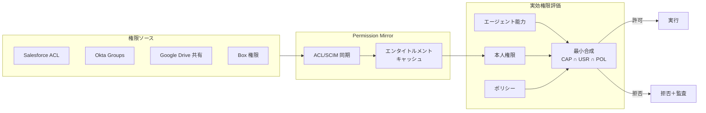

# ID-4 Permission Mirror & Least-of Faithful Access（権限忠実アクセス）

## 概要

「検索できたから答えていい」わけではない。RAG で全社文書を検索すると、本来そのユーザーには見えないはずの機密文書まで取得できてしまうことがある。このパターンは、Salesforce・Box・Google Drive など各 SaaS のアクセス権限をエージェント基盤側に同期（Permission Mirror）し、実効権限を「エージェント能力 ∩ 本人権限 ∩ ポリシー」の最小に縮退させる。退職者や異動者の権限剥奪もリアルタイムに反映し、「見えてはいけないものが見える」事故を防ぐ。

## 解決する企業課題

企業 RAG や横断検索エージェントが社内に展開されるとき、「検索できたから答える」という状態が最大のリスクになる。ベクトル DB に全社文書を入れて高速検索できるようにした結果、本来ユーザーが参照できないはずの機密文書を RAG が取得して回答に含めてしまう——これが実際に発生する。

問題の根本は、検索インデックスの構築と権限チェックが切り離されていることにある。インデックスは全文書を平等に扱うが、各ユーザーのアクセス権限は SaaS ごと・ドキュメントごとに異なる。この乖離を埋めるのが Permission Mirror である。

さらに深刻なのは退職者・異動者の問題である。Salesforce の権限を剥奪しても、エージェント側のキャッシュが古い状態のまま残ると「剥奪済みのはずの情報」にアクセスできてしまう。これは遅延失効問題として知られ、ACL 同期の仕組みがなければ防げない。

OBO 委譲（[ID-2](id2-identity-federation-obo.md)）が使える SaaS では、SaaS 側が本人権限でアクセスを制御できる。しかし委譲非対応の旧式 SaaS や独自システムでは、エージェント基盤側で権限を再現する必要がある。Permission Mirror はこの差を埋める。

このパターンが解決する企業課題は次の3点である。

- RAGが本来見えない文書を返す「サイロ越え漏洩」の防止
- 退職・異動後に剥奪済みアクセスが残る「遅延失効」リスクの抑制
- OBO 委譲が使えない系での権限忠実なアクセス制御の実現

## 解決策と設計

解決策は、各 SaaS の権限状態をエージェント基盤側に同期した Permission Mirror を持ち、RAG クエリ実行前・ツール呼び出し前に実効権限を計算する仕組みを設けることである。

SaaS の users/groups/roles/ACL/共有設定を同期した Permission Mirror を持ち、RAG・ツール実行前にアクセス可否を判定する。委譲（[ID-2 OBO](id2-identity-federation-obo.md)）が使える系では下流が本人権限で制御する。委譲不可の独自・旧式系は、本人エンタイトルメントを再現したフィルタを必ず通し「高リスク」に分類する。

実効権限の計算式は以下のとおりである。

$$\text{effective\_permission} = \text{agent\_capability} \cap \text{user\_entitlement} \cap \text{policy\_constraint}$$

この三者の交差が空であればアクセスは拒否される。どの要素がボトルネックになったかを監査に記録することで、権限不足時の原因特定が容易になる。

## 向き／不向き

| 向き | 不向き |
|---|---|
| 文書/チケット/CRM/チャットを横断検索する全社AI | 権限が極めて単純な小環境 |
| 多数のSaaSにまたがるデータアクセス | 完全公開情報のみを扱うユースケース |
| 退職・異動に伴う権限変更が頻繁な組織 | 単一SaaS完結で OBO が使える場合（OBO優先） |
| OBO 委譲非対応の旧式SaaS・独自システムが混在する環境 | PoC で ACL 同期の実装コストが正当化できない段階 |

## 要素技術・既存システム連携

- **同期手段**：ACL 同期、SCIM Group Sync、SaaS Admin API
- **認可モデル**：Zanzibar 系/ReBAC、ABAC、PDP（[ID-6](id6-zero-trust-pdp-pep.md)）
- **対象SaaS**：Salesforce、Box、Google Drive、Confluence、Notion、Slack、ServiceNow
- **組織グラフ**：Workday/Okta からの組織情報を属性源として利用

## 落とし穴／選定の勘所

!!! warning "遅延失効の罠"
    エンタイトルメントのコピーが源と乖離し、剥奪済みアクセスが残る「遅延失効」が最大のリスクである。再同期＋短TTLで抑え、同期遅延を監視する。

- Permission Mirror は**キャッシュであり権威ソースではない**。SaaS 側の権限を真実とし、乖離を検出・修正する仕組みを持つ。
- 同期頻度はリスクに応じて決める。人事異動は日次、機密文書の共有変更はリアルタイムに近づける。
- 「全社データを1つのベクトル DB に入れて高速検索」は禁忌である。ACL 同梱（[KM-1](../km-knowledge/km1-access-controlled-rag.md)）またはフェデレーション（[KM-2](../km-knowledge/km2-context-mesh.md)）を前提にする。

## 関連パターン

- [ID-2 Identity Federation & OBO](id2-identity-federation-obo.md) — OBO対応SaaSでは本パターン不要、非対応SaaSで Permission Mirror が必要（**対比**：OBO が使える系では SaaS 側の権限制御で足り、使えない系で Permission Mirror が代替手段になる）
- [ID-6 Zero-Trust PDP/PEP](id6-zero-trust-pdp-pep.md) — 最小合成の評価を PDP が担う（**補完**：Permission Mirror が提供するエンタイトルメントを PDP が認可判断の属性源として利用する）
- [KM-1 Access-Controlled RAG](../km-knowledge/km1-access-controlled-rag.md) — RAG検索時に Permission Mirror を参照（**補完**：ベクトル検索の結果を Permission Mirror でフィルタし、本人が参照できる文書のみを返す）
- [KM-2 Context Mesh](../km-knowledge/km2-context-mesh.md) — フェデレーション型では本人トークンで JIT 取得（**類似**：権限付きデータへのアクセスを分散管理するアプローチが共通する）
- [GV-3 Department Agent Factory](../gv-governance/gv3-department-agent-factory.md) — テンプレートの過剰権限を最小権限で削る（**補完**：エージェントテンプレートの能力定義が CAP 項目として最小合成に入力される）
