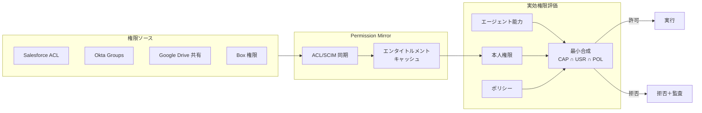

# ID-4 Permission Mirror & Least-of Faithful Access（権限忠実アクセス）

## 概要

各SaaS/独自システムの権限を基盤側で再現・参照し、実効権限を常に「**エージェント能力 ∩ 本人権限 ∩ ポリシー**」の最小に縮退させる。権限の最小合成を実現する中核パターンである。

## 設計

SaaS の users/groups/roles/ACL/共有設定を同期した Permission Mirror を持ち、RAG・ツール実行前にアクセス可否を判定する。委譲（[ID-2 OBO](id2-identity-federation-obo.md)）が使える系は下流が本人権限で弾く。委譲不可の独自・旧式系は、本人エンタイトルメントを再現したフィルタを必ず通し「高リスク」に分類する。

実効権限の計算式は以下のとおりである。

$$\text{effective\_permission} = \text{agent\_capability} \cap \text{user\_entitlement} \cap \text{policy\_constraint}$$

この三者の交差が空ならアクセスは拒否される。どの要素がボトルネックかを監査に記録することで、権限不足時の原因特定が容易になる。

## 解決する企業課題

「検索できたから答える」状態は企業RAG最大のリスクである。本来見えない文書をRAGが返す、権限を超えた要約を生成する、退職者・異動者のアクセスが残る——これらを構造的に防ぐ。

## 向き／不向き

| 向き | 不向き |
|---|---|
| 文書/チケット/CRM/チャットを横断検索する全社AI | 権限が極めて単純な小環境 |
| 多数のSaaSにまたがるデータアクセス | 完全公開情報のみを扱うユースケース |
| 退職・異動に伴う権限変更が頻繁な組織 | 単一SaaS完結で OBO が使える場合（OBO優先） |

## 要素技術・既存システム連携

- **同期手段**：ACL 同期、SCIM Group Sync、SaaS Admin API
- **認可モデル**：Zanzibar 系/ReBAC、ABAC、PDP（[ID-6](id6-zero-trust-pdp-pep.md)）
- **対象SaaS**：Salesforce、Box、Google Drive、Confluence、Notion、Slack、ServiceNow
- **組織グラフ**：Workday/Okta からの組織情報を属性源として利用

## 落とし穴／選定の勘所

!!! warning "遅延失効の罠"
    エンタイトルメントのコピーが源と乖離し、剥奪済みアクセスが残る「遅延失効」が最大のリスクである。再同期＋短TTLで抑え、同期遅延を監視する。

- Permission Mirror は**キャッシュであり権威ソースではない**。SaaS側の権限を真実とし、乖離を検出・修正する仕組みを持つ。
- 同期頻度はリスクに応じて決める。人事異動は日次、機密文書の共有変更はリアルタイムに近づける。
- 「全社データを1つのベクトルDBに入れて速く検索」は禁忌。ACL 同梱（[KM-1](../km-knowledge/km1-access-controlled-rag.md)）またはフェデレーション（[KM-2](../km-knowledge/km2-context-mesh.md)）を前提にする。

## 関連パターン

- [ID-2 Identity Federation & OBO](id2-identity-federation-obo.md) — OBO対応SaaSでは本パターン不要、非対応SaaSで Permission Mirror が必要
- [ID-6 Zero-Trust PDP/PEP](id6-zero-trust-pdp-pep.md) — 最小合成の評価を PDP が担う
- [KM-1 Access-Controlled RAG](../km-knowledge/km1-access-controlled-rag.md) — RAG検索時に Permission Mirror を参照
- [KM-2 Context Mesh](../km-knowledge/km2-context-mesh.md) — フェデレーション型では本人トークンで JIT 取得
- [GV-3 Department Agent Factory](../gv-governance/gv3-department-agent-factory.md) — テンプレートの過剰権限を最小権限で削る
