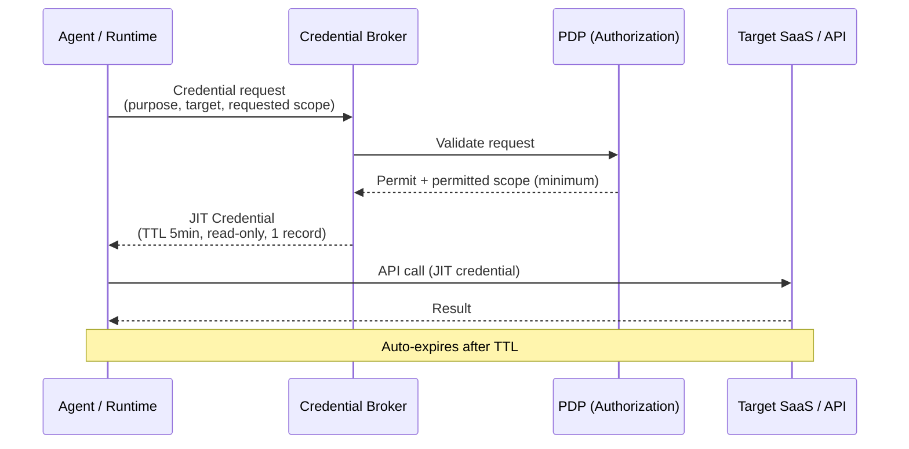

# ID-5 JIT Scoped Credentials (Minimal, Short-Lived, Purpose-Limited)

## Overview

An agent carrying a long-lived API key is like leaving the house key taped to the mailbox. In this pattern, the agent obtains purpose-limited credentials from a broker immediately before each tool call — for example, "read-only access to this specific customer record, valid for 5 minutes." Even if leaked, the damage is confined to a few minutes and a single resource. Dynamic issuance via HashiCorp Vault or AWS STS eliminates scattered, long-lived key exposure at the root.

## Business Problem

A common pattern in SaaS integrations is for broad-scope API keys, created during development and valid for years, to be shared across multiple connectors indefinitely. These "scattered long-lived keys" are the most frequent problem in enterprise credential risk.

Three specific risks compound:

The first is **long exposure windows**. It typically takes months from an API key compromise to detection and revocation. Long-lived keys remain available to attackers the entire time. Short-lived credentials that auto-expire within minutes minimize actual damage.

The second is **broad scope**. Creating "a key that can read and write everything" out of convenience means a leak exposes the entire dataset. Restricting the credential to "read-only access to this customer record, for this call only" limits what an attacker can do with a leaked credential to a single operation.

The third is **opaque usage**. When multiple agents and connectors share the same long-lived key, it becomes impossible to determine which agent operated what data at what time. Audit trails and compliance investigations yield nothing, and in the worst case, revoking the key takes down unrelated services.

This pattern resolves all three by designing around the principle: "don't hold credentials, treat them as disposable, keep scope minimal."

!!! tip "Minimum Viable Implementation"
    Use Vault or AWS STS to dynamically issue a short-lived token (TTL of a few minutes) for one SaaS immediately before tool calls. Create a configuration where no credentials are hardcoded in connectors.

## Value Hypothesis

Minimal-privilege, short-lived tokens limit the blast radius in the event of a leak. Reducing security risk makes it possible to apply agents to highly confidential workflows, expanding the scope of automation (= cost reduction and efficiency gains).

## Solution and Design

The solution is to fundamentally change the credential issuance model. Connectors and runtimes do not hold credentials in advance; immediately before a tool call, they send a dynamic request to a credential broker and obtain a credential with a scope and TTL specific to that call. Retrieved credentials are treated as single-use and must not be reused or cached.



Each credential includes a purpose tag, requesting agent ID, issuance time, TTL, and permitted scope. This makes it possible to trace in audit logs which agent operated what data at what time with what scope.

## Applicability

| Good Fit | Poor Fit |
|---|---|
| Many agents operating across multiple SaaS systems | PoC calling only a single internal API |
| Workflows including high-risk operations (write, delete, access to personal data) | Small-scale deployments where the cost of introducing a credential broker is not justified |
| Existing secret management infrastructure (Vault/STS, etc.) | Legacy SaaS where the external IdP does not support JIT issuance (use [ID-4](id4-permission-mirror-least-of.md) in combination) |
| SOC2/ISO 27001 requiring credential management audit trails | Cases where rate limits make the broker call itself a bottleneck |

## Technology and Integration

- **HashiCorp Vault**: Dynamic Secrets (per-SaaS short-lived credential generation), TTL control
- **AWS STS**: AssumeRole / GetSessionToken for temporary credential issuance
- **Azure Managed Identity / Entra Workload Identity**: Short-lived tokens for cloud resources
- **Salesforce / ServiceNow**: Per-SaaS scoped tokens (Connected App + scope restrictions)
- **OAuth 2.0 Token Exchange (RFC 8693)**: Combined with [ID-2 OBO](id2-identity-federation-obo.md) to issue JIT tokens for downstream SaaS

## Pitfalls and Selection Criteria

!!! danger "Broadening Scope Cache to Avoid Latency"
    Widening scope and extending cache windows because JIT acquisition adds latency completely defeats the purpose of short-lived credentials. Set TTL according to business risk; if caching is used, key on target, scope, and caller with exact-match — and re-acquire on any mismatch. Enforce this without exception.

!!! warning "TTL and Risk Mismatch"
    Applying the same TTL to low-risk read-only operations and high-risk writes, deletes, or PII access is inappropriate. The higher the risk of the operation, the shorter the TTL and the narrower the scope must be.

- Hardcoding API keys inside connector or tool implementations is strictly prohibited. Establish an architectural constraint requiring that all credentials be obtained through the credential broker.
- The credential broker itself can become a single point of failure. Design for broker availability (Active-Active, health checks) and implement fail-closed behavior (abort the operation) if broker acquisition fails.

## Interfaces

The following are the key interfaces for implementing this pattern. Coding agents can generate stub code from these definitions.

```yaml
interfaces:
  - name: Credential Broker
    description: "Vault/STS endpoint that issues JIT credentials with explicit scope, TTL, target resource, and agent ID tag; validates request against PDP before issuing."
    input:
      request: object
    output:
      response: object
    errors:
      - code: GENERAL_ERROR
        description: "Error occurred during Credential Broker processing"
    protocol: "REST / gRPC"
    implementation_hints:
      - "See the Solution and Design section for details"
  - name: PDP Pre-Issuance Check
    description: "Broker consults ID-6 PDP to confirm the requesting agent is authorized before issuing the credential; sets minimum permitted scope."
    input:
      request: object
    output:
      response: object
    errors:
      - code: GENERAL_ERROR
        description: "Error occurred during PDP Pre-Issuance Check processing"
    protocol: "REST / gRPC"
    implementation_hints:
      - "See the Solution and Design section for details"
  - name: Credential Audit Trail
    description: "Each issued credential record includes agent_id, purpose, scope, TTL, and target_resource for full forensic traceability."
    input:
      request: object
    output:
      response: object
    errors:
      - code: GENERAL_ERROR
        description: "Error occurred during Credential Audit Trail processing"
    protocol: "REST / gRPC"
    implementation_hints:
      - "See the Solution and Design section for details"
```

## Related Patterns

- [ID-2 Identity Federation & OBO](id2-identity-federation-obo.md) — Combining OBO token issuance with JIT short-lived credentials (**complementary**: apply the JIT pattern to OBO-issued delegation tokens to keep them short-lived and purpose-limited)
- [ID-3 Workload / Agent Identity](id3-workload-agent-identity.md) — Workload identity as the holder for JIT credential issuance (**complementary**: issue JIT credentials per tool call using the workload identity as the holder)
- [ID-6 Zero-Trust PDP/PEP](id6-zero-trust-pdp-pep.md) — Authorization decision before JIT credential issuance (**complementary**: the PDP evaluates the validity of the request and determines the permitted scope before the broker issues the credential)
- [IN-1 Tool / MCP Gateway](../in-integration/in1-tool-mcp-gateway.md) — Unified integration entry point that interacts with the broker on tool calls (**complementary**: the tool gateway serves as the integration point with the credential broker)
