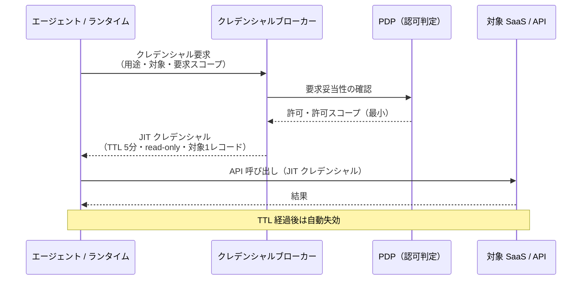

# ID-5 JIT Scoped Credentials（最小・短命・用途限定）

## 概要

エージェントが長期間有効な API キーを持ち歩くのは、家の鍵をポストに貼っておくようなものです。このパターンでは、ツール呼び出しの直前に「この顧客レコードの読み取り専用・5分間有効」といった用途限定の資格情報をブローカーから都度取得します。万が一漏洩しても被害は数分間・単一リソースに限定されます。HashiCorp Vault や AWS STS による動的発行で、鍵の散在と長期露出のリスクを根本から断ちます。

## 解決する企業課題

SaaS 統合でありがちな問題は、開発時に作った広スコープの API キーが何年も有効なまま複数のコネクターで共有され続ける状態です。このような「散在する長命キー」は、企業のクレデンシャルリスクにおける最頻出の問題です。

具体的には次の3つのリスクが積み重なります。

第一は「露出時間窓の長さ」です。API キーが侵害されてから発見・失効まで平均数か月かかることが多いです。長命キーはその間ずっと攻撃者に使い続けられます。短命クレデンシャルなら自動失効までの窓が数分で済み、実害を極小化できます。

第二は「スコープの広さ」です。便宜上「全部読み書きできるキー」を作ってしまうと、漏洩時の影響範囲が全データに及びます。用途を「この顧客レコードの読み取り専用・今この呼び出し限定」に絞れば、漏洩しても使える操作は1つに限定されます。

第三は「使用状況の不透明さ」です。同一の長命キーを複数のエージェント・コネクターが共有すると、どのエージェントがいつ何を操作したかが特定できません。インシデント調査・コンプライアンス監査で証跡が得られず、最悪の場合はキーを失効させると無関係なサービスまで停止します。

クレデンシャルを「持たない・使い捨てる・最小に絞る」という設計原則でこれらを解消するのが、本パターンの本質です。

!!! tip "最小成立条件（MVP）"
    Vault または AWS STS でツール呼び出し直前に短命トークン（TTL 数分）を1つの SaaS 向けに動的発行し、コネクタにクレデンシャルをハードコードしない構成を作ります。

## 価値仮説

最小権限・短命トークンにより、万一の漏洩時の被害範囲を限定できます。セキュリティリスクの低減は高機密業務へのエージェント適用を可能にし、自動化対象の拡大（＝コスト削減・効率向上）につながります。

## 解決策と設計

解決策はクレデンシャルの発行モデルを根本から変えることです。コネクターやランタイムはクレデンシャルを事前に保持しません。ツール呼び出しの直前にクレデンシャルブローカーへ動的リクエストを送り、その呼び出し専用のスコープ・TTL を持つクレデンシャルを取得します。

エージェントランタイムはクレデンシャルを保持しません。ツール呼び出し時にクレデンシャルブローカー（Vault/STS 等）へ動的リクエストを送り、スコープと TTL が明示された短命クレデンシャルを取得します。取得したクレデンシャルは使い捨てとし、再利用やキャッシュは禁止です。



クレデンシャルには用途タグ・要求元エージェント ID・発行時刻・TTL・許可スコープを含めます。これにより、監査ログでどのエージェントがいつどのスコープで何を操作したかを追跡できます。

## 向き／不向き

| 向き | 不向き |
|---|---|
| 複数 SaaS を横断するエージェントが多い | 単一システム・内部API のみを呼ぶ PoC |
| 高リスク操作（書き込み・削除・個人情報へのアクセス）を含む | クレデンシャルブローカーの導入コストが正当化できない小規模 |
| 既に Vault/STS 等のシークレット管理基盤がある | 外部 IdP が JIT 発行に非対応のレガシー SaaS（[ID-4](id4-permission-mirror-least-of.md) との組み合わせで対処） |
| SOC2/ISO27001 等でクレデンシャル管理の証跡が求められる | レート制限が厳しくブローカー呼び出し自体がボトルネックになる場合 |

## 要素技術・既存システム連携

- **HashiCorp Vault**：Dynamic Secrets（SaaS ごとの短命クレデンシャル生成）、TTL 制御
- **AWS STS**：AssumeRole / GetSessionToken による一時クレデンシャル発行
- **Azure Managed Identity / Entra Workload Identity**：クラウドリソース向け短命トークン
- **Salesforce / ServiceNow**：per-SaaS スコープドトークン（接続済みアプリ＋スコープ制限）
- **OAuth 2.0 Token Exchange（RFC 8693）**：[ID-2 OBO](id2-identity-federation-obo.md) と組み合わせて下流 SaaS 用 JIT トークンを発行

## 落とし穴／選定の勘所

!!! danger "「遅い」という理由での広スコープキャッシュ"
    JIT 取得がレイテンシに影響するからと、スコープを広げて長めにキャッシュする対処は短命化の目的を完全に無効化します。TTL は業務リスクに応じて設定し、キャッシュを設ける場合は対象・スコープ・呼び出し元を完全一致でキーとします。「一致しない場合は再取得」を徹底します。

!!! warning "TTL とリスクのミスマッチ"
    読み取り専用で低リスクの操作と、書き込み・削除・PII アクセスを同一の TTL で扱うのは不適切です。高リスク操作ほど TTL を短く、スコープを狭くします。

- コネクターやツールの実装内に API キーをハードコードするのは厳禁です。クレデンシャルブローカー経由での取得を必須とするアーキテクチャ制約を設けておきます。
- クレデンシャルブローカー自体が単一障害点になるリスクもあります。ブローカーの可用性設計（Active-Active、ヘルスチェック）と、取得失敗時のフェイルクローズ（操作中断）を実装しておきます。

## Interfaces

以下はこのパターンを実装する際の主要インターフェイスです。コーディングエージェントはこの定義からスタブコードを生成できます。

```yaml
interfaces:
  - name: Credential Broker
    description: "Vault/STS endpoint that issues JIT credentials with explicit scope, TTL, target resource, and agent ID tag; validates request against PDP before issuing."
    input:
      request: object
    output:
      response: object
    errors:
      - code: GENERAL_ERROR
        description: "Credential Broker の処理中にエラーが発生"
    protocol: "REST / gRPC"
    implementation_hints:
      - "詳細は本文の「解決策と設計」節を参照"
    code_examples:
      typescript: |
        interface CredentialBrokerRequest {
          agentId: string;
          scope: string[];
          targetResource: string;
          ttlSeconds: number;
        }
        interface CredentialBrokerResponse {
          credential: string;
          expiresAt: Date;
          credentialId: string;
        }
        interface CredentialBroker {
          credentialBroker(req: CredentialBrokerRequest): Promise<CredentialBrokerResponse>;
        }
      python: |
        @dataclass
        class CredentialBrokerRequest:
            agent_id: str
            scope: list[str]
            target_resource: str
            ttl_seconds: int
        
        @dataclass
        class CredentialBrokerResponse:
            credential: str
            expires_at: datetime
            credential_id: str
        
        class CredentialBroker(Protocol):
            async def credential_broker(self, req: CredentialBrokerRequest) -> CredentialBrokerResponse: ...
  - name: PDP Pre-Issuance Check
    description: "Broker consults ID-6 PDP to confirm the requesting agent is authorized before issuing the credential; sets minimum permitted scope."
    input:
      request: object
    output:
      response: object
    errors:
      - code: GENERAL_ERROR
        description: "PDP Pre-Issuance Check の処理中にエラーが発生"
    protocol: "REST / gRPC"
    implementation_hints:
      - "詳細は本文の「解決策と設計」節を参照"
    code_examples:
      typescript: |
        interface PdpPreIssuanceCheckRequest {
          agentId: string;
          requestedScope: string[];
          targetResource: string;
        }
        interface PdpPreIssuanceCheckResponse {
          authorized: boolean;
          permittedScope: string[];
          reason: string;
        }
        interface PdpPreIssuanceCheck {
          pdpPreIssuanceCheck(req: PdpPreIssuanceCheckRequest): Promise<PdpPreIssuanceCheckResponse>;
        }
      python: |
        @dataclass
        class PdpPreIssuanceCheckRequest:
            agent_id: str
            requested_scope: list[str]
            target_resource: str
        
        @dataclass
        class PdpPreIssuanceCheckResponse:
            authorized: bool
            permitted_scope: list[str]
            reason: str
        
        class PdpPreIssuanceCheck(Protocol):
            async def pdp_pre_issuance_check(self, req: PdpPreIssuanceCheckRequest) -> PdpPreIssuanceCheckResponse: ...
  - name: Credential Audit Trail
    description: "Each issued credential record includes agent_id, purpose, scope, TTL, and target_resource for full forensic traceability."
    input:
      request: object
    output:
      response: object
    errors:
      - code: GENERAL_ERROR
        description: "Credential Audit Trail の処理中にエラーが発生"
    protocol: "REST / gRPC"
    implementation_hints:
      - "詳細は本文の「解決策と設計」節を参照"
    code_examples:
      typescript: |
        interface CredentialAuditTrailRequest {
          actorId: string;
          agentId: string;
          correlationId: string;
          action: string;
          resource: string;
        }
        interface CredentialAuditTrailResponse {
          auditId: string;
          recordedAt: Date;
        }
        interface CredentialAuditTrail {
          credentialAuditTrail(req: CredentialAuditTrailRequest): Promise<CredentialAuditTrailResponse>;
        }
      python: |
        @dataclass
        class CredentialAuditTrailRequest:
            actor_id: str
            agent_id: str
            correlation_id: str
            action: str
            resource: str
        
        @dataclass
        class CredentialAuditTrailResponse:
            audit_id: str
            recorded_at: datetime
        
        class CredentialAuditTrail(Protocol):
            async def credential_audit_trail(self, req: CredentialAuditTrailRequest) -> CredentialAuditTrailResponse: ...
```

## 関連パターン

- [ID-2 Identity Federation & OBO](id2-identity-federation-obo.md) — OBO トークンの短命化と JIT 発行の組み合わせ（**補完**：OBO で発行された委譲トークンを JIT パターンで短命・用途限定に絞る）
- [ID-3 Workload / Agent Identity](id3-workload-agent-identity.md) — 自律エージェントの JIT クレデンシャル発行元（**補完**：ワークロード ID を保有者として、ツール呼び出しごとに JIT クレデンシャルを発行する）
- [ID-6 Zero-Trust PDP/PEP](id6-zero-trust-pdp-pep.md) — JIT クレデンシャル発行前の認可判定（**補完**：ブローカーが発行する前に PDP が要求の妥当性を評価し、許可スコープを決定する）
- [IN-1 Tool / MCP Gateway](../in-integration/in1-tool-mcp-gateway.md) — ツール呼び出し時にブローカーと連携する統合入口（**補完**：ツールゲートウェイがクレデンシャルブローカーとの連携点になる）

## Decision Summary

```yaml
decision_summary:
  pattern: ID-5
  participates_in:
    - decision: DC-7
      role: primary
    - decision: DC-1
      role: enabler
  recommended_if:
    - "高リスク操作（書き込み・削除）に短命トークンが必要"
    - "侵害時の爆発半径を最小化したい"
  avoid_if:
    - "読み取り専用で低リスクの操作のみ"
  combines_with: [ID-2, ID-4, ID-6]
  conflicts_with: []
  value_outcome:
    drivers: [audit_compliance]
    kpis: [資格情報の平均有効期間, 過剰権限の検知件数]
  mvp: "高リスク操作のみJIT発行に切り替え、TTL 5分以内"
  cost: S
```
