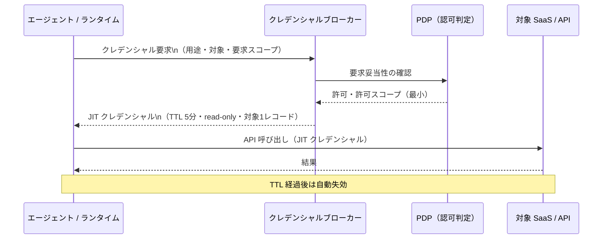

# ID-5 JIT Scoped Credentials（最小・短命・用途限定）

## 概要

コネクターやエージェントランタイムが長命なAPIキー・トークンを保持することを廃止する。ツール呼び出し直前に、用途（例：「この顧客レコードの読み取り専用」）・対象システム・有効期間（例：5分）を限定したクレデンシャルをクレデンシャルブローカーから取得して使う。クレデンシャルの漏洩ウィンドウを業務単位に縮小し、漏洩した場合でもダメージ範囲を局所化する。

## 設計

エージェントランタイムはクレデンシャルを保持しない。ツール呼び出し時にクレデンシャルブローカー（Vault/STS等）へ動的リクエストを送り、スコープと TTL が明示された短命クレデンシャルを取得する。取得したクレデンシャルは使い捨てで、再利用・キャッシュを禁止する。

クレデンシャルには用途タグ・要求元エージェント ID・発行時刻・TTL・許可スコープを含める。これにより監査ログでどのエージェントがいつどのスコープで何を操作したかが追跡可能になる。

## 解決する企業課題

SaaS 統合でありがちなのは、開発時に作った広スコープのAPIキーが何年も有効なまま複数コネクターで共有される状態である。一つのキーが漏洩すると全 SaaS へのアクセスが危険にさらされる。また、どのエージェントがそのキーを使っているか特定できないため失効もできない。JIT Scoped Credentials はこの「散在する長命キー」構造を根本から解消する。

## 向き／不向き

| 向き | 不向き |
|---|---|
| 複数 SaaS を横断するエージェントが多い | 単一システム・内部API のみを呼ぶ PoC |
| 高リスク操作（書き込み・削除・個人情報へのアクセス）を含む | クレデンシャルブローカーの導入コストが正当化できない小規模 |
| 既に Vault/STS 等のシークレット管理基盤がある | 外部 IdP が JIT 発行に非対応のレガシー SaaS（[ID-4](id4-permission-mirror-least-of.md) との組み合わせで対処） |
| SOC2/ISO27001 等でクレデンシャル管理の証跡が求められる | レート制限が厳しくブローカー呼び出し自体がボトルネックになる場合 |

## 要素技術・既存システム連携

- **HashiCorp Vault**：Dynamic Secrets（SaaS ごとの短命クレデンシャル生成）、TTL 制御
- **AWS STS**：AssumeRole / GetSessionToken による一時クレデンシャル発行
- **Azure Managed Identity / Entra Workload Identity**：クラウドリソース向け短命トークン
- **Salesforce / ServiceNow**：per-SaaS スコープドトークン（接続済みアプリ＋スコープ制限）
- **OAuth 2.0 Token Exchange（RFC 8693）**：[ID-2 OBO](id2-identity-federation-obo.md) と組み合わせて下流 SaaS 用 JIT トークンを発行

## 落とし穴／選定の勘所

!!! danger "「遅い」という理由での広スコープキャッシュ"
    JIT 取得がレイテンシに影響するからと、スコープを広げて長めにキャッシュする対処は短命化の目的を完全に無効化する。TTL は業務リスクに応じて設定し、キャッシュを設ける場合は対象・スコープ・呼び出し元を完全一致でキーとする。「一致しない場合は再取得」を徹底する。

!!! warning "TTL とリスクのミスマッチ"
    読み取り専用で低リスクの操作と、書き込み・削除・PII アクセスを同一の TTL で扱うのは不適切である。高リスク操作ほど TTL を短く、スコープを狭くする。

- コネクターやツールの実装内にAPIキーをハードコードするのは厳禁である。クレデンシャルブローカー経由の取得を必須とするアーキテクチャ制約を設ける。
- クレデンシャルブローカー自体が単一障害点になるリスクがある。ブローカーの可用性設計（Active-Active、ヘルスチェック）と、取得失敗時のフェイルクローズ（操作中断）を実装する。

## 関連パターン

- [ID-2 Identity Federation & OBO](id2-identity-federation-obo.md) — OBO トークンの短命化と JIT 発行の組み合わせ
- [ID-3 Workload / Agent Identity](id3-workload-agent-identity.md) — 自律エージェントの JIT クレデンシャル発行元
- [ID-6 Zero-Trust PDP/PEP](id6-zero-trust-pdp-pep.md) — JIT クレデンシャル発行前の認可判定
- [IN-1 Tool / MCP Gateway](../in-integration/in1-tool-mcp-gateway.md) — ツール呼び出し時にブローカーと連携する統合入口
