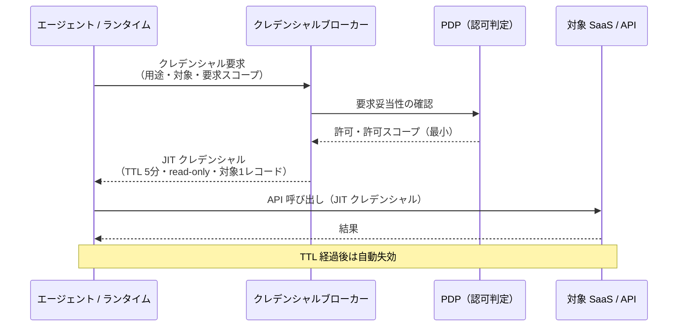

# ID-5 JIT Scoped Credentials（最小・短命・用途限定）

## 概要

エージェントが長期間有効な API キーを持ち歩くのは、家の鍵をポストに貼っておくようなものである。このパターンでは、ツール呼び出しの直前に「この顧客レコードの読み取り専用・5分間有効」といった用途限定の資格情報をブローカーから都度取得する。万が一漏洩しても被害は数分間・単一リソースに限定される。HashiCorp Vault や AWS STS による動的発行で、鍵の散在と長期露出のリスクを根本から断つ。

## 解決する企業課題

SaaS 統合でありがちな問題は、開発時に作った広スコープの API キーが何年も有効なまま複数のコネクターで共有され続ける状態である。このような「散在する長命キー」は、企業のクレデンシャルリスクにおける最頻出の問題である。

具体的には次の3つのリスクが積み重なる。

第一は「露出時間窓の長さ」である。API キーが侵害されてから発見・失効まで平均数ヶ月かかることが多い。長命キーはその間ずっと攻撃者に使い続けられる。短命クレデンシャルなら自動失効までの窓が数分であり、実害を極小化できる。

第二は「スコープの広さ」である。便宜上「全部読み書きできるキー」を作ってしまうと、漏洩時の影響範囲が全データに及ぶ。用途を「この顧客レコードの読み取り専用・今この呼び出し限定」に絞ることで、漏洩しても使える操作を1つに限定できる。

第三は「使用状況の不透明さ」である。同一の長命キーを複数のエージェント・コネクターが共有すると、どのエージェントがいつ何を操作したかが特定できない。インシデント調査・コンプライアンス監査で証跡が得られず、最悪の場合はキーを失効させると無関係なサービスまで停止する。

このパターンは、クレデンシャルを「持たない・使い捨てる・最小に絞る」という設計原則でこれらを解消する。

!!! tip "最小成立条件（MVP）"
    Vault または AWS STS でツール呼び出し直前に短命トークン（TTL 数分）を1つの SaaS 向けに動的発行し、コネクタにクレデンシャルをハードコードしない構成を作る。

## 価値仮説

最小権限・短命トークンにより、万一の漏洩時の被害範囲を限定する。セキュリティリスクの低減は高機密業務へのエージェント適用を可能にし、自動化対象の拡大（＝コスト削減・効率向上）に繋がる。

## 解決策と設計

解決策はクレデンシャルの発行モデルを根本から変えることである。コネクターやランタイムはクレデンシャルを事前に保持せず、ツール呼び出しの直前にクレデンシャルブローカーへ動的リクエストを送り、その呼び出し専用のスコープ・TTL を持つクレデンシャルを取得する。

エージェントランタイムはクレデンシャルを保持しない。ツール呼び出し時にクレデンシャルブローカー（Vault/STS 等）へ動的リクエストを送り、スコープと TTL が明示された短命クレデンシャルを取得する。取得したクレデンシャルは使い捨てとし、再利用・キャッシュを禁止する。

クレデンシャルには用途タグ・要求元エージェント ID・発行時刻・TTL・許可スコープを含める。これにより、監査ログでどのエージェントがいつどのスコープで何を操作したかを追跡できる。

## 向き／不向き

| 向き | 不向き |
|---|---|
| 複数 SaaS を横断するエージェントが多い | 単一システム・内部API のみを呼ぶ PoC |
| 高リスク操作（書き込み・削除・個人情報へのアクセス）を含む | クレデンシャルブローカーの導入コストが正当化できない小規模 |
| 既に Vault/STS 等のシークレット管理基盤がある | 外部 IdP が JIT 発行に非対応のレガシー SaaS（[ID-4](id4-permission-mirror-least-of.md) との組み合わせで対処） |
| SOC2/ISO27001 等でクレデンシャル管理の証跡が求められる | レート制限が厳しくブローカー呼び出し自体がボトルネックになる場合 |

## 要素技術・既存システム連携

- **HashiCorp Vault**：Dynamic Secrets（SaaS ごとの短命クレデンシャル生成）、TTL 制御
- **AWS STS**：AssumeRole / GetSessionToken による一時クレデンシャル発行
- **Azure Managed Identity / Entra Workload Identity**：クラウドリソース向け短命トークン
- **Salesforce / ServiceNow**：per-SaaS スコープドトークン（接続済みアプリ＋スコープ制限）
- **OAuth 2.0 Token Exchange（RFC 8693）**：[ID-2 OBO](id2-identity-federation-obo.md) と組み合わせて下流 SaaS 用 JIT トークンを発行

## 落とし穴／選定の勘所

!!! danger "「遅い」という理由での広スコープキャッシュ"
    JIT 取得がレイテンシに影響するからと、スコープを広げて長めにキャッシュする対処は短命化の目的を完全に無効化する。TTL は業務リスクに応じて設定し、キャッシュを設ける場合は対象・スコープ・呼び出し元を完全一致でキーとする。「一致しない場合は再取得」を徹底する。

!!! warning "TTL とリスクのミスマッチ"
    読み取り専用で低リスクの操作と、書き込み・削除・PII アクセスを同一の TTL で扱うのは不適切である。高リスク操作ほど TTL を短く、スコープを狭くする。

- コネクターやツールの実装内に API キーをハードコードするのは厳禁である。クレデンシャルブローカー経由での取得を必須とするアーキテクチャ制約を設ける。
- クレデンシャルブローカー自体が単一障害点になるリスクがある。ブローカーの可用性設計（Active-Active、ヘルスチェック）と、取得失敗時のフェイルクローズ（操作中断）を実装する。

## 関連パターン

- [ID-2 Identity Federation & OBO](id2-identity-federation-obo.md) — OBO トークンの短命化と JIT 発行の組み合わせ（**補完**：OBO で発行された委譲トークンを JIT パターンで短命・用途限定に絞る）
- [ID-3 Workload / Agent Identity](id3-workload-agent-identity.md) — 自律エージェントの JIT クレデンシャル発行元（**補完**：ワークロード ID を保有者として、ツール呼び出しごとに JIT クレデンシャルを発行する）
- [ID-6 Zero-Trust PDP/PEP](id6-zero-trust-pdp-pep.md) — JIT クレデンシャル発行前の認可判定（**補完**：ブローカーが発行する前に PDP が要求の妥当性を評価し、許可スコープを決定する）
- [IN-1 Tool / MCP Gateway](../in-integration/in1-tool-mcp-gateway.md) — ツール呼び出し時にブローカーと連携する統合入口（**補完**：ツールゲートウェイがクレデンシャルブローカーとの連携点になる）
