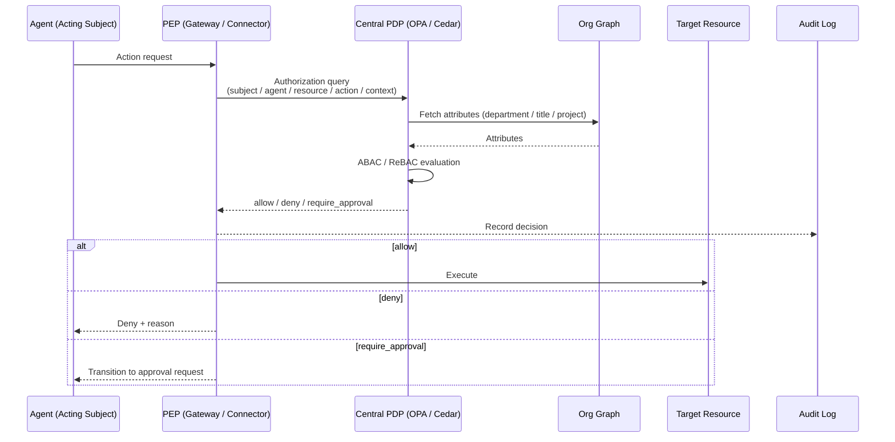

# ID-6 Zero-Trust Runtime + Central PDP / Distributed PEP (ABAC/ReBAC)

## Overview

The assumption "it's on the internal network, so it's safe" does not hold in the world of agents. If an agent is hijacked through prompt injection, the attacker can exploit the authorized session to reach internal APIs. This pattern verifies every action, every time, against the question: "is this specific subject, through this specific agent, accessing this specific data, permitted at this exact moment?" Authorization decisions are centralized in a PDP (OPA/Cedar), and the Gateway, runtime, and connectors each act as PEPs that enforce those decisions. This is a zero-trust authorization infrastructure compliant with NIST SP 800-207.

## Business Problem

Traditional access control was based on a "trust once authenticated" model. Being connected to the VPN granted access to internal resources; an authenticated user's session was trusted continuously — this was the standard design. Running agents on top of this model creates serious problems.

The first is **lateral movement of internal permissions**. When an agent that has already been authorized can execute subsequent tool calls and downstream API accesses without re-verification, a prompt-injection attacker who hijacks the agent can exploit the authorized session to reach data that should normally be inaccessible.

The second is **inability to respond to context changes**. A design where "authorization granted in the morning permits afternoon operations as well" means that transfers, departures, and permission changes are not reflected in a running agent. Zero-trust closes this gap through verification on every call.

The third is **difficulty controlling distributed execution environments**. When agents run in multi-cloud, multi-SaaS configurations, each execution point having its own authorization logic leads to inconsistency. An architecture where authorization decisions are centralized in a PDP and each point enforces as a PEP becomes necessary.

This pattern realizes zero-trust authorization for enterprise AI agents using ABAC/ReBAC context evaluation with the organizational graph as the attribute source.

!!! tip "Minimum Viable Implementation"
    Stand up one OPA instance, place a single PEP at the Gateway, and evaluate every agent request against "subject × action × resource" on every call. Default to fail-closed (deny if uncertain).

## Value Hypothesis

Real-time authorization of every action enables safe expansion of agent usage into high-risk business domains. Expanding the applicable scope directly translates to business cost reduction and processing speed improvements through automation.

## Solution and Design

The solution is to centralize authorization decisions while distributing the enforcement points. The PDP (Policy Decision Point) decides "permit, deny, or require approval," and the Gateway, connectors, and runtime each act as PEPs (Policy Enforcement Points) that enforce those decisions. Agents never autonomously decide "is this permitted?" — they always query the PDP.

Centralize authorization decisions in the central PDP (Policy Decision Point), with each execution point — Gateway, connectors, and runtime — acting as a PEP (Policy Enforcement Point) that enforces those decisions. Evaluate subject × resource × context × action using ABAC/ReBAC with the organizational graph as the attribute source. Record every decision in the audit log.



PEPs are distributed across multiple locations:

- **Gateway PEP**: Authentication and risk classification at the entry point
- **Runtime PEP**: Immediately before tool calls and data access
- **Connector PEP**: Immediately before SaaS API calls

## Applicability

| Good Fit | Poor Fit |
|---|---|
| Multi-SaaS environments handling confidential data | Fully isolated experimental environments |
| Multi-cloud, multi-tenant configurations | Single-user personal PoC |
| Regulated industries (finance, healthcare) | Processing of public-only information requiring no access control |
| Multi-agent configurations with multiple autonomous agents interacting | Early development stages where policies are not yet defined |

## Technology and Integration

- **PDP engine**: OPA/Rego, Cedar
- **Transport authentication**: mTLS, Workload Identity ([ID-3](id3-workload-agent-identity.md))
- **Tokens**: Short-lived tokens ([ID-5](id5-jit-scoped-credentials.md))
- **Network control**: Network Policy, Runtime Sandbox
- **Standard**: NIST SP 800-207 Zero Trust Architecture

## Pitfalls and Selection Criteria

!!! warning "The PDP Single Point of Failure"
    Do not allow the PDP to become a single point of failure or a bottleneck. Design decision caching (short TTL) and **fail-safe behavior (deny if uncertain)**.

- Run PDP decision caches with short TTLs. Long caches mean permission revocations are not reflected.
- Default to "deny if uncertain" (fail-closed), not "permit if uncertain."
- When authorization decision latency impacts business operations, address it through PDP replicas or edge caching — never by bypassing the PDP.
- The freshness of the organizational graph directly affects the accuracy of PDP decisions. Monitor delays in reflecting transfers and departures.

## Interfaces

The following are the key interfaces for implementing this pattern. Coding agents can generate stub code from these definitions.

```yaml
interfaces:
  - name: Central PDP (OPA/Cedar)
    description: "Evaluates every authorization request with ABAC/ReBAC against attributes from the org graph; returns allow/deny/require_approval and logs the decision."
    input:
      request: object
    output:
      response: object
    errors:
      - code: GENERAL_ERROR
        description: "Error occurred during Central PDP (OPA/Cedar) processing"
    protocol: "REST / gRPC"
    implementation_hints:
      - "See the Solution and Design section for details"
    code_examples:
      typescript: |
        interface CentralPdpRequest {
          principalId: string;
          agentId: string;
          action: string;
          resource: string;
          attributes: object;
        }
        interface CentralPdpResponse {
          decision: string;
          reason: string;
          decisionId: string;
        }
        interface CentralPdp {
          centralPdp(req: CentralPdpRequest): Promise<CentralPdpResponse>;
        }
      python: |
        @dataclass
        class CentralPdpRequest:
            principal_id: str
            agent_id: str
            action: str
            resource: str
            attributes: dict
        
        @dataclass
        class CentralPdpResponse:
            decision: str
            reason: str
            decision_id: str
        
        class CentralPdp(Protocol):
            async def central_pdp(self, req: CentralPdpRequest) -> CentralPdpResponse: ...
  - name: Distributed PEP
    description: "PEPs at Gateway (EX-1), runtime, and connector enforce PDP decisions; no enforcement point bypasses the PDP."
    input:
      request: object
    output:
      response: object
    errors:
      - code: GENERAL_ERROR
        description: "Error occurred during Distributed PEP processing"
    protocol: "REST / gRPC"
    implementation_hints:
      - "See the Solution and Design section for details"
    code_examples:
      typescript: |
        interface DistributedPepRequest {
          pdpDecision: string;
          requestContext: object;
          enforcementPoint: string;
        }
        interface DistributedPepResponse {
          enforced: boolean;
          allowed: boolean;
          auditId: string;
        }
        interface DistributedPep {
          distributedPep(req: DistributedPepRequest): Promise<DistributedPepResponse>;
        }
      python: |
        @dataclass
        class DistributedPepRequest:
            pdp_decision: str
            request_context: dict
            enforcement_point: str
        
        @dataclass
        class DistributedPepResponse:
            enforced: bool
            allowed: bool
            audit_id: str
        
        class DistributedPep(Protocol):
            async def distributed_pep(self, req: DistributedPepRequest) -> DistributedPepResponse: ...
  - name: Org Graph Attribute Feed
    description: "Supplies department, role, and project attributes to the PDP for contextual evaluation; attribute staleness is monitored."
    input:
      request: object
    output:
      response: object
    errors:
      - code: GENERAL_ERROR
        description: "Error occurred during Org Graph Attribute Feed processing"
    protocol: "REST / gRPC"
    implementation_hints:
      - "See the Solution and Design section for details"
    code_examples:
      typescript: |
        interface OrgGraphAttributeFeedRequest {
          principalId: string;
          attributeTypes: string[];
        }
        interface OrgGraphAttributeFeedResponse {
          attributes: object;
          department: string;
          roles: string[];
          projects: string[];
        }
        interface OrgGraphAttributeFeed {
          orgGraphAttributeFeed(req: OrgGraphAttributeFeedRequest): Promise<OrgGraphAttributeFeedResponse>;
        }
      python: |
        @dataclass
        class OrgGraphAttributeFeedRequest:
            principal_id: str
            attribute_types: list[str]
        
        @dataclass
        class OrgGraphAttributeFeedResponse:
            attributes: dict
            department: str
            roles: list[str]
            projects: list[str]
        
        class OrgGraphAttributeFeed(Protocol):
            async def org_graph_attribute_feed(self, req: OrgGraphAttributeFeedRequest) -> OrgGraphAttributeFeedResponse: ...
```

## Related Patterns

- [ID-2 Identity Federation & OBO](id2-identity-federation-obo.md) — PDP verifies OBO tokens (**complementary**: validate the validity and permissions of delegation tokens through the PEP every time)
- [ID-4 Permission Mirror](id4-permission-mirror-least-of.md) — Use Permission Mirror as an attribute source for the PDP (**complementary**: the PDP uses entitlements synchronized by Permission Mirror as ABAC attribute inputs)
- [ID-7 Policy-as-Code Guardrail](id7-policy-as-code-guardrail.md) — The policy description format running on the PDP (**complementary**: rules written as Policy-as-Code are executed by the PDP's policy engine)
- [GV-4 Industry Policy Pack](../gv-governance/gv4-industry-policy-pack.md) — Deploy industry-specific policies to the PDP (**complementary**: industry regulation rules are deployed as policies to the PDP)
- [RT-3 Risk-Tiered Autonomy](../rt-runtime/rt3-risk-tiered-autonomy.md) — PDP determines autonomy based on risk classification (**complementary**: the PDP evaluates risk_tier and determines the upper bound of agent autonomy)
- [EX-1 Enterprise Agent Gateway](../ex-experience/ex1-enterprise-agent-gateway.md) — Gateway functions as the first PEP (**complementary**: the entry-point gateway serves as the entry-level PEP)
