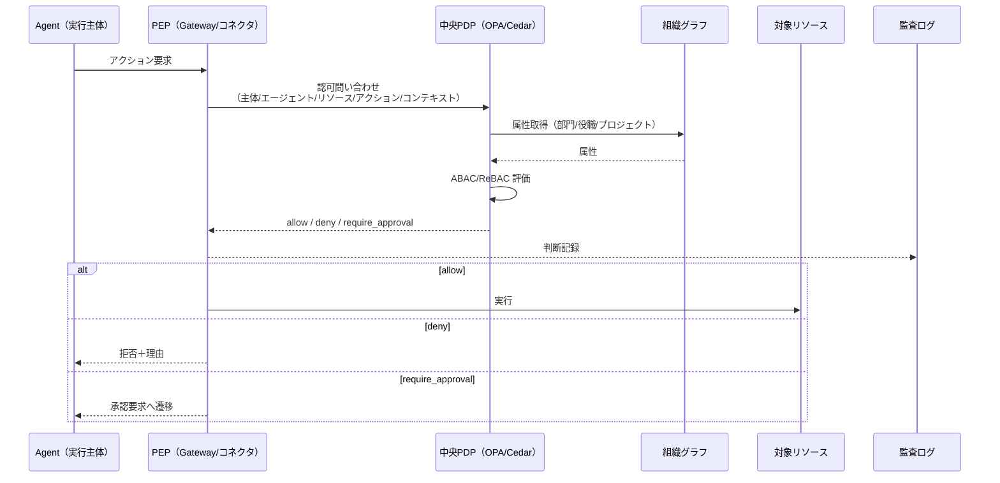

# ID-6 Zero-Trust Runtime + 中央PDP/分散PEP（ABAC/ReBAC）

## 概要

「社内ネットワークだから安全」という前提は、エージェントの世界では通用しない。プロンプトインジェクションでエージェントが乗っ取られたら、認可済みセッションを悪用して内部 API に到達できてしまう。このパターンは、すべての行為を毎回「誰が・どのエージェントで・どのデータに・今この瞬間に許可されるか」で検証する。認可判断は中央の PDP（OPA/Cedar）に集約し、Gateway・ランタイム・コネクタの各実行点が PEP として判断結果を強制する。NIST SP 800-207 準拠のゼロトラスト認可基盤である。

## 解決する企業課題

従来のアクセス制御は「一度認証を通過したら信頼する」モデルに基づいていた。VPN 接続中なら社内リソースにアクセスできる、認証済みユーザーのセッションは継続的に信頼する——これが標準的な設計だった。エージェントがこのモデルの上で動くと、深刻な問題が発生する。

第一は「内部権限の横展開」だ。一度認可を受けたエージェントが、その後のツール呼び出しや下流 API アクセスを検証なしに実行できると、プロンプトインジェクションで攻撃者がエージェントを乗っ取ったとき、認可済みセッションを悪用して本来アクセスできないデータに到達できてしまう。

第二は「コンテキスト変化への対応不能」だ。「朝に認可を受けたから夕方の操作も許可」という設計では、異動・退職・権限変更が実行中のエージェントに反映されない。ゼロトラストは毎回の検証でこのギャップを塞ぐ。

第三は「分散実行環境での制御難」だ。マルチクラウド・マルチ SaaS 構成でエージェントが動く場合、各実行点がそれぞれ独自の認可判断を持つと一貫性が失われる。中央 PDP に判断を集約し、各点が PEP として強制するアーキテクチャが必要になる。

ABAC/ReBAC によるコンテキスト評価と組織グラフを属性源とする構成で、エンタープライズ AI エージェントのゼロトラスト認可を実現するのが本パターンだ。

!!! tip "最小成立条件（MVP）"
    OPA を1台立て、Gateway に PEP を1か所配置し、全エージェントリクエストを「主体×アクション×リソース」で都度認可判定する。fail-closed（不明なら拒否）を既定とする。

## 価値仮説

全アクションのリアルタイム認可により、高リスク業務領域へのエージェント適用を安全に拡大する。適用範囲の拡大は自動化による業務コスト削減と処理速度向上に直結する。

## 解決策と設計

解決策は認可判断を中央化し、実行点を分散させることだ。PDP（Policy Decision Point）が「許可か・拒否か・承認要求か」を判断し、Gateway・コネクタ・ランタイムがそれぞれ PEP（Policy Enforcement Point）として判断結果を強制する。エージェントは自律的に「これはやっていいか」を判断せず、常に PDP に問い合わせる形にする。

認可判断を中央 PDP に集約し、Gateway・コネクタ・ランタイムの各実行点が PEP として強制する。ABAC/ReBAC で主体×リソース×コンテキスト×アクションを評価し、組織グラフを属性源として使う。判断結果は必ず監査に記録する。



PEP の配置は以下の複数箇所に分散する。

- **Gateway PEP**：入口での認証・リスク分類
- **Runtime PEP**：ツール呼び出し・データアクセスの直前
- **Connector PEP**：SaaS API 呼び出しの直前

## 向き／不向き

| 向き | 不向き |
|---|---|
| 機密データを扱うマルチSaaS環境 | 完全閉域の実験環境 |
| マルチクラウド・マルチテナント構成 | 単一ユーザーの個人PoC |
| 規制対応が求められる業界（金融・医療） | 権限が不要な公開情報のみの処理 |
| 自律エージェントが複数連携するマルチエージェント構成 | 開発初期でポリシーが未定義の段階 |

## 要素技術・既存システム連携

- **PDP エンジン**：OPA/Rego、Cedar
- **通信認証**：mTLS、Workload Identity（[ID-3](id3-workload-agent-identity.md)）
- **トークン**：短命トークン（[ID-5](id5-jit-scoped-credentials.md)）
- **ネットワーク制御**：Network Policy、Runtime Sandbox
- **標準**：NIST SP 800-207 Zero Trust Architecture

## 落とし穴／選定の勘所

!!! warning "PDP の単一障害点化"
    PDP を単一障害点/ボトルネックにしないこと。判断キャッシュ（短TTL）と**フェイルセーフ（不明なら拒否）**を設計する。

- PDP の判断キャッシュは短 TTL で運用する。キャッシュが長いと権限剥奪が反映されない。
- 「不明なら許可」ではなく「不明なら拒否」を既定にする（fail-closed）。
- 認可判断のレイテンシが業務に影響する場合は、PDP のレプリカ配置やエッジキャッシュで対処する。PDP を省略するという選択肢はない。
- 組織グラフの鮮度は PDP の判断精度に直結する。異動・退職の反映遅延は定期的に監視する。

## Interfaces

以下はこのパターンを実装する際の主要インターフェイスである。コーディングエージェントはこの定義からスタブコードを生成できる。

```yaml
interfaces:
  - name: Central PDP (OPA/Cedar)
    description: "Evaluates every authorization request with ABAC/ReBAC against attributes from the org graph; returns allow/deny/require_approval and logs the decision."
    input:
      request: object
    output:
      response: object
    errors:
      - code: GENERAL_ERROR
        description: "Central PDP (OPA/Cedar) の処理中にエラーが発生"
    protocol: "REST / gRPC"
    implementation_hints:
      - "詳細は本文の「解決策と設計」節を参照"
    code_examples:
      typescript: |
        interface CentralPdpRequest {
          principalId: string;
          agentId: string;
          action: string;
          resource: string;
          attributes: object;
        }
        interface CentralPdpResponse {
          decision: string;
          reason: string;
          decisionId: string;
        }
        interface CentralPdp {
          centralPdp(req: CentralPdpRequest): Promise<CentralPdpResponse>;
        }
      python: |
        @dataclass
        class CentralPdpRequest:
            principal_id: str
            agent_id: str
            action: str
            resource: str
            attributes: dict
        
        @dataclass
        class CentralPdpResponse:
            decision: str
            reason: str
            decision_id: str
        
        class CentralPdp(Protocol):
            async def central_pdp(self, req: CentralPdpRequest) -> CentralPdpResponse: ...
  - name: Distributed PEP
    description: "PEPs at Gateway (EX-1), runtime, and connector enforce PDP decisions; no enforcement point bypasses the PDP."
    input:
      request: object
    output:
      response: object
    errors:
      - code: GENERAL_ERROR
        description: "Distributed PEP の処理中にエラーが発生"
    protocol: "REST / gRPC"
    implementation_hints:
      - "詳細は本文の「解決策と設計」節を参照"
    code_examples:
      typescript: |
        interface DistributedPepRequest {
          pdpDecision: string;
          requestContext: object;
          enforcementPoint: string;
        }
        interface DistributedPepResponse {
          enforced: boolean;
          allowed: boolean;
          auditId: string;
        }
        interface DistributedPep {
          distributedPep(req: DistributedPepRequest): Promise<DistributedPepResponse>;
        }
      python: |
        @dataclass
        class DistributedPepRequest:
            pdp_decision: str
            request_context: dict
            enforcement_point: str
        
        @dataclass
        class DistributedPepResponse:
            enforced: bool
            allowed: bool
            audit_id: str
        
        class DistributedPep(Protocol):
            async def distributed_pep(self, req: DistributedPepRequest) -> DistributedPepResponse: ...
  - name: Org Graph Attribute Feed
    description: "Supplies department, role, and project attributes to the PDP for contextual evaluation; attribute staleness is monitored."
    input:
      request: object
    output:
      response: object
    errors:
      - code: GENERAL_ERROR
        description: "Org Graph Attribute Feed の処理中にエラーが発生"
    protocol: "REST / gRPC"
    implementation_hints:
      - "詳細は本文の「解決策と設計」節を参照"
    code_examples:
      typescript: |
        interface OrgGraphAttributeFeedRequest {
          principalId: string;
          attributeTypes: string[];
        }
        interface OrgGraphAttributeFeedResponse {
          attributes: object;
          department: string;
          roles: string[];
          projects: string[];
        }
        interface OrgGraphAttributeFeed {
          orgGraphAttributeFeed(req: OrgGraphAttributeFeedRequest): Promise<OrgGraphAttributeFeedResponse>;
        }
      python: |
        @dataclass
        class OrgGraphAttributeFeedRequest:
            principal_id: str
            attribute_types: list[str]
        
        @dataclass
        class OrgGraphAttributeFeedResponse:
            attributes: dict
            department: str
            roles: list[str]
            projects: list[str]
        
        class OrgGraphAttributeFeed(Protocol):
            async def org_graph_attribute_feed(self, req: OrgGraphAttributeFeedRequest) -> OrgGraphAttributeFeedResponse: ...
```

## 関連パターン

- [ID-2 Identity Federation & OBO](id2-identity-federation-obo.md) — OBO トークンの検証を PDP が行う（**補完**：委譲トークンが PEP を通るたびに PDP で有効性・権限を検証する）
- [ID-4 Permission Mirror](id4-permission-mirror-least-of.md) — Permission Mirror を PDP の属性源として利用（**補完**：Permission Mirror が同期したエンタイトルメントを ABAC の属性として PDP に提供する）
- [ID-7 Policy-as-Code Guardrail](id7-policy-as-code-guardrail.md) — PDP 上で動作するポリシーの記述形式（**補完**：Policy-as-Code で記述されたルールが PDP のポリシーエンジンで評価される）
- [GV-4 Industry Policy Pack](../gv-governance/gv4-industry-policy-pack.md) — 業界別ポリシーを PDP に展開（**補完**：業界規制ルールをポリシーとして PDP に配備する）
- [RT-3 Risk-Tiered Autonomy](../rt-runtime/rt3-risk-tiered-autonomy.md) — リスク分類に基づく自律度判定を PDP が担う（**補完**：PDP が risk_tier を評価してエージェントの自律度上限を決定する）
- [EX-1 Enterprise Agent Gateway](../ex-experience/ex1-enterprise-agent-gateway.md) — Gateway が最初の PEP として機能（**補完**：エントリポイントのゲートウェイが入口 PEP の役割を担う）
