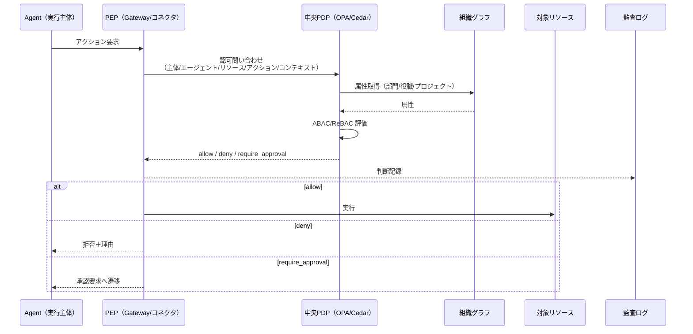

# ID-6 Zero-Trust Runtime + 中央PDP/分散PEP（ABAC/ReBAC）

## 概要

社内起動でも信頼せず、すべての行為を毎回「誰が・どのエージェントで・どのテナント/プロジェクト・どのデータ・どの目的・どのリスク・今許されるか」で検証する。認可判断を中央 PDP に集約し、各実行点が PEP として強制する。NIST SP 800-207 準拠のゼロトラストランタイムである。

## 設計

認可判断を中央 PDP（Policy Decision Point）に集約し、Gateway・コネクタ・ランタイムの各実行点が PEP（Policy Enforcement Point）として強制する。ABAC/ReBAC で主体×資源×コンテキスト×アクションを評価し、組織グラフを属性源にする。判断結果は監査に記録する。

PEP の配置は以下の複数箇所に分散する。

- **Gateway PEP**：入口での認証・リスク分類
- **Runtime PEP**：ツール呼び出し・データアクセスの直前
- **Connector PEP**：SaaS API 呼び出しの直前

## 解決する企業課題

「社内だから安全」の誤解は最も危険な前提である。内部権限の横展開、プロンプトインジェクション経由の内部API悪用、退職者のアクセス残存——これらをゼロトラストで構造的に防ぐ。

## 向き／不向き

| 向き | 不向き |
|---|---|
| 機密データを扱うマルチSaaS環境 | 完全閉域の実験環境 |
| マルチクラウド・マルチテナント構成 | 単一ユーザーの個人PoC |
| 規制対応が求められる業界（金融・医療） | 権限が不要な公開情報のみの処理 |

## 要素技術・既存システム連携

- **PDP エンジン**：OPA/Rego、Cedar
- **通信認証**：mTLS、Workload Identity（[ID-3](id3-workload-agent-identity.md)）
- **トークン**：短命トークン（[ID-5](id5-jit-scoped-credentials.md)）
- **ネットワーク制御**：Network Policy、Runtime Sandbox
- **標準**：NIST SP 800-207 Zero Trust Architecture

## 落とし穴／選定の勘所

!!! warning "PDP の単一障害点化"
    PDP を単一障害点/ボトルネックにしないこと。判断キャッシュ（短TTL）と**フェイルセーフ（不明なら拒否）**を設計する。

- PDP の判断キャッシュは短TTLで運用する。キャッシュが長いと権限剥奪が反映されない。
- 「不明なら許可」ではなく「不明なら拒否」を既定にする（fail-closed）。
- 認可判断のレイテンシが業務に影響する場合は、PDP のレプリカ配置やエッジキャッシュで対処する。PDP を省略してはならない。
- 組織グラフの鮮度が PDP の判断精度に直結する。異動・退職の反映遅延を監視する。

## 関連パターン

- [ID-2 Identity Federation & OBO](id2-identity-federation-obo.md) — OBO トークンの検証を PDP が行う
- [ID-4 Permission Mirror](id4-permission-mirror-least-of.md) — Permission Mirror を PDP の属性源として利用
- [ID-7 Policy-as-Code Guardrail](id7-policy-as-code-guardrail.md) — PDP 上で動作するポリシーの記述形式
- [GV-4 Industry Policy Pack](../gv-governance/gv4-industry-policy-pack.md) — 業界別ポリシーを PDP に展開
- [RT-3 Risk-Tiered Autonomy](../rt-runtime/rt3-risk-tiered-autonomy.md) — リスク分類に基づく自律度判定を PDP が担う
- [EX-1 Enterprise Agent Gateway](../ex-experience/ex1-enterprise-agent-gateway.md) — Gateway が最初の PEP として機能
