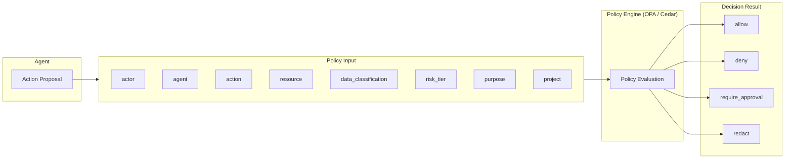

# ID-7 Policy-as-Code Guardrail (Deterministic Action Authorization)

## Overview

Writing "do not output confidential information" in a prompt is easily bypassed through prompt injection. Prompts are not a security boundary. This pattern uses OPA/Rego or Cedar to deterministically evaluate whether an agent's action is permitted. The LLM structures "what it intends to do," and the Policy Engine returns allow / deny / require_approval / redact. Because the same input always produces the same decision, every permit or deny can be explained in an audit.

## Business Problem

Relying on prompts to enforce agent safety fails repeatedly in enterprise environments. Writing "do not output confidential information" or "access to financial data is prohibited" into a system prompt does not create a security boundary.

The reason is clear. Prompts can be overwritten through prompt injection. User input, content returned by external tools, and messages generated by other agents can all contain malicious instructions. An LLM processes these as context and may produce output that "overrides" the original safety instructions.

Furthermore, large enterprises have complex regulatory, internal policy, and compliance requirements. In financial institutions, rules around customer data handling; in healthcare organizations, PHI access restrictions; in publicly listed companies, insider information management policies — when these are scattered across each agent's prompt, approval standards become person-dependent and change management becomes difficult. It becomes impossible to explain to an auditor "why this action was permitted."

This pattern addresses four enterprise problems:

- Deterministic guardrails on the execution infrastructure side that cannot be bypassed through prompt injection
- Centralizing regulations and internal rules as code, eliminating person-dependency
- Making "why this was permitted or denied" explainable in the audit trail
- Governing permit/deny/require_approval/redact decisions consistently through a single policy

!!! tip "Minimum Viable Implementation"
    Write a single OPA/Rego rule for allow/deny based on data classification × action (read/write), and evaluate it before each agent tool call. Record the decision result in a log to make it auditable.

## Value Hypothesis

Encoding policies enables rapid expansion of agent action scope while maintaining governance. Faster policy changes reduce the lead time for deploying new use cases, accelerating value realization.

## Solution and Design

The solution is straightforward. Place a deterministic Policy Engine outside the LLM's decision loop, pass the agent's proposed action as policy input, and have the engine return the evaluation result. The LLM structures "what it intends to do"; it delegates the question of "is this permitted?" to the policy.

Pass the agent's proposed action (as structured input) to the Policy Engine for deterministic evaluation. Deploy the Industry Policy Pack ([GV-4](../gv-governance/gv4-industry-policy-pack.md)) and agent constitutions as policies.



The policy input attributes are:

| Attribute | Description |
|---|---|
| actor | Requester (user ID, department, title) |
| agent | Agent (ID, risk tier, purpose) |
| action | Operation (read / write / send / approve, etc.) |
| resource | Target resource (system, data type) |
| data_classification | Data classification (public / internal / confidential / restricted) |
| risk_tier | Risk tier (Tier 0–5) |
| purpose | Purpose of use |
| project | Project scope |

## Applicability

| Good Fit | Poor Fit |
|---|---|
| Large enterprises with complex rules, permissions, and regulations | Use cases involving only simple text generation |
| Regulated industries (finance / healthcare / legal / public sector) | Internal FAQ with no access control requirements |
| Environments where multiple agents must follow common rules | Personal experimentation |
| Cases where policy change history and audit trails are required | PoC stages where the cost of introducing a policy engine is not justified |

## Technology and Integration

- **Policy engine**: OPA/Rego, Cedar
- **Authorization infrastructure**: PDP/PEP ([ID-6](id6-zero-trust-pdp-pep.md))
- **Policy management**: Policy Versioning ([GV-6](../gv-governance/gv6-version-registry.md)), Git-managed
- **Approval workflow**: Approval Workflow ([RT-4](../rt-runtime/rt4-human-approval-chain.md))
- **Industry policies**: Industry Policy Pack ([GV-4](../gv-governance/gv4-industry-policy-pack.md))

## Pitfalls and Selection Criteria

!!! danger "Never Delegate the Final Decision to the LLM"
    In high-risk domains, the LLM must never make the final permit/deny decision. Delegate decisions to deterministic policies; limit the LLM to organizing and structuring the inputs for that decision.

- The design principle "write 'don't output confidential information' in the prompt and it's safe" is prohibited. Prompt injection easily bypasses it.
- Version-control policies in Git, and deploy changes through review, testing, and canary phases ([GV-7](../gv-governance/gv7-evaluation-governance-pipeline.md)).
- As the number of policies grows, conflicts emerge. Define priority rules explicitly and build a mechanism to detect conflicts.
- Returning the deny reason to the user enables an improvement cycle when legitimate business operations are blocked.

## Interfaces

The following are the key interfaces for implementing this pattern. Coding agents can generate stub code from these definitions.

```yaml
interfaces:
  - name: Structured Policy Input
    description: "Agent action proposals are structured into actor, agent, action, resource, data_classification, risk_tier, purpose, and project attributes before policy evaluation."
    input:
      request: object
    output:
      response: object
    errors:
      - code: GENERAL_ERROR
        description: "Error occurred during Structured Policy Input processing"
    protocol: "REST / gRPC"
    implementation_hints:
      - "See the Solution and Design section for details"
    code_examples:
      typescript: |
        interface StructuredPolicyInputRequest {
          actor: string;
          agent: string;
          action: string;
          resource: string;
          dataClassification: string;
          riskTier: number;
          purpose: string;
        }
        interface StructuredPolicyInputResponse {
          structured: boolean;
          inputId: string;
        }
        interface StructuredPolicyInput {
          structuredPolicyInput(req: StructuredPolicyInputRequest): Promise<StructuredPolicyInputResponse>;
        }
      python: |
        @dataclass
        class StructuredPolicyInputRequest:
            actor: str
            agent: str
            action: str
            resource: str
            data_classification: str
            risk_tier: int
            purpose: str
        
        @dataclass
        class StructuredPolicyInputResponse:
            structured: bool
            input_id: str
        
        class StructuredPolicyInput(Protocol):
            async def structured_policy_input(self, req: StructuredPolicyInputRequest) -> StructuredPolicyInputResponse: ...
  - name: Policy Engine (OPA/Cedar)
    description: "Deterministically evaluates inputs against versioned policy rules; returns allow, deny, require_approval, or redact with reason."
    input:
      request: object
    output:
      response: object
    errors:
      - code: GENERAL_ERROR
        description: "Error occurred during Policy Engine (OPA/Cedar) processing"
    protocol: "REST / gRPC"
    implementation_hints:
      - "See the Solution and Design section for details"
    code_examples:
      typescript: |
        interface PolicyEngineRequest {
          inputId: string;
          policyVersion: string;
          attributes: object;
        }
        interface PolicyEngineResponse {
          verdict: string;
          reason: string;
          requiresApproval: boolean;
          redact: boolean;
        }
        interface PolicyEngine {
          policyEngine(req: PolicyEngineRequest): Promise<PolicyEngineResponse>;
        }
      python: |
        @dataclass
        class PolicyEngineRequest:
            input_id: str
            policy_version: str
            attributes: dict
        
        @dataclass
        class PolicyEngineResponse:
            verdict: str
            reason: str
            requires_approval: bool
            redact: bool
        
        class PolicyEngine(Protocol):
            async def policy_engine(self, req: PolicyEngineRequest) -> PolicyEngineResponse: ...
  - name: Policy Version & Test Gate
    description: "Policy changes are managed in Git with PR review, automated test, and canary before production deployment; conflicts between policies are surfaced automatically."
    input:
      request: object
    output:
      response: object
    errors:
      - code: GENERAL_ERROR
        description: "Error occurred during Policy Version & Test Gate processing"
    protocol: "REST / gRPC"
    implementation_hints:
      - "See the Solution and Design section for details"
    code_examples:
      typescript: |
        interface PolicyVersionTestGateRequest {
          policyDiff: string;
          prId: string;
          testSuiteId: string;
        }
        interface PolicyVersionTestGateResponse {
          passed: boolean;
          conflicts: string[];
          canarySlot: string;
        }
        interface PolicyVersionTestGate {
          policyVersionTestGate(req: PolicyVersionTestGateRequest): Promise<PolicyVersionTestGateResponse>;
        }
      python: |
        @dataclass
        class PolicyVersionTestGateRequest:
            policy_diff: str
            pr_id: str
            test_suite_id: str
        
        @dataclass
        class PolicyVersionTestGateResponse:
            passed: bool
            conflicts: list[str]
            canary_slot: str
        
        class PolicyVersionTestGate(Protocol):
            async def policy_version_test_gate(self, req: PolicyVersionTestGateRequest) -> PolicyVersionTestGateResponse: ...
```

## Related Patterns

- [ID-6 Zero-Trust PDP/PEP](id6-zero-trust-pdp-pep.md) — Policy-as-Code runs on the PDP (**complementary**: rules written as Policy-as-Code are executed as the PDP's policy engine)
- [GV-4 Industry Policy Pack](../gv-governance/gv4-industry-policy-pack.md) — Concrete industry-specific policy descriptions (**complementary**: financial, healthcare, and other industry regulations deployed as Policy-as-Code)
- [RT-3 Risk-Tiered Autonomy](../rt-runtime/rt3-risk-tiered-autonomy.md) — Controlling agent autonomy by risk tier through policy (**complementary**: the risk_tier attribute defines the range within which autonomous agent execution is permitted by policy)
- [RT-4 Human Approval Chain](../rt-runtime/rt4-human-approval-chain.md) — Approval flow triggered by require_approval decisions (**complementary**: when the policy returns require_approval, Human Approval Chain handles the subsequent approval flow)
- [RT-5 Command Envelope](../rt-runtime/rt5-command-envelope.md) — Structured commands become policy inputs (**complementary**: the structured commands generated by Command Envelope are used directly as policy input attributes)
