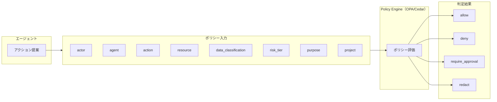

# ID-7 Policy-as-Code Guardrail（決定論的行動可否）

## 概要

「機密情報を出力しないでください」とプロンプトに書いても、プロンプトインジェクションで簡単に無視される。プロンプトはセキュリティ境界にならない。このパターンは、エージェントの行動可否を OPA/Rego や Cedar で記述した Policy-as-Code で決定論的に判定する。LLM は「何をしようとしているか」を整理し、Policy Engine が allow / deny / require_approval / redact を返す。同じ入力に対して常に同じ判定を返す決定論的な仕組みだから、「なぜ許可/拒否したか」を監査で説明できる。

## 解決する企業課題

エージェントの安全性をプロンプトで確保しようとする設計は、エンタープライズ環境で繰り返し失敗する。「機密情報を出力しないこと」「財務データへのアクセスは禁止」といった指示をシステムプロンプトに書いても、それはセキュリティ境界にならない。

理由は明確である。プロンプトはプロンプトインジェクションで書き換えられうる。ユーザーの入力、外部ツールが返した内容、他エージェントが生成したメッセージのいずれも、悪意ある指示を含み得る。LLM はそれを文脈として処理し、元の安全指示を「上書き」した判断を出力することがある。

さらに、大企業では規制・社内ルール・コンプライアンス要件が複雑に絡み合う。金融機関なら顧客情報の取り扱い規則、医療機関なら PHI のアクセス制限、上場企業ならインサイダー情報の管理規定——これらが各エージェントのプロンプトに散在すると、承認基準が属人化し変更管理も困難になる。「なぜそのアクションを許可したか」を監査者に説明できなくなる。

このパターンが解決する企業課題は次の4点である。

- プロンプトインジェクションで突破されない、実行基盤側の決定論的ガードレール
- 規制・社内ルールをコードとして一元管理し、属人化を排除する
- 「なぜ許可/拒否したか」を監査証跡で説明可能にする
- 許可/拒否/承認要求/マスキングの4種類の判定を一貫したポリシーで統制する

## 解決策と設計

解決策はシンプルである。LLM の判断ループの外側に決定論的な Policy Engine を置き、エージェントのアクション提案をポリシー入力として渡して Engine が判定結果を返す。LLM は「何をしようとしているか」を構造化し、「やっていいか」の判断はポリシーに委ねる。

エージェントの提案（アクション）を構造化した入力として Policy Engine に渡し、決定論的に判定する。Industry Policy Pack（[GV-4](../gv-governance/gv4-industry-policy-pack.md)）やエージェント憲法をポリシーとして展開する。

ポリシーの入力属性は以下で構成される。

| 属性 | 説明 |
|---|---|
| actor | 依頼者（ユーザーID・部門・役職） |
| agent | エージェント（ID・リスク階層・目的） |
| action | 操作（read/write/send/approve等） |
| resource | 対象リソース（システム・データ型） |
| data_classification | データ分類（公開/社内/機密/極秘） |
| risk_tier | リスク階層（Tier 0〜5） |
| purpose | 利用目的 |
| project | プロジェクトスコープ |

## 向き／不向き

| 向き | 不向き |
|---|---|
| 規程・権限・ルールが複雑な大企業 | 単純な文章生成のみのユースケース |
| 規制産業（金融/医療/法務/公共） | 権限制御が不要な社内FAQ |
| 複数エージェントが共通ルールに従う必要がある環境 | 個人の実験用途 |
| ポリシーの変更履歴・監査証跡が求められる場合 | PoC でポリシーエンジンの導入コストが正当化できない段階 |

## 要素技術・既存システム連携

- **ポリシーエンジン**：OPA/Rego、Cedar
- **認可基盤**：PDP/PEP（[ID-6](id6-zero-trust-pdp-pep.md)）
- **ポリシー管理**：Policy Versioning（[GV-6](../gv-governance/gv6-version-registry.md)）、Git 管理
- **承認ワークフロー**：Approval Workflow（[RT-4](../rt-runtime/rt4-human-approval-chain.md)）
- **業界ポリシー**：Industry Policy Pack（[GV-4](../gv-governance/gv4-industry-policy-pack.md)）

## 落とし穴／選定の勘所

!!! danger "LLMに最終判断を委ねない"
    高リスク領域で LLM に最終的な許可/拒否判断をさせてはならない。判断は決定論ポリシーに委ね、LLM は判断材料の整理と構造化に留める。

- 「プロンプトに『機密情報を出力するな』と書けば安全」という設計は禁忌である。プロンプトインジェクションで容易に突破される。
- ポリシーは Git で版管理し、変更はレビュー・テスト・カナリアを経てデプロイする（[GV-7](../gv-governance/gv7-evaluation-governance-pipeline.md)）。
- ポリシーが増えすぎると競合が生じる。優先順位を明確にし、競合を検出する仕組みを持つ。
- deny の理由をユーザーに返すことで、正当な業務がブロックされた場合の改善サイクルを回せる。

## 関連パターン

- [ID-6 Zero-Trust PDP/PEP](id6-zero-trust-pdp-pep.md) — Policy-as-Code が PDP 上で動作する（**補完**：Policy-as-Code で記述されたルールが PDP のポリシーエンジンとして実行される）
- [GV-4 Industry Policy Pack](../gv-governance/gv4-industry-policy-pack.md) — 業界別ポリシーの具体的な記述（**補完**：金融・医療等の業界規制が Policy-as-Code として展開される具体的なポリシー集）
- [RT-3 Risk-Tiered Autonomy](../rt-runtime/rt3-risk-tiered-autonomy.md) — リスク階層に応じた自律度をポリシーで制御（**補完**：risk_tier 属性がエージェントの自律実行を許可する範囲をポリシーで定める）
- [RT-4 Human Approval Chain](../rt-runtime/rt4-human-approval-chain.md) — require_approval 判定後の承認フロー（**補完**：ポリシーが require_approval を返したとき、Human Approval Chain が後続の承認フローを担う）
- [RT-5 Command Envelope](../rt-runtime/rt5-command-envelope.md) — 構造化コマンドがポリシー入力になる（**補完**：Command Envelope が生成する構造化コマンドがそのままポリシーの入力属性として使われる）
