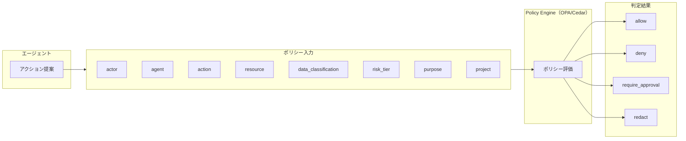

# ID-7 Policy-as-Code Guardrail（決定論的行動可否）

## 概要

行動可否を自然言語プロンプトでなく Policy-as-Code で判定する。LLM は判断材料を整理し、Policy Engine が許可/拒否/承認要求/マスキングを決定論的に返す。安全保証は実行基盤側に置くという根本原則を具現化するパターンである。

## 設計

エージェントの提案（アクション）を構造化した入力として Policy Engine に渡し、決定論的に判定する。Industry Policy Pack（[GV-4](../gv-governance/gv4-industry-policy-pack.md)）やエージェント憲法をポリシーとして展開する。

ポリシーの入力属性は以下で構成される。

| 属性 | 説明 |
|---|---|
| actor | 依頼者（ユーザーID・部門・役職） |
| agent | エージェント（ID・リスク階層・目的） |
| action | 操作（read/write/send/approve等） |
| resource | 対象リソース（システム・データ型） |
| data_classification | データ分類（公開/社内/機密/極秘） |
| risk_tier | リスク階層（Tier 0〜5） |
| purpose | 利用目的 |
| project | プロジェクトスコープ |

## 解決する企業課題

プロンプトはセキュリティ境界にならない。自然言語による安全指示は、プロンプトインジェクションで容易に突破される。規制・社内ルールが各エージェントのプロンプトに散在し、承認基準が属人化し、「なぜ許可したか」を説明できない——これらの問題を決定論的ポリシーで解決する。

## 向き／不向き

| 向き | 不向き |
|---|---|
| 規程・権限・ルールが複雑な大企業 | 単純な文章生成のみのユースケース |
| 規制産業（金融/医療/法務/公共） | 権限制御が不要な社内FAQ |
| 複数エージェントが共通ルールに従う必要がある環境 | 個人の実験用途 |

## 要素技術・既存システム連携

- **ポリシーエンジン**：OPA/Rego、Cedar
- **認可基盤**：PDP/PEP（[ID-6](id6-zero-trust-pdp-pep.md)）
- **ポリシー管理**：Policy Versioning（[GV-6](../gv-governance/gv6-version-registry.md)）、Git 管理
- **承認ワークフロー**：Approval Workflow（[RT-4](../rt-runtime/rt4-human-approval-chain.md)）
- **業界ポリシー**：Industry Policy Pack（[GV-4](../gv-governance/gv4-industry-policy-pack.md)）

## 落とし穴／選定の勘所

!!! danger "LLMに最終判断を委ねない"
    高リスク領域で LLM に最終的な許可/拒否判断をさせてはならない。判断は決定論ポリシーに委ね、LLM は判断材料の整理と構造化に留める。

- 「プロンプトに『機密情報を出力するな』と書けば安全」という設計は禁忌である。プロンプトインジェクションで容易に突破される。
- ポリシーは Git で版管理し、変更はレビュー・テスト・カナリアを経てデプロイする（[GV-7](../gv-governance/gv7-evaluation-governance-pipeline.md)）。
- ポリシーが増えすぎると競合が生じる。優先順位の明確化と競合検出の仕組みを持つ。
- deny の理由をユーザーに返すことで、正当な業務がブロックされた場合の改善サイクルを回す。

## 関連パターン

- [ID-6 Zero-Trust PDP/PEP](id6-zero-trust-pdp-pep.md) — Policy-as-Code が PDP 上で動作する
- [GV-4 Industry Policy Pack](../gv-governance/gv4-industry-policy-pack.md) — 業界別ポリシーの具体的な記述
- [RT-3 Risk-Tiered Autonomy](../rt-runtime/rt3-risk-tiered-autonomy.md) — リスク階層に応じた自律度をポリシーで制御
- [RT-4 Human Approval Chain](../rt-runtime/rt4-human-approval-chain.md) — require_approval 判定後の承認フロー
- [RT-5 Command Envelope](../rt-runtime/rt5-command-envelope.md) — 構造化コマンドがポリシー入力になる
