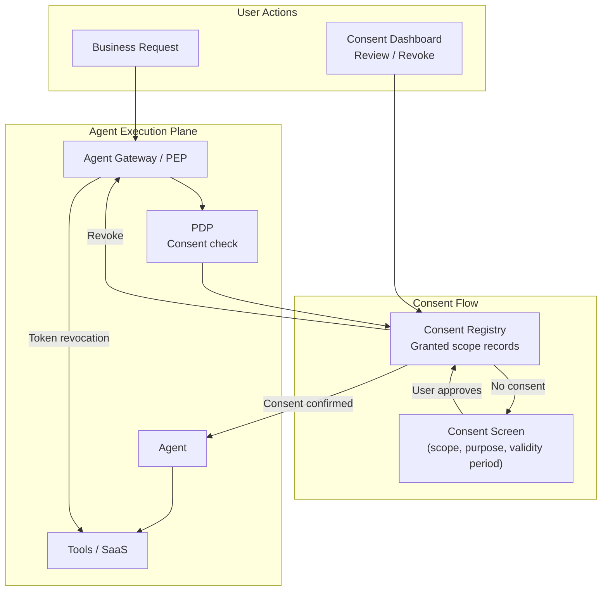

# ID-8 Consent & Access Transparency

## Overview

"Honestly, I'm not really sure what my agent is accessing behind the scenes" — many employees feel this way. This pattern provides a dashboard where users can review, consent to, and revoke exactly which SaaS systems the agent is accessing and with what scope, acting on their behalf. It collects explicit delegation consent on first use or for high-risk operations, and provides a view of all granted scopes with the ability to revoke any of them instantly. This prevents the distrust of "doing everything without my knowledge" and satisfies consent principles under GDPR and similar regulations.

## Business Problem

When an agent is operating under a user's identity, that user typically has no visibility into "when the agent is accessing what, on their behalf, with what scope." This opacity is both a barrier to agent adoption and a compliance problem.

Start with the trust problem. The feeling that "the agent can do anything with my identity without my knowledge" becomes a real concern. Delegation scopes granted at the time of first use can remain valid for months, during which the agent can access email, calendar, and drive at any time — yet the user has no awareness of this. When delegation scopes are invisible, users either avoid using the agent or the IT department decides to shut down all agents.

There is also a dynamic-context problem. When the nature of work changes, the originally granted delegation scope can become excessive. A consent granting "access to DocuSign for contract review" that remains valid after the project ends is far from what the user intended.

There is also a compliance problem. GDPR and various national privacy laws require user consent and the right of withdrawal for access to personal data in certain cases. In regulated industries such as finance and healthcare, obtaining and recording consent for delegated access may be an audit requirement.

This pattern addresses three enterprise problems:

- Resolving distrust of "not knowing what the agent is doing with my permissions" and building trust
- Preventing "scope creep" through purpose-limited, time-bound scope management
- Implementing the consent acquisition and right of withdrawal required by privacy regulations such as GDPR

!!! tip "Minimum Viable Implementation"
    At the time of the first OBO token issuance, display the scope and purpose on the IdP consent screen and save a record of the user's approval to the consent registry. Revocation operations immediately invalidate the token.

## Value Hypothesis

Transparency in data usage and consent management builds employee trust in agents. Higher trust increases utilization and retention rates, which increases the total value agents generate.

## Solution and Design

The solution is to design users as active participants in access management. When the agent first accesses a resource on a user's behalf, present the scope, purpose, and validity period explicitly and obtain consent. After consent, record it in the consent registry and provide a dashboard where users can review and revoke their consents at any time.

When the agent first accesses a resource on a user's behalf, present the scope, purpose, and validity period on the IdP consent screen or internal portal and obtain the user's consent. Record the consent in the consent registry. Users can view all granted consents through the dashboard and revoking any consent immediately invalidates the corresponding token.

Consent is not perpetual once granted — it is managed individually by purpose and scope. "Box read access for contract review work" and "Salesforce write access for customer follow-up" are recorded as separate consent entries.

## Applicability

| Good Fit | Poor Fit |
|---|---|
| Agents that access employees' own data (email / calendar / documents) | Cases where agents handle only system data and never touch personal data |
| Privacy regulations (GDPR / APPI, etc.) requiring user consent and right of withdrawal | Fully internal batch processing with no human-initiated origin (ID-3 is more appropriate) |
| Building trust by ensuring users are aware of the scopes they have granted | Early PoC stages where there is no capacity to implement a consent flow |
| Customer-facing agents needing to satisfy GDPR data-subject consent requirements | Fully autonomous system batch jobs using short-lived JIT credentials only (no user consent involved) |

## Technology and Integration

- **IdP consent screen**: Okta Consent, Entra ID Admin Consent / User Consent
- **OAuth 2.0 scope management**: Fine-grained scope definition and revocation (RFC 7009 Token Revocation)
- **Internal consent portal**: Internal dashboard providing a list of granted scopes and revocation controls
- **Consent registry**: DB or policy store recording consent entries (subject, scope, purpose, expiry)
- **Audit integration**: Record consent acquisition and revocation events in [OB-2 Unified Audit & Lineage](../ob-observability/ob2-unified-audit-lineage.md)

## Pitfalls and Selection Criteria

!!! warning "Scope Creep from Perpetual Consent"
    Designing initial consent to "take a broad scope in case of future business expansion" causes agents to hold more permissions than necessary over time. Limit consent by purpose and duration, and require re-consent after expiration.

!!! warning "Revocation Not Reflected Immediately"
    An implementation where a user revokes access through the dashboard but cached tokens remain valid until their expiry does not function as consent control. Bind revocation to token invalidation (Revocation) and re-verify consent state on each Gateway or tool call.

- Reducing the consent screen to a single "allow all" button renders it meaningless. Allow users to select scopes individually, and attach a user-readable explanation to each scope.
- Store the consent log in tamper-proof form for use in audits and compliance investigations.

## Related Patterns

- [ID-2 Identity Federation & OBO](id2-identity-federation-obo.md) — Foundation for issuing delegation tokens based on consent (**complementary**: the consent registry's contents serve as the basis for OBO token issuance)
- [ID-4 Permission Mirror & Least-of](id4-permission-mirror-least-of.md) — Alignment between delegation scope minimization and minimum composition (**complementary**: the consented scope feeds into the USR element of the minimum composition CAP∩USR∩POL)
- [ID-5 JIT Scoped Credentials](id5-jit-scoped-credentials.md) — Reflect consented scopes as the upper bound for JIT credential issuance (**similar**: both share the design philosophy of managing scopes individually; consent becomes a prerequisite for JIT issuance)
- [KM-4 Scoped Memory Hierarchy](../km-knowledge/km4-scoped-memory-hierarchy.md) — Align memory access scope with consent scope (**complementary**: bind memory access scope to the consented scope)
- [OB-2 Unified Audit & Lineage](../ob-observability/ob2-unified-audit-lineage.md) — Audit records for consent acquisition and revocation events (**complementary**: store consent grants, changes, and revocations as tamper-proof audit logs)
