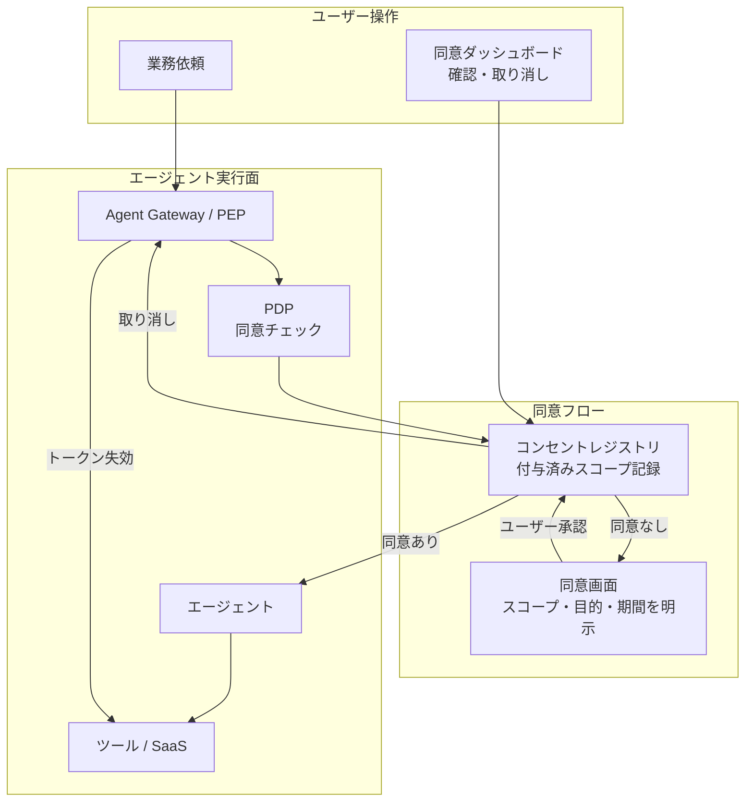

# ID-8 Consent & Access Transparency（同意・透明化）

## 概要

「自分のエージェントが裏で何にアクセスしているか、正直よく分からない」——多くの従業員がそう感じている。このパターンは、エージェントがどの SaaS にどのスコープでアクセスしているかをユーザー本人が確認・同意・取り消しできるダッシュボードを提供する。初回利用時や高リスク操作時に明示的な委譲同意を取得し、付与済みスコープの一覧と即時失効の機能を備える。「いつの間にか何でもしている」という不信を防ぎ、GDPR 等の同意原則にも対応する。

## 解決する企業課題

エージェントが自分の ID で動いているとき、ユーザーは「エージェントが自分の権限でいつ・何に・どの範囲でアクセスしているか」を知らないのが標準状態である。この不透明さは、エージェント採用の障壁になると同時に、コンプライアンス上の問題を生む。

まず不信の問題から述べる。「エージェントが自分の ID で勝手に何でもできる状態になっている」という感覚は現実に生まれる。初回の業務依頼時に付与した委譲スコープが何ヶ月も有効なまま残り、エージェントがいつでもメール・カレンダー・ドライブにアクセスできる——ユーザーはこれを把握できていない。委譲スコープが目に見えなければ、ユーザーはエージェントの使用を控えるか、IT 部門が全エージェントを停止する判断を下すことになる。

動的文脈の問題もある。業務の内容が変わったとき、当初の委譲スコープが過剰になることがある。「契約書レビューのために Docusign にアクセスさせた」という同意が、そのプロジェクト終了後も有効なまま残るのは、ユーザーの意図とかけ離れている。

コンプライアンスの問題も見逃せない。GDPR・各国プライバシー法では、個人データへのアクセスに対するユーザー同意と取り消し権を要求するケースがある。金融・医療等の規制産業では、代理アクセスの同意取得と記録が監査要件になる場合もある。

解決すべき企業課題は次の3点にまとめられる。

- 「エージェントが自分の権限で何をしているか分からない」不信の解消と信頼醸成
- スコープの目的限定・期限管理による「なし崩しのスコープ拡大」の防止
- GDPR 等のプライバシー規制が要求する同意取得・取り消し権の実装

!!! tip "最小成立条件（MVP）"
    初回の OBO トークン発行時に IdP の同意画面でスコープと目的を明示し、ユーザーが承認した記録をコンセントレジストリに保存する。取り消し操作でトークンを即時失効させる。

## 価値仮説

データ利用の透明化と同意管理により、従業員のエージェントへの信頼を醸成する。信頼の向上は利用率・定着率を高め、エージェントが生む価値の総量を増大させる。

## 解決策と設計

解決策はユーザーをアクセス管理の主体として設計することである。エージェントが初めてユーザーの代理でリソースにアクセスする際、スコープ・目的・有効期間を明示して同意を取得する。同意後はコンセントレジストリに記録し、ユーザーがいつでも確認・取り消しできるダッシュボードを提供する。

エージェントが初めてユーザーの代理でリソースにアクセスする際、IdP の同意画面または内部ポータルでスコープ・目的・有効期間を明示してユーザーの同意を取得する。同意後はコンセントレジストリに記録する。ユーザーはダッシュボードで付与済み同意の一覧を確認でき、任意の同意を取り消すと即座にトークンが失効する。



同意は一度取れば永続ではなく、目的ごと・スコープごとに個別管理する。「契約書レビュー業務のための Box 読み取り」と「顧客フォローアップのための Salesforce 書き込み」は、別個の同意エントリとして記録することになる。

## 向き／不向き

| 向き | 不向き |
|---|---|
| 従業員自身のデータ（メール/カレンダー/ドキュメント）にエージェントがアクセスする | エージェントがシステムデータのみを扱い個人のデータに触れない場合 |
| プライバシー規制（GDPR/APPI等）でユーザー同意と取り消し権が求められる | 完全に内部バッチ処理で人間の操作起点がない自律ジョブ（[ID-3](id3-workload-agent-identity.md) が適する） |
| ユーザーが付与スコープを認識することで信頼醸成を図りたい | PoC で同意フローを実装する工数が取れない初期段階 |
| 顧客向けエージェントで GDPR のデータ主体同意要件を満たす必要がある | 短命JITクレデンシャルのみを使うシステム自律バッチ（ユーザー同意が介在しない） |

## 要素技術・既存システム連携

- **IdP 同意画面**：Okta Consent、Entra ID Admin Consent / User Consent
- **OAuth 2.0 スコープ管理**：スコープの細粒度定義と取り消し（RFC 7009 Token Revocation）
- **内部コンセントポータル**：付与済みスコープ一覧・取り消し操作を提供する社内ダッシュボード
- **コンセントレジストリ**：DB またはポリシーストアに同意エントリ（subject・scope・purpose・expiry）を記録
- **監査連携**：[OB-2 統一監査・系譜](../ob-observability/ob2-unified-audit-lineage.md) に同意取得・取り消しイベントを記録

## 落とし穴／選定の勘所

!!! warning "一度の同意でスコープが永続化するスコープクリープ"
    初回同意時に「将来の業務拡張のため広めに取っておく」設計は、時間とともにエージェントが必要以上の権限を持ち続ける原因になる。同意は目的・期間を限定し、期限切れ後は再同意を要求する。

!!! warning "取り消しが即時に反映されない実装"
    ユーザーがダッシュボードで取り消しを操作しても、キャッシュされたトークンが有効期限まで使い続けられる実装は同意制御として機能しない。取り消しはトークン失効（Revocation）と結びつけ、Gateway・ツール呼び出し時に同意状態を再検証する。

- 同意画面を「全部許可」の確認ボタン1つにすると意味をなさない。スコープを個別に選択できるようにし、各スコープにユーザーが理解できる説明文を添えること。
- 同意ログ自体も改ざん不能な形で保管し、監査・コンプライアンス調査に利用できるようにしておく。

## Interfaces

以下はこのパターンを実装する際の主要インターフェイスである。コーディングエージェントはこの定義からスタブコードを生成できる。

```yaml
interfaces:
  - name: Consent Screen (IdP / Internal Portal)
    description: "At first OBO token issuance or for high-risk operations, presents scope, purpose, and expiry to the user; records approval in Consent Registry."
    input:
      request: object
    output:
      response: object
    errors:
      - code: GENERAL_ERROR
        description: "Consent Screen (IdP / Internal Portal) の処理中にエラーが発生"
    protocol: "REST / gRPC"
    implementation_hints:
      - "詳細は本文の「解決策と設計」節を参照"
  - name: Consent Registry
    description: "Stores per-purpose consent entries (subject, scope, purpose, expiry); PDP checks registry before any delegated action proceeds."
    input:
      request: object
    output:
      response: object
    errors:
      - code: GENERAL_ERROR
        description: "Consent Registry の処理中にエラーが発生"
    protocol: "REST / gRPC"
    implementation_hints:
      - "詳細は本文の「解決策と設計」節を参照"
  - name: Revocation & Instant Token Invalidation
    description: "User revocation in the dashboard immediately invalidates cached tokens via RFC 7009; Gateway re-checks consent state on each subsequent call."
    input:
      request: object
    output:
      response: object
    errors:
      - code: GENERAL_ERROR
        description: "Revocation & Instant Token Invalidation の処理中にエラーが発生"
    protocol: "REST / gRPC"
    implementation_hints:
      - "詳細は本文の「解決策と設計」節を参照"
```

## 関連パターン

- [ID-2 Identity Federation & OBO](id2-identity-federation-obo.md) — 同意に基づく委譲トークン発行の基盤（**補完**：同意レジストリの内容を根拠として OBO トークンを発行する）
- [ID-4 Permission Mirror & Least-of](id4-permission-mirror-least-of.md) — 委譲スコープの最小化と整合（**補完**：同意したスコープが最小合成 CAP∩USR∩POL の USR 項目として反映される）
- [ID-5 JIT Scoped Credentials](id5-jit-scoped-credentials.md) — 同意スコープを JIT クレデンシャルの発行上限に反映（**類似**：スコープを個別管理するという設計思想が共通する。同意は JIT 発行の前提条件になる）
- [KM-4 Scoped Memory Hierarchy](../km-knowledge/km4-scoped-memory-hierarchy.md) — 同意スコープとメモリアクセス範囲の整合（**補完**：メモリへのアクセス範囲を同意したスコープに縛る）
- [OB-2 統一監査・系譜](../ob-observability/ob2-unified-audit-lineage.md) — 同意取得・取り消しイベントの監査記録（**補完**：同意の付与・変更・失効を改ざん不能な監査ログとして保管する）
